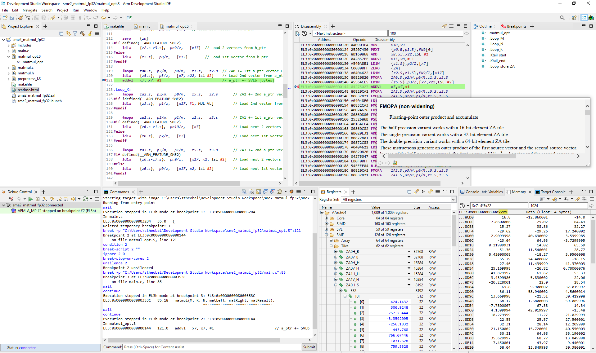

A single-precision floating-point matrix multiply (vector length agnostic) bare-metal example to illustrate Scalable Matrix Extension (SME) is provided with Arm Development Studio, 2023.0 and later.

The example shows a reference C implementation compared to an optimized version in assembler using SME2 instructions.

The example builds with Arm Compiler for Embedded 6, executes on the Arm Architecture Envelope Model for A-class (AEMvA) Fixed Virtual Platform (FVP) model, and can be run/debugged with the Arm Debugger.

The compiler, FVP model, and debugger are all provided in Arm Development Studio.

## Import the example

Open the Arm Development Studio IDE. Navigate to `File` > `Import...` > `Arm Development Studio` > `Examples & Programming Libraries` > `Examples` > `Armv9 Bare-Metal`, and select the `sme2_matmul_fp32` example. Using the text filter at the top of the pane can help locate the example. Click `Finish` to import.

Alternatively extract the example on the command line from the `<install_dir>\examples\Bare-metal_examples_Armv9.zip` archive. For interactive debug (see later) using the IDE is recommended.

Though the project is provided pre-compiled, you can also rebuild with the `Build` icon, or the `make` command from the command line.

The example is compiled with `-march=armv9-a+sme2`, as set in the `makefile`.

See the supplied `readme.html` for more information.

## Load the example

There is a supplied `sme2_matmul_fp32.launch` debug connection which has all necessary settings configured.

Double-click on the `.launch` file to open.

The AEMvA FVP model is a generic Arm implementation, which can be configured appropriately to enable Arm architectural features.

The model is launched with appropriate settings to implement full SME2 support, including:

`-C SVE.ScalableVectorExtension.has_sme=1 -C SVE.ScalableVectorExtension.has_sme2=1 -C SVE.ScalableVectorExtension.sme_veclens_implemented=7`

The `has_sme=1` and `has_sme2=1` parameters enable support for SME and SME2 respectively.

The `sme_veclens_implemented` parameter sets which SME vector lengths are implemented.  This is represented as a bitfield where bit[n]==1 implies SME vector length of 128*2^n bits is implemented.  `sme_veclens_implemented=7` means vector lengths of 128, 256, and 512 are supported.  You can change this to fix a particular vector length by setting, for example, `sme_veclens_implemented=2` for 256 bits.

For more information on the model parameters, launch the model with `FVP_Base_AEMvA --list-params`

Click `Debug` to launch the FVP and load the image.

Execution can be controlled by the `Debug Control` pane icon bar (eg `Step Instruction` ), the command line (`stepi`), or short-cut keys (`F5`).

## Understand the example

Follow the "Exploring the example" section of the supplied `readme.html` to learn about the example, the SME2 instructions and registers, how to view the tiles, and how to debug the example.

