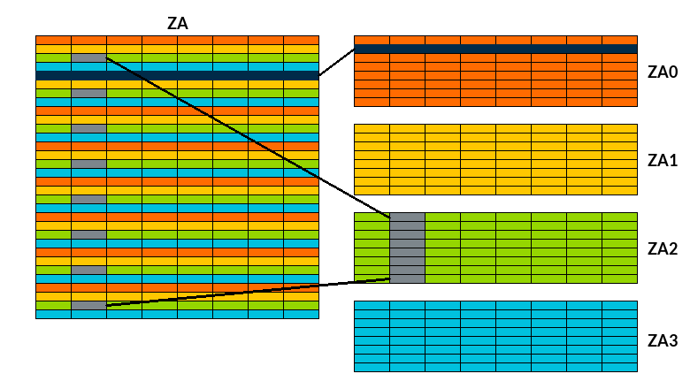

The [Scalable Matrix Extension](https://community.arm.com/arm-community-blogs/b/architectures-and-processors-blog/posts/scalable-matrix-extension-armv9-a-architecture) (`SME`) is a system solution consisting of hardware and software components to efficiently process matrices, including matrix tile storage and outer-product operations.

SME introduces:
* A register array storage ("ZA") capable of holding two-dimensional matrix tiles.
* A Streaming SVE processing mode, which supports execution of SVE2 instructions with a vector length that matches the tile width.
* Instructions that accumulate the outer product of two vectors into a tile.
* Instructions that transfer a vector to or from a tile row or column.
* System registers and fields that identify the presence and capabilities of SME, and enable and control its behavior at each Exception level.

The ZA storage is two-dimensional array of SVL x SVL bits, where SVL (the Effective Streaming SVE Vector Length), is a power of two in the range 128 to 2048 bits.
The ZA array can be accessed as vectors of 8-bit, 16-bit, 32-bit, 64-bit, or 128-bit elements, or as vectors of SVL bits.
The ZA array can also be accessed as tiles.  A tile is a square, two-dimensional sub-array of elements within the ZA array.  
A ZA tile can be accessed as vectors of 8-bit, 16-bit, 32-bit, 64-bit, or 128-bit elements, or as horizontal or vertical slices of SVL bits.

The Scalable Matrix Extension version 2 (SME2) extends the SME architecture to increase the number of applications that can benefit from the computational efficiency of SME, beyond its initial focus on outer products and matrix-matrix multiplication.  SME2 adds:
* Data processing instructions with multi-vector operands and a multi-vector predication mechanism.
* A Range Prefetch hint instruction.
* Compressed neural network capability using dedicated lookup table instructions and outer product instructions that support binary neural networks.
* A 512-bit architectural register, ZT0, to support the lookup table feature.

The new instructions enable SME2 to accelerate more workloads than the original SME, including GEMV, Non-Linear Solvers, Small and Sparse Matrices, and Feature Extraction or tracking.

SME is represented by the architectural feature FEAT_SME.  FEAT_SME is an optional extension from Armv9.2-A.
SME2 is represented by the architectural feature FEAT_SME2.  FEAT_SME2 is an optional extension from Armv9.2-A.  FEAT_SME2 requires FEAT_SME.

