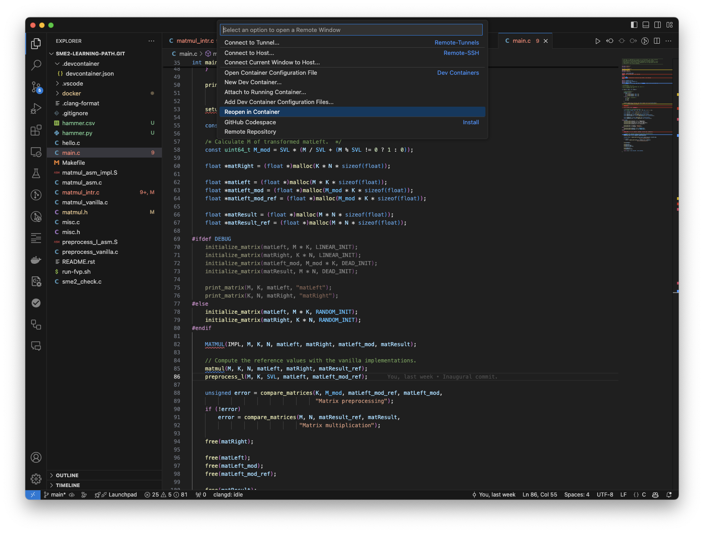

In this section, you will set up an environment to develop with SME2.

SME2 hardware is not widely deployed at the time of writing, so you will require:

 - A compiler with support for SME2 instructions. [clang](https://www.llvm.org/)
   version >= 18 or [gcc](https://gcc.gnu.org/) versions >= 14. This Learning
   Path uses ``clang``.

 - An emulator to execute code with the SME2 instructions. This Learning
   Path uses [Arm's Fixed Virtual Platform (FVP) model](https://developer.arm.com/Tools%20and%20Software/Fixed%20Virtual%20Platforms).


## Prerequisites

This learning path assumes that you have ``git`` and ``docker`` installed on your machine.

### git

Check that ``git`` is installed on your machine with the following command line in a terminal:

```BASH { output_lines=2 }
git --version
git version 2.47.1
```

If the above command line fails with a message similar to "``git: command not found``", then install ``git`` following the steps for your specific machine OS:


  
sudo apt install git
  
  
brew install git
  


### docker

For ease of learning, without any risk of harming your computer setup, the
required compiler and FVP are provided as a docker container that you can fetch
from the internet to get instantly started. However, the ``Dockerfile`` to build
the container is available as well should you prefer to build it yourself or
study how it's built.

{}
This learning path should also work without ``docker``, the only assumption is
that the compiler and the FVP are available on your search path.
{}

Start by checking that ``docker`` is installed on your machine by typing the following
command line in a terminal:

```BASH { output_lines="2" }
docker --version
Docker version 27.3.1, build ce12230
```

If the above command fails with a message similar to "``docker: command not found``"
then follow the steps from the [docker install guide](https://learn.arm.com/install-guides/docker/).
Note that you might have to re-login or restart your machine for the changes to be taken into account.

Once you have confirmed that ``docker`` is installed on your machine, you can check that it is operating normally with the following:

```BASH { output_lines="2-27" }
docker run hello-world
Unable to find image 'hello-world:latest' locally
latest: Pulling from library/hello-world
478afc919002: Pull complete
Digest: sha256:305243c734571da2d100c8c8b3c3167a098cab6049c9a5b066b6021a60fcb966
Status: Downloaded newer image for hello-world:latest

Hello from Docker!
This message shows that your installation appears to be working correctly.

To generate this message, Docker followed these steps:
 
 1. The Docker client contacted the Docker daemon.
 
 2. The Docker daemon pulled the "hello-world" image from the Docker Hub.
    (arm64v8)
 
 3. The Docker daemon created a new container from that image which runs the
    executable that produces the output you are currently reading.
 
 4. The Docker daemon streamed that output to the Docker client, which sent it
    to your terminal.

To try something more ambitious, you can run an Ubuntu container with:
 $ docker run -it ubuntu bash

Share images, automate workflows, and more with a free Docker ID:
 https://hub.docker.com/

For more examples and ideas, visit:
 https://docs.docker.com/get-started/
```

## Environment

Now, using ``git``, clone the environment for experimenting with SME2 to a directory
named ``SME2.git``:

```BASH
git clone  https://gitlab.arm.com/learning-code-examples/TODO_SOME_PATH SME2-learning-path.git
```

This repository content looks like:

```TXT
SME2-learning-path.git/
├── .clang-format
├── .devcontainer/
│   └── devcontainer.json
├── .git/
├── .gitignore
├── Makefile
├── README.rst
├── docker/
│   ├── assets.source_me
│   ├── build-all-containers.sh
│   ├── build-my-container.sh
│   └── sme2-environment.docker
├── hello.c
├── main.c
├── matmul.h
├── matmul_asm.c
├── matmul_asm_impl.S
├── matmul_intr.c
├── matmul_vanilla.c
├── misc.c
├── misc.h
├── preprocess_l_asm.S
├── preprocess_vanilla.c
├── run-fvp.sh
└── sme2_check.c
```

It contains:
- The code examples that this Learning Path uses.
- The ``Makefile`` that builds the code examples.
- The ``run-fvp.sh`` shell script that runs the FVP.
- The ``docker/`` directory that contains ``docker``-related material.
  ``assets.source_me`` provides the FVP and compiler toolchain references,
  ``sme2-environment.docker`` is the docker receipe to build the container that
  you will use, ``build-my-container.sh`` is the shell script you should use in
  case you want to build the docker container (but you don't have to, ready-made
  images are made available for you ). Lastly ``build-all-containers.sh`` is the
  script that was used to create the multi-arch (x86_64 and aarch64 support)
  image for you to download.
- ``.devcontainer/devcontainer.json`` is a configuration script for VSCode to be
  able to use the container from the IDE (read below).

Change directory to your checkout:

```BASH
cd SME2-learning-path.git
```

From now on, all instructions in this learning path assume your current
directory is ``SME2-learning-path.git``.

## Using the environment

Docker provides you with a way to execute commands in a different environment,
where all necessary tools are available without cluttering your machine. You can:
- use docker directly from the command line, for example when you are working
  from a terminal,
- configure VSCode to run all the commands in the docker environment.

### Directly in a terminal

When a command has to be executed in the docker container environment, you have
to prepend it with instructions on the command line so that your shell will
execute them in the container. For example, to execute ``COMMAND ARGUMENTS`` in
the SME2 docker container, the command line looks like:

```SH
docker run --rm -v "$PWD:/work" -w /work armswdev/sme2-learning-path:sme2-environment-v1 COMMAND ARGUMENTS
```

This invokes docker, using the
``armswdev/sme2-learning-path:sme2-environment-v1``container
image, and mounts the current working directory (the ``SME2-learning-path.git``)
inside the container to ``/work``, sets ``/work`` as the
working directory and run ``COMMAND ARGUMENTS`` in this environment.

For example, to run ``make``, you would have to type:

```SH
docker run --rm -v "$PWD:/work" -w /work armswdev/sme2-learning-path:sme2-environment-v1 make
```

### In VSCode

Make sure you have the [Dev
Containers](https://marketplace.visualstudio.com/items?itemName=ms-vscode-remote.remote-containers)
extension installed. It should then be as easy as using the "Reopen in
Container" menu entry as in figure 1 (it will automatically find and use
``.devcontainer/devcontainer.json``):



All your commands will now take place in the container, so no need to prepend
them with some docker invocation, VSCode handles all this transparently for you.

In the remainder of this learning path, the shell commands will show the docker
invocation (so readers that don't use VSCode can copy the full command line),
but you should only use the ``COMMAND ARGUMENTS`` part.

## Suggested reading

If you are not familiar with matrix multiplication --- or need a refresh ---
this [wikipedia article on Matrix
multiplication](https://en.wikipedia.org/wiki/Matrix_multiplication) is a good
start.

If you are not familiar with SVE and / or SME, it is strongly suggested that you
first read some material as this learning path assumes some basic understanding
of those technologies:

 - [Introducing the Scalable Matrix Extension for the Armv9-A
   Architecture](https://community.arm.com/arm-community-blogs/b/architectures-and-processors-blog/posts/scalable-matrix-extension-armv9-a-architecture)
 - [Arm Scalable Matrix Extension (SME) Introduction (part
   1)](https://community.arm.com/arm-community-blogs/b/architectures-and-processors-blog/posts/arm-scalable-matrix-extension-introduction)
 - [Arm Scalable Matrix Extension (SME) Introduction (part
   2)](https://community.arm.com/arm-community-blogs/b/architectures-and-processors-blog/posts/arm-scalable-matrix-extension-introduction-p2)

You are now all set to move to the next chapter !