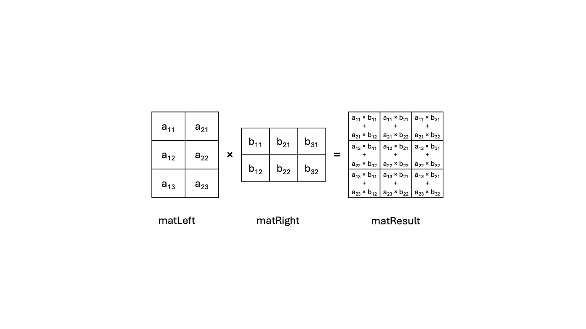

## Vanilla matrix multiplication

In this section, you will learn about a textbook example of matrix multiplication in C.

### Algorithm description

The vanilla matrix multiplication operation takes two input matrices, A [Al
rows x Ac columns] and B [Bl rows x Bc columns], to produce an output matrix C
[Cl rows x Cc columns]. The operation consists of iterating on each row of A
and each column of B, multiplying each element of the A row with its corresponding
element in the B column then summing all these products, as Figure 2 shows.



This implies that the A, B, and C matrices have some constraints on their
dimensions:

- A's number of columns must match B's number of lines: Ac == Bl.
- C has the ll have dimensions Cl == Al and Cc == Bc

You can learn more about matrix multiplication, including its history,
properties and use, with this [wikipedia
article](https://en.wikipedia.org/wiki/Matrix_multiplication)

In this Learning Path, you will see the following variable names:

- ``matLeft`` corresponds to the left-hand side argument of the matrix
  multiplication.
- ``matRight``corresponds to the right-hand side of the matrix multiplication.
- ``M`` is ``matLeft`` number of rows.
- ``K`` is ``matLeft`` number of columns (and ``matRight`` number of rows).
- ``N`` is ``matRight`` number of columns.
- ``matResult``corresponds to the result of the matrix multiplication, with
  ``M`` rows and ``N`` columns.

### C implementation

A literal implementation of the textbook matrix multiplication algorithm, as
described above, can be found in file ``matmul_vanilla.c``:

```C
void matmul(uint64_t M, uint64_t K, uint64_t N,
            const float *restrict matLeft, const float *restrict matRight,
            float *restrict matResult) {
    for (uint64_t m = 0; m < M; m++) {
        for (uint64_t n = 0; n < N; n++) {

            float acc = 0.0;

            for (uint64_t k = 0; k < K; k++)
                acc += matLeft[m * K + k] * matRight[k * N + n];

            matResult[m * N + n] = acc;
        }
    }
}
```

In this Learning Path, the matrices are laid out in memory as contiguous
sequences of elements, in [Row-Major
Order](https://en.wikipedia.org/wiki/Row-_and_column-major_order). The
``matmul`` function performs the algorithm described above. The
pointers to ``matLeft``, ``matRight`` and ``matResult`` have been annotated as
``restrict``, which informs the compiler that the memory areas designated by
those pointers do not alias. This means that they do not overlap in any way, so that the
compiler does not need to insert extra instructions to deal with these cases.
The pointers to ``matLeft`` and ``matRight`` are marked as ``const`` as neither of these two matrices are modified by ``matmul``.

You now have a reference standard matrix multiplication function. You will use it later
on in this Learning Path to ensure that the assembly version and the intrinsics
version of the multiplication algorithm do not contain errors.