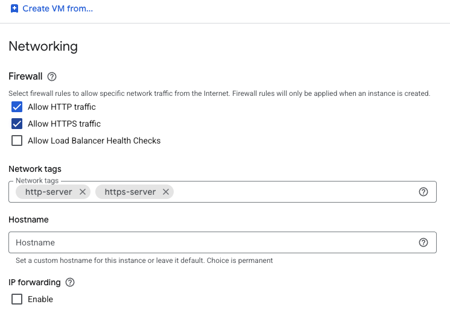
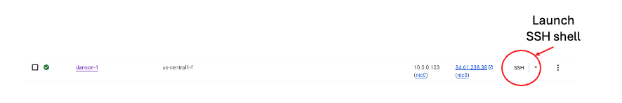

## Overview

In this section, you provision a Google Axion C4A virtual machine on Google Cloud Platform (GCP) using the `c4a-standard-32` machine type, which provides 16 vCPUs and 128 GB of memory. This VM size is required for building a Yocto-based image in the next steps. 

{}
For general guidance on setting up a Google Cloud account and project, see the Learning Path [Getting started with Google Cloud Platform](/learning-paths/servers-and-cloud-computing/csp/google/). 
{}

## Provision a Google Axion C4A VM in Google Cloud Console

To create a virtual machine using the C4A instance type:

- Open the [Google Cloud Console](https://console.cloud.google.com/).
- Go to **Compute Engine** > **VM instances**, and then select **Create instance**.
- Under **Machine configuration**:
  - Specify an **Instance name**, **Region**, and **Zone**.
  - Set **Series** to **C4A**.
  - Select **c4a-standard-32** as the machine type.

- Under **OS and storage**, select **Change**, and then choose an Arm64-based operating system image.
  - For this Learning Path, select **Ubuntu 22.04 LTS**.
  - Increase **Size (GB)** from **10** to **100** to allocate sufficient disk space.
  - Select **Choose** to apply the changes.

- Under **Networking**, enable **Allow HTTP traffic** and **Allow HTTPS traffic** to simplify access for later Kubernetes testing.
- Select **Create** to launch the virtual machine.

After the instance starts, click **SSH** next to the VM in the instance list to open a browser-based terminal session.

A new browser window opens with a terminal connected to your virtual machine.

{}
This is a rather expensive VM given its vCPU and memory usage. It is highly recommended to delete this VM once you have completed this learning path!
{}

## What you've accomplished and what's next

In this section, you:
- Provisioned a Google Axion C4A VM on Google Cloud Platform
- Configured the VM for Arm64-based Yocto image builds

Next, you'll use this VM to build a Yocto image for your target hardware. Continue to the Yocto installation section to complete your edge deployment workflow.