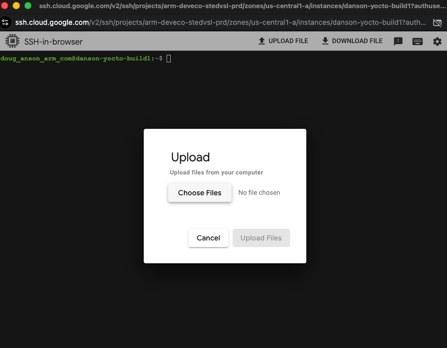
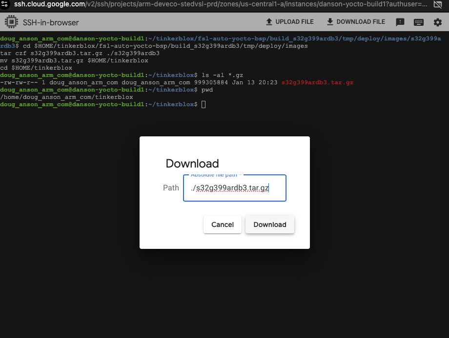

## System requirements

{}
The requirements below are given as additional information only. The GCP C4A VM instance, running Ubuntu 22.04 with 100GB disk space, will work fine for this Learning Path.
{}

- Linux host system (64-bit recommended)
- Supported host architectures:
  - AArch64 (arm64)
  - ARMv7

- Supported Linux distributions(Tested):
  - Ubuntu 20.04 LTS (AArch64)
  - Ubuntu 22.04 LTS (AArch64)

{}
As of this Learning Path's publication, Ubuntu 24.04 LTS is NOT a supported Yocto build host OS. This may change in the future.
{}

- Minimum hardware requirements:
  - CPU: Quad-core processor minimum (16 cores or greater recommended) 
  - RAM: 8 GB minimum (16 GB or greater recommended)
  - Disk space: At least 100 GB free (250 GB +recommended for multiple builds)

- Required software (will be installed below):
  - Git (for fetching Yocto layers)
  - Python (Yocto-supported version from host distro)
  - GNU build tools (gcc, make, etc.)

- Internet access:
  - Required for downloading source code, layers, and dependencies

{}
Yocto builds are **very** resource-intensive and may take several hours depending on hardware and memory capacities
{}


## Build a Yocto image for your NXP board

You'll use the **NXP S32G-VNP-GLDBOX3** hardware platform with the **BSP 38.0** release from NXP's `auto_yocto_bsp` repository to run EdgeBlox Agent. Follow these steps to build a Yocto-based Linux image and prepare it for deployment.

- **NXP Auto Linux BSP Repository (BSP 38.0):**
  https://github.com/nxp-auto-linux/auto_yocto_bsp/tree/release/bsp38.0
- **NXP GoldBox 3 Design Page:**
  https://www.nxp.com/design/design-center/development-boards-and-designs/GOLDBOX-3

### Get the replacement meta-edgeblox layer

Contact the Tinkerblox support team at **techsupport@tinkerblox.io** to request the meta-edgeblox zip file for your Yocto image. The file you receive will be called "meta-edgeblox.zip" and will be used in the next steps and in the build script below.


## Build the Yocto image

{}
If you see an error about updating the `/etc/sudoers` file, follow the instructions provided. The script needs these permissions to set up properly. If you skip this, the `bitbake` commands below will fail.
{}

First, copy the following config file and save it as "kernel.cfg":

```bash
CONFIG_NAMESPACES=y
CONFIG_UTS_NS=y
CONFIG_IPC_NS=y
CONFIG_PID_NS=y
CONFIG_NET_NS=y
CONFIG_USER_NS=y
CONFIG_CGROUPS=y
CONFIG_CGROUP_BPF=y
CONFIG_CGROUP_SCHED=y
CONFIG_CPUSETS=y
CONFIG_MEMCG=y
CONFIG_BLK_CGROUP=y
CONFIG_CGROUP_HUGETLB=y
CONFIG_OVERLAY_FS=y
CONFIG_SECCOMP=y
CONFIG_SECCOMP_FILTER=y
CONFIG_VETH=y
CONFIG_BRIDGE=y
CONFIG_IPTABLES=y
CONFIG_NETFILTER=y
CONFIG_NETFILTER_ADVANCED=y
CONFIG_IP_NF_IPTABLES=y
CONFIG_IP_NF_FILTER=y
CONFIG_NF_CONNTRACK=y
CONFIG_IP6_NF_IPTABLES=y
CONFIG_IP6_NF_FILTER=y
```

Next, copy the following build script and save it as "build.sh":

```bash
#!/bin/bash

export BASE_CWD=`pwd`
export BLOX_MACHINE="s32g399ardb3"
export LANG=en_US.UTF-8
export LC_ALL=en_US.UTF-8
export LC_CTYPE=en_US.UTF-8

echo "Clearing out old build..."
rm -rf fsl-auto-yocto-bsp 

echo "Installing prerequisites..."
sudo apt update
sudo apt install -y gawk wget git diffstat unzip texinfo gcc build-essential chrpath socat cpio python3 python3-pip python3-pexpect xz-utils debianutils iputils-ping python3-git python3-jinja2 libegl1-mesa libsdl1.2-dev xterm python3-subunit mesa-common-dev zstd liblz4-tool
sudo apt-get install -y chrpath diffstat gawk lz4 mtools
sudo apt-get install -y curl
sudo apt-get install -y git
sudo apt-get install -y python2

echo "Installing repo..."
mkdir -p ~/bin
curl https://storage.googleapis.com/git-repo-downloads/repo > ~/bin/repo
chmod a+x ~/bin/repo
export PATH=${PATH}:~/bin

echo "Creating build directory..."
mkdir fsl-auto-yocto-bsp
cd fsl-auto-yocto-bsp/

echo "Cloning repo..."
repo init -u https://github.com/nxp-auto-linux/auto_yocto_bsp -b release/bsp38.0
repo sync

echo "Ready to build!"
sudo ./sources/meta-alb/scripts/host-prepare.sh

echo "Setting locale..."
sudo locale-gen en_US.UTF-8
sudo update-locale LANG=en_US.UTF-8

echo "Sourcing build setup... machine: ${BLOX_MACHINE}..."
source ./nxp-setup-alb.sh -m ${BLOX_MACHINE} 
CWD=`pwd`
echo "Current working directory: ${CWD}"

# Check if we have our custom layer from Tinkerblox
if [ -f ${BASE_CWD}/meta-edgeblox.zip ]; then
    echo "Replacing meta-edgeblox layer..."
    cd ${BASE_CWD}/fsl-auto-yocto-bsp
    rm -rf ../meta-edgeblox
    unzip -q ${BASE_CWD}/meta-edgeblox.zip
else
    echo "ERROR: Unable to find replacement meta-edgeblox.zip layer. Please contact Tinkerblox team by email **techsupport@tinkerblox.io** for the layer"
    echo "Exiting on ERROR"
    exit 1
fi

echo "Adding updated meta-edgeblox layer..."
cd ${CWD}
# not needed due to zip file? time bitbake-layers create-layer ../meta-edgeblox
time bitbake-layers add-layer ../meta-edgeblox

echo "Updating the yocto local configuration: ./conf/layer.conf"
echo "IMAGE_INSTALL:append = \" dpkg ldd libxcrypt binutils zlib cjson edgeblox-agent cgroup-lite rng-tools procps ca-certificates catatonit openssh htop  python3-cantools  python3-joblib  python3-numpy  python3-pandas python3-can python3-djangorestframework python3-dev python3-pip runit go node-exporter  util-linux \"" >> ./conf/local.conf  

echo "Local yocto configuation:"
cat ./conf/local.conf

echo "Building for the machine type: ${BLOX_MACHINE}" 
time bitbake fsl-image-base

# Kernel reconfigure and rebuild of image
if [ -f ${BASE_CWD}/kernel.cfg ]; then
    echo "Customizing kernel..."
    # not needed: time bitbake -c menuconfig virtual/kernel
    echo "Updating kernel configuration: ./tmp/work/s32g399ardb3-fsl-linux/linux-s32/5.15.119-r0/build/.config"
    cat ${BASE_CWD}/kernel.cfg >> ./tmp/work/${BLOX_MACHINE}-fsl-linux/linux-*/*r0/build/.config
    
    echo "Setting config as default kernel config..."
    time bitbake -c savedefconfig virtual/kernel
    
    echo "Rebuilding kernel..."
    time bitbake virtual/kernel -f -c compile
    
    echo "Updating final image content..."
    time bitbake fsl-image-base

    echo "All Done! Exiting..."
else
    echo "ERROR: Unable to find kernel config file: ${BASE_CWD}/kernel.cfg. Exiting on error"
    exit 2
fi
exit 0
```


In your VM SSH window, select "upload" to upload "kernel.cfg", "meta-edgeblox.zip", and "build.sh" to the VM instance.

Invoking SSH file upload:


Selecting files to upload through SSH:


Upload completed:


In your VM SSH window, run the following commands to start the build:

```bash
chmod 755 ./build.sh
mkdir tinkerblox
mv build.sh kernel.cfg meta-edgeblox.zip tinkerblox
cd ./tinkerblox
./build.sh
```


{}
- The build takes about 20-40 minutes to complete.
- During the build, you might be prompted to restart some services. Press the "tab" key to select "OK" and then "enter" to continue.
- You will be prompted to accept the NXP BSP license. Type "q" followed by "y" to accept and begin the build.
{}


## Download the built Yocto image

After the build completes, archive the image and download it to your local machine. Make sure your local machine has access to the **NXP S32G-VNP-GLDBOX3** and its SD card for the next steps.


## Flash the SD card

### Download the built Yocto image from the VM instance

In the VM SSH shell, perform the following commands:
```bash
cd $HOME/tinkerblox/fsl-auto-yocto-bsp/build_s32g399ardb3/tmp/deploy/images
tar czf s32g399ardb3.tar.gz ./s32g399ardb3
mv s32g399ardb3.tar.gz $HOME/tinkerblox
cd $HOME/tinkerblox
ls -al `pwd`/s32g399ardb3.tar.gz
```

Next, in the VM SSH, press the "Download" button to download the created file:

Select the file to download. Use the fully qualified path for the file in the previous step and paste it into the download dialog to initiate the download:


Download completed:


Back on your local host (where access to the **NXP S32G-VNP-GLDBOX3** SDcard is available for writing), extract the archive:

```bash
tar xzpf s32g399ardb3.tar.gz
cd s32g399ardb3
ls -al fsl-image-base-s32g399ardb3.sdcard
```

Insert the SD card. Your system may expose it as /dev/sdb (Linux/Ubuntu example).

{}
Replace "/dev/sdb" with your system's device file for the SD card.
{}

Write the image to the SD card:

```bash
ls -al fsl-image-base-s32g399ardb3.sdcard
sudo dd if=fsl-image-base-s32g399ardb3.sdcard of=/dev/sdb bs=1M && sync
```


## Activate the agent on your NXP device

On first boot, the agent automatically generates a file named `activation_key.json` at:

  /opt/tinkerblox/activation_key.json

Log in to your **NXP S32G-VNP-GLDBOX3** device using SSH. Replace `1.2.3.4` with your device's IP address:

```bash
ssh root@1.2.3.4
```

In the SSH shell, check for the activation key:

```bash
cd /opt/tinkerblox/
ls -al activation_key.json
```

Send this `activation_key.json` file to the Tinkerblox team at **techsupport@tinkerblox.io** to receive your license key. You will get a new `activation_key.json` to use in the next steps.

Once you receive the licensed file:

1.  Stop the agent using the following command:

        sudo systemctl stop tbx-agent.service

2.  Replace the existing `activation_key.json` file in
    `/opt/tinkerblox/` with the licensed one provided by TinkerBlox.

For example, using "1.2.3.4" as the NXP device's IP address, on your local machine:
```bash
    scp activation_key.json root@1.2.3.4:/opt/tinkerblox
```

3.  Start the agent on the NXP device:

        sudo systemctl start tbx-agent.service

### Run the agent manually

- Binary path: `/bin/tbx-agent`
- To start:
  ```bash
  cd /bin
  ./tbx-agent
  ```
- To stop, press **Ctrl+C** once.

<video width="800" controls>
  <source src="https://raw.githubusercontent.com/Tinkerbloxsupport/arm-learning-path-support/main/static/videos/Activation.mp4" type="video/mp4">
  Your browser does not support the video tag.
</video>


## Install and run workloads

You can deploy and manage MicroPac-based workloads on your UltraEdge-enabled device using the MicroBoost CLI. Use the following steps to install, start, stop, and monitor workloads.

This workflow uses the MicroBoost CLI to install, start, stop, and monitor MicroPac-based workloads running on UltraEdge.

### Build the workload using mpac builder

To build the .mpac file from a cross-architecture setup using **Micropac Builder**:

-   Verify QEMU installation:

        qemu-aarch64-static --version

-   Check binfmt registration:

        ls /proc/sys/fs/binfmt_misc/


Navigate to your project directory and make sure the micropacfile is placed in your project directory (refer to debian_installation.md for more details).

-   Run below command:

        sudo micropac-builder build

After the build completes, the workload file your_service.mpac will be generated in your project directory.

Copy the your_service.mpac file to any root filesystem path of your NXP target to deploy it.


systemctl start runit-supervise
tinkerblox-cli microboost install -f /path/to/your_service.mpac
tinkerblox-cli microboost list
tinkerblox-cli microboost start <id>
tinkerblox-cli microboost stop <id>
tinkerblox-cli microboost status <id>
tinkerblox-cli microboost uninstall <id>

### Install the workloads on the device

Start the runit supervisor:
```bash
systemctl start runit-supervise
```

Install the workload:
```bash
tinkerblox-cli microboost install -f /path/to/your_service.mpac
```

List installed services:
```bash
tinkerblox-cli microboost list
```

Copy the service ID and use the following commands to manage the service:

Start the service:
```bash
tinkerblox-cli microboost start <id>
```

Stop the service:
```bash
tinkerblox-cli microboost stop <id>
```

Check the service status:
```bash
tinkerblox-cli microboost status <id>
```

Uninstall the workload:
```bash
tinkerblox-cli microboost uninstall <id>
```


## Watch video walkthroughs

Watch these videos for additional guidance:

**Microservice setup and install:**
<video width="800" controls>
  <source src="https://raw.githubusercontent.com/Tinkerbloxsupport/arm-learning-path-support/main/static/videos/microservice_installation.mp4" type="video/mp4">
  Your browser does not support the video tag.
</video>

**Yocto setup, build, and install:**
<video width="800" controls>
  <source src="https://raw.githubusercontent.com/Tinkerbloxsupport/arm-learning-path-support/main/static/videos/yocto.mp4" type="video/mp4">
  Your browser does not support the video tag.
</video>

## What you've accomplished and what's next

In this section, you:
- Built a Yocto image for the NXP S32G-VNP-GLDBOX3 platform
- Activated and managed the UltraEdge agent on your target device
- Built, installed, and managed MicroPac workloads using the mpac builder and CLI

Next, you can further customize your Yocto builds, automate deployment pipelines, or explore integration with other edge and cloud platforms.