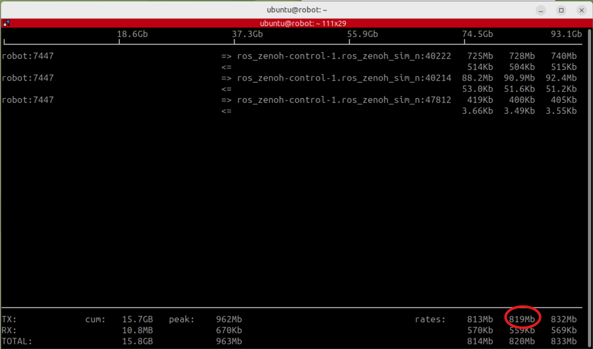

## Start the ROS 2 and Zenoh environment

{}
You'll tune the working system from [Build a ROS 2 and Zenoh simulation environment on an Arm server](/learning-paths/cross-platform/ros2-zenoh-arm/) and [Distribute a ROS 2 robotic system across Arm devices with Zenoh](/learning-paths/cross-platform/distributed-ros2-zenoh-lp2/). Ensure that you've completed installation and network configuration steps as described in these Learning Paths.
{}

If the containers are stopped, start them from the Arm server host. 

Use the same working directory that you set up while completing [Build a ROS 2 and Zenoh simulation environment on an Arm server](/learning-paths/cross-platform/ros2-zenoh-arm/):

```bash
cd ~/ros_zenoh
docker compose up -d
docker compose ps
```

The output is similar to:

```output
NAME                  STATUS
ros_zenoh-control-1   Up
ros_zenoh-robot-1     Up
```

Both services should report `Up`.

The commands that you ran in interactive terminals while completing the previous Learning Paths don't restart with the containers. If the robot stack isn't running, restart the robot stack.

<details>
<summary>Restart the robot stack</summary>

Each running container provides a browser-accessible desktop:

- `Robot` container desktop: `http://<your_arm_server_ip_address>:6080/`
- `Control` container desktop: `http://<your_arm_server_ip_address>:6081/`

If prompted for a password, enter `ubuntu`. 

Open the `robot` container desktop and launch three terminals.

Run the router in the first terminal:

```bash
source ~/workshop_env.bash
just router
```

Run the simulation in the second terminal:

```bash
source ~/workshop_env.bash
just rox_simu no_gui
```

Run Navigation2 in the third terminal:

```bash
source ~/workshop_env.bash
just rox_nav2
```

</details>

Next, open the robot container desktop (`http://<your_arm_server_ip_address>:6080/`) in another browser tab or window.

After opening the robot container desktop, open a terminal and remove any network limit left by earlier tests:

```bash
source ~/workshop_env.bash
just network_normal
```

## Understand the four measurements

Throughout this Learning Path, you'll repeat the same measurements after every configuration change. Run all four at the same time so that every scenario creates the same network demand.

Using three separate terminals in the `control` container, run the following commands:

| Terminal | Command | Value to record |
|---|---|---|
| Control 1 | `ros2 topic hz /scan` | Average rate and standard deviation |
| Control 2 | `ros2 topic hz /camera/image_raw` | Average rate and standard deviation |
| Control 3 | `ros2 topic bw /camera/points` | Average bandwidth and message size |

In another terminal within the `robot` container, run the fourth measurement:

```bash
source ~/workshop_env.bash
just iftop_router
```

The command monitors traffic leaving the Zenoh router on TCP port `7447`. Each remote `ros2 topic` process creates a separate connection, so you should see three active connections.

At the end of the display, `iftop` reports three TX rates. The output is similar to:

```output
TX:  rates: 813Mb  819Mb  832Mb
```

These values show the 2-second, 10-second, and 40-second moving averages of traffic sent by the robot. Record the middle value, which is the 10-second average.



{}
`iftop` reports bits per second, such as `819 Mbps`. `ros2 topic bw` reports bytes per second, such as `92 MB/s`. One byte contains 8 bits.
{}

## Record the baseline

Let all four measurements run for 60–90 seconds.

Expected result:

| Scenario | `/scan` | `/camera/image_raw` | `/camera/points` | Link traffic |
|---|---|---|---|---|
| A0: Baseline | 7.97 Hz (std 0.115 s) | 11.85 Hz (std 0.035 s) | ~88 MB/s (7.37 MB per frame) | ~810 Mbps |

A typical baseline is approximately 8 Hz for `/scan`, 12 Hz for the image, 88–98 MB/s for the point cloud, and 800–820 Mbps of link traffic. Treat these as reference observations rather than pass or fail limits. Simulation speed and host performance affect the exact values.

Stop all four measurement commands with **Ctrl+C**. ROS 2 calculates these statistics cumulatively, so you must stop and restart the commands for each scenario.

## What you've accomplished and what's next

You've measured what reaches the remote receiver when the Docker link has enough capacity. This baseline is the reference for every later result. 

Next, you'll constrain the link and observe which topics survive.
