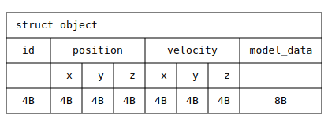
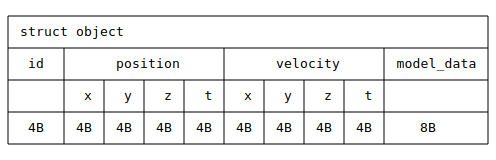

Before trying any optimization, it's important to understand the way the data is represented and accessed in memory. In this case, the compiler cannot issue SIMD instructions because the operations are done in triplets (x,y,z) and SIMD operations for 32-bit floating point values require 4 elements.

In order to improve the data layout and help the compiler you need to go back and look at the `object` struct in more detail. The memory layout of `object` is the following:



Because the `vec3` types are triplets, their alignment `is 3 x 4 bytes = 12 bytes`. That makes usage of SIMD instructions difficult as they usually operate on data multiples of 16 bytes. Alignment to 16 bytes is also important. You can usually solve this by adding extra bytes in such structures as padding. This results in wasted bytes but sometimes these can be used for extra information. Even if the extra bytes cannot be used, the performance benefit outweighs the loss in memory.

How should padding be added to the struct? You can convert the `vec3` helper struct to a `vec4` to include an extra 'dimension', such as `t`. 

Make the following change to the code to add the padding:

```C
// Helper struct of a 3D vector with x, y, z, coordinates
typedef struct vec4 {
  float x, y, z, t;
} vec4_t;
```

You also need to change the object struct:

```C
// The object struct
typedef struct object {
...
  vec4_t position;
  vec4_t velocity;
...
} object_t;
```

Also change the function `init_objects()` to initialize the new `t` member:

```C
void init_objects(object_t *objects) {
  // Give initial speeds and positions
  for (size_t i=0; i < N; i++) {
...
    objects[i].position.z = randf(20.0) - 10.0f;
    objects[i].position.t = 0.0f;
...
    objects[i].velocity.y = randf(2.0) - 1.0f;
    objects[i].velocity.t = 1.0f;
  }
}
```

Finally, update the `simulate_objects()` function:

```C
void simulate_objects(object_t *objects, float duration, float step) {
...
  while (current_time < duration) {
    // Move the object in msec steps
    for (size_t i=0; i < N; i++) {
...
      objects[i].position.z += objects[i].velocity.z * step;
      objects[i].position.t += objects[i].velocity.t * step;
    }
    current_time += step;
  }
}
```

The memory layout now looks like this:



After making the changes, compile the code again: 

```bash
gcc -O3 simulation1.c -o simulation1
```

Running the new program shows immediate improvement:

```console
./simulation1
```

The new `elapsed time` is less than before:

```output
elapsed time: 12.993359
```

Use `objdump` again to view the new assembly code for the`simulate_objects()` function:

```console
objdump -S simulation1 | less
```

The usage of SIMD instructions is obvious now. You can see that loading is done in quads `ldp q0, q3, [x0]`, then `fmla` is used to do the step multiply-accumulate instruction and it stores the vector directly with `str`:

```output
0000000000000b20 <simulate_objects>:
 b20:   1e202018        fcmpe   s0, #0.0
 b24:   1e204004        fmov    s4, s0
 b28:   1e204025        fmov    s5, s1
 b2c:   4e040422        dup     v2.4s, v1.s[0]
 b30:   5400004c        b.gt    b38 <simulate_objects+0x18>
 b34:   d65f03c0        ret
 b38:   91524c02        add     x2, x0, #0x493, lsl #12
 b3c:   91524c01        add     x1, x0, #0x493, lsl #12
 b40:   0f000401        movi    v1.2s, #0x0
 b44:   91002003        add     x3, x0, #0x8
 b48:   91376042        add     x2, x2, #0xdd8
 b4c:   91380021        add     x1, x1, #0xe00
 b50:   aa0303e0        mov     x0, x3
 b54:   d503201f        nop
 b58:   ad400c00        ldp     q0, q3, [x0]
 b5c:   4e23cc40        fmla    v0.4s, v2.4s, v3.4s
 b60:   3c830400        str     q0, [x0], #48
 b64:   eb00005f        cmp     x2, x0
 b68:   54ffff81        b.ne    b58 <simulate_objects+0x38>  // b.any
 b6c:   3cdd8020        ldur    q0, [x1, #-40]
 b70:   1e252821        fadd    s1, s1, s5
 b74:   3cde8023        ldur    q3, [x1, #-24]
 b78:   1e212090        fcmpe   s4, s1
 b7c:   4e23cc40        fmla    v0.4s, v2.4s, v3.4s
 b80:   3c9d8020        stur    q0, [x1, #-40]
 b84:   54fffe6c        b.gt    b50 <simulate_objects+0x30>
 b88:   d65f03c0        ret
 ```

Sometimes it's easy to make data layout improvements, continue to the next section for a more complex problem.