---
# User change
title: Create Windows on Arm virtual machine in Azure cloud

weight: 2 # 1 is first, 2 is second, etc.

# Do not modify these elements
layout: "learningpathall"

---
If you don't have access to a Windows on Arm device, you can create a Windows on Arm virtual machine in the Azure cloud.

{}
These same instructions can be used to deploy a Linux image on the Arm Virtual Machine. Simply select a Linux distribution instead of Windows.
{}

## Create a Windows on Arm Virtual Machine

[Microsoft Azure](https://portal.azure.com/#home) is Microsoft's cloud computing platform. You can log into Azure using either your personal subscription or your organization's subscription.

To begin:

1. Login to your Azure account.
2. From the Azure search bar, begin typing the word "virtual machines" until the [Virtual Machines](https://portal.azure.com/#view/HubsExtension/BrowseResource/resourceType/Microsoft.Compute%2FVirtualMachines) service appears as a selection. 

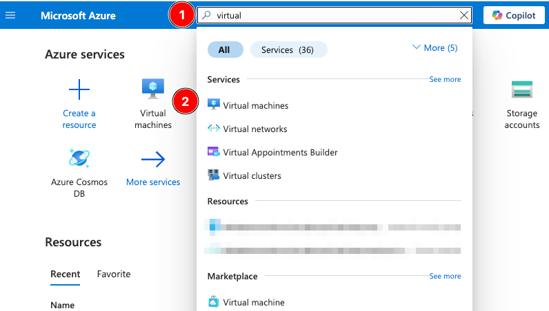

3. Select `Virtual Machines`.

The Virtual Machines page appears.

4. Click `Create` > `Azure virtual machine`.

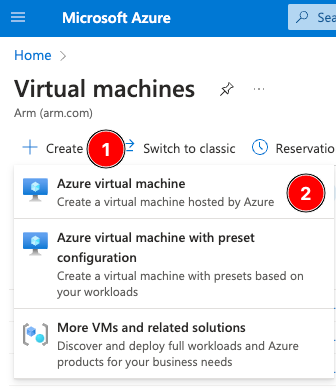

The `Create a virtual machine` page appears.

5. Select a valid `Subscription`.
6. Select a `Resource group` - Optional; you may leave blank.
7. Enter a `Virtual Machine name` - We'll call it armtest-0 for this example.
8. Select a `Region` - For best performance, select the region closest to you.
9. Select `Standard` for `Security Type`.
10. Select `See all images` - You can find this under the `Image` dropdown.

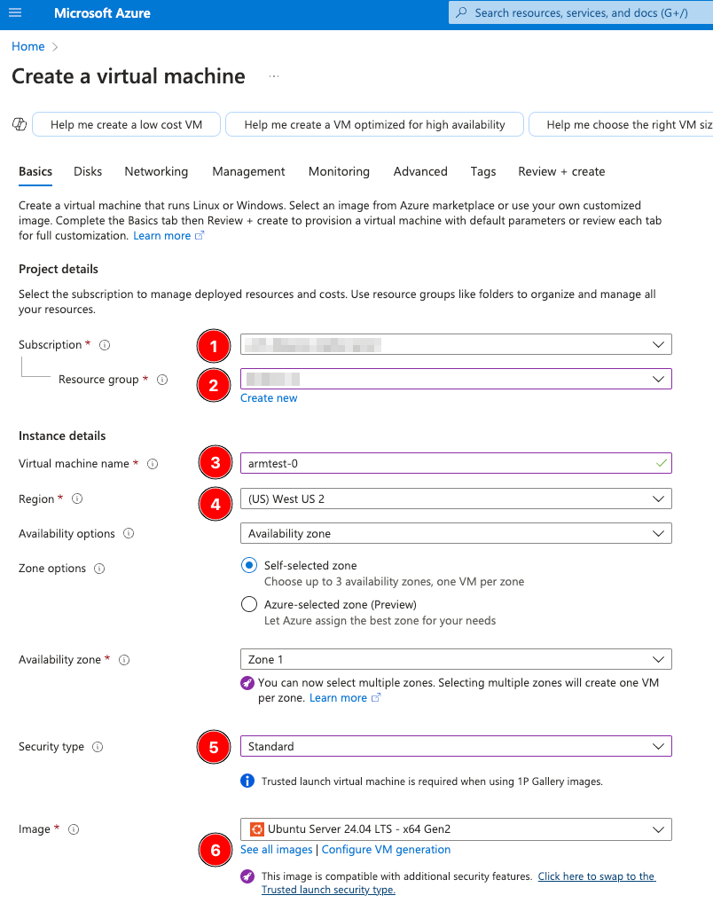

The `Marketplace` page appears.

11. Enter `windows 11` into the search bar and press enter.
12. Click the `Image Type` filter and select `Arm64`.

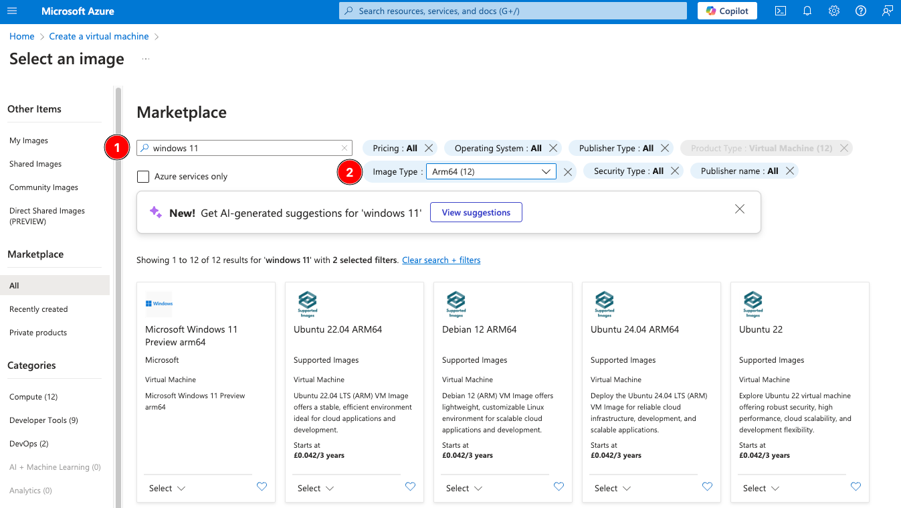

You are  presented with all available Arm VM images.

{}
Note all the different Arm images (Windows and others) Azure provides; feel free to experiment with different Arm images from the Azure Marketplace upon completion of this learning path.
{}

13. From the drop-down at the bottom of the `Microsoft Windows 11 Preview arm64` tile, select `Windows 11 Professional 24H2 - Arm64`.

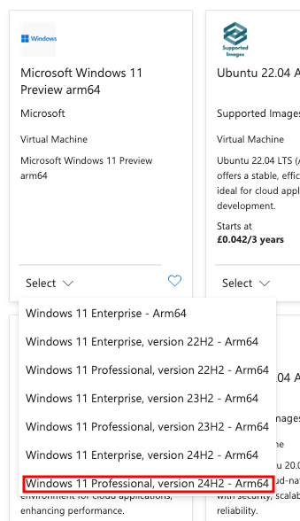

Upon selection, you are returned to the `Create a virtual machine` screen with your architecture set to `Arm64` and your image set to `Windows 11 Professional, version 24H2 - ARM64 Gen2`.

14. For `Size`, select `Standard_D2ps_v5 - 2 vcpus, 8 GiB memory`.

{}
The VM size suggested for this learning path is enough to demonstrate Windows on Arm in the Azure cloud, but may need to be adjusted to support other workloads.  For more information rightsizing your VM instances, please see [Rightsize to maximize your cloud investment with Microsoft Azure](https://azure.microsoft.com/en-us/blog/rightsize-to-maximize-your-cloud-investment-with-microsoft-azure/).   
{}

15. For `Username` and `Password`, provide values which will be used to login to the Windows virtual machine.

16. For `Inbound port rules` > `Public inbound ports`, select `Allow selected ports` and choose `RDP (3389)` from the drop-down menu.

17. For `Licensing` confirm that you have an eligible Windows 10/11 license with multi-tenant hosting rights. To learn more about this checkbox, please visit [documentation](https://learn.microsoft.com/en-us/azure/virtual-machines/windows/windows-desktop-multitenant-hosting-deployment).

18. Leave all other settings as default.

19. Click `Review + create`.

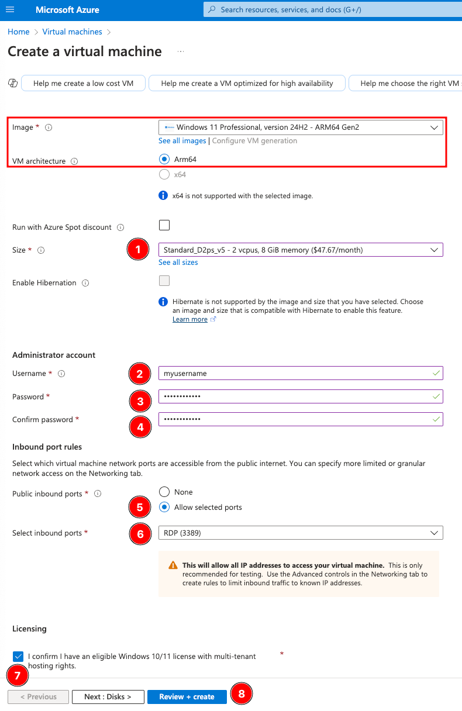

The validation and confirmation page appears.

20. Upon review and validation of your settings, select `Create` to launch your Windows on Arm virtual machine.

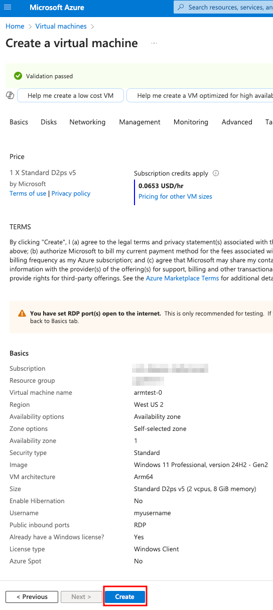

At this point, Azure will deploy your new Windows on Arm instance to the Azure cloud.  This may take a few moments to complete.

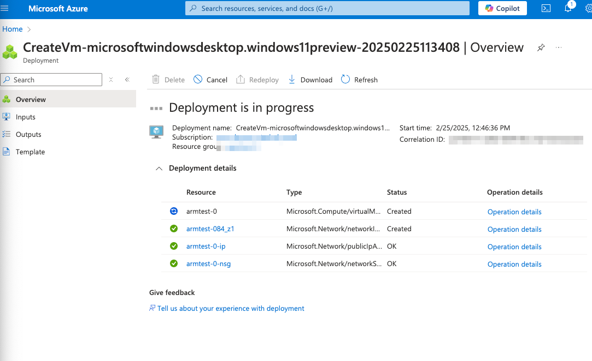

Upon completion, your screen will look similar to:

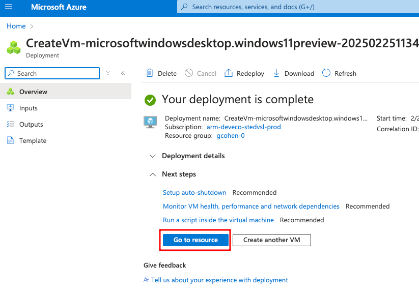

21. Click `Go to Resource`.

From this resource page, note the `Public IP address` of your virtual machine, as you will use in the next step to connect to your VM instance. 

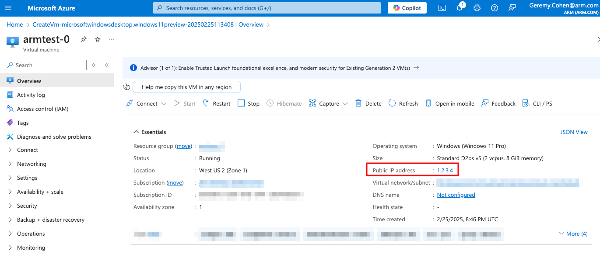

## Connect to your Windows on Arm VM

1. On your local host PC, launch your RDP client application.

{}
In our example, we use the `Remote Desktop Connection` app as our RDP client, but you may choose any RDP client to use.   
{}

2. Enter the `Public IP Address` you wrote down earlier as the `Computer` or remote host/IP to connect to.

3. Enter the username and password you set earlier while creating the VM instance.

4. Click connect.

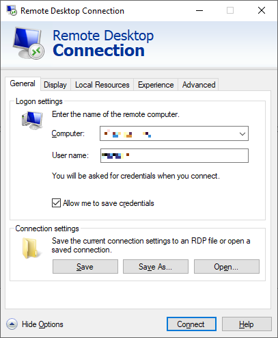

You can now interact with the VM in the same way as you would a local desktop.

If you have issues connecting to your instance, see this Microsoft article:
* [How to connect using Remote Desktop and sign on to an Azure virtual machine running Windows](https://learn.microsoft.com/en-us/azure/virtual-machines/windows/connect-rdp)

## Explore your VM

Open `Control Panel` > `System`, and verify that `Device` > `System Type` identifies as an Arm-based processor.

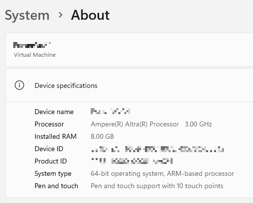
