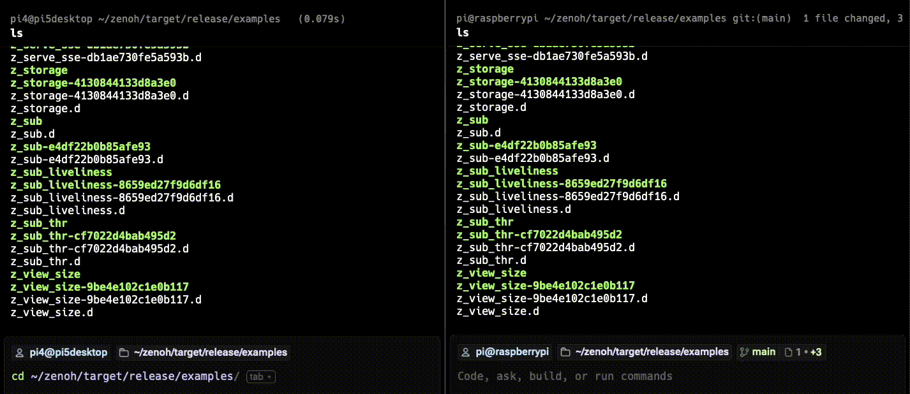

## Test Zenoh pub/sub across two devices

This example demonstrates how to use Zenoh’s real-time publish/subscribe model to exchange messages between two Raspberry Pi devices over a local network.

Pub/sub is a core Zenoh communication pattern where data producers (publishers) send values to a key, and data consumers (subscribers) receive updates for matching key expressions. In this case, the subscriber listens for all messages published under the key expression `demo/example/**`, which matches any topic that begins with `demo/example/`. This enables flexible topic filtering and lightweight data dissemination across distributed systems.

## Start the subscriber node

Run the subscriber example on one of the Raspberry Pi systems:

```bash
cd ~/zenoh/target/release/examples
./z_sub
```

## Start the publisher node

Then, log in to the other Raspberry Pi and run the publisher:

```bash
cd ~/zenoh/target/release/examples
./z_pub
```

{}
You can run both `z_sub` and `z_pub` on the same device for testing, but running them on separate Raspberry Pis demonstrates Zenoh’s distributed discovery and cross-node communication.
{}

## Observe the pub/sub data flow

The results are shown below:



The left-side window shows the `z_sub` program. It receives values with the key `demo/example/zenoh-rs-pub` continuously published by `z_pub` running in the right-side window.

This example confirms that Zenoh’s zero-configuration peer discovery and real-time pub/sub communication are working correctly across physical nodes.

