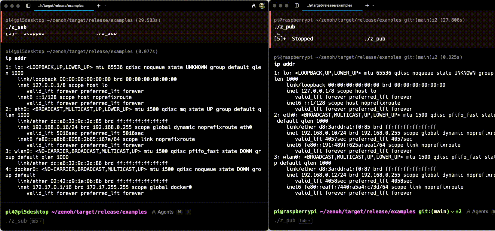

## Run Zenoh in Multi-Node Environment

This section illustrates the procedures to run the Zenoh examples so as to demonstrate the primary capabilities of Zenoh
1.	Basic Pub/Sub – for real-time message distribution
2.	Query and Storage – to persist and retrieving historical data
3.	Queryable – to enable on-demand remote computation

The source of the examples written in Rust and Python will be provided, and both are interoperable. The Rust binaries are already available under:

They are located in the `$ZENOH_LOC/target/release/examples/` directory. 

## Example 1: Simple Pub/Sub

This first test demonstrates Zenoh’s real-time publish/subscribe model using two Raspberry Pi devices.

The following command is to initiate a subscriber for a key expression `demo/example/**`, i.e. a set of topics starting with the path `demo/example`.

### Step 1: Run Subscriber

Log in to Pi using any of the methods:

```bash
cd zenoh/target/release/examples
./z_sub
```

### Step 2: Run Publisher

Then, log in to another machine Pi.

```bash
cd zenoh/target/release/examples
./z_pub
```

The result will look like: 


In the left-side window, I have logged into the device Pi4 and run the z_sub program. 
It receives values with the key `demo/example/zenoh-rs-pub` continuously published by z_pub running on Pi in the right-side window.

This basic example shows Zenoh’s zero-config discovery and low-latency pub/sub across physical nodes.


## Example 2: Storage and Query

Building on the previous Pub/Sub example, you’ll now explore how Zenoh supports `persistent data storage` and `on-demand querying` -- a powerful feature for robotics and IIoT applications.

In a typical warehouse or factory scenario, autonomous robots may periodically publish sensor data (e.g., position, temperature, battery level), and a central system—or another robot—may later need to query the latest state of each unit. 

Unlike Pub/Sub, which requires live, real-time message exchange, Zenoh’s storage and query model enables asynchronous access to data that was published earlier, even if the original publisher is no longer online.

In this example, you’ll run the zenohd daemon with in-memory storage and use z_put to publish data and z_get to retrieve it.

This is especially useful for distributed systems where nodes may intermittently connect or request snapshots of state from peers.


### Step 1: Start the Zenoh Daemon with In-Memory Storage

On one Raspberry Pi, launch the Zenoh daemon with a configuration that enables in-memory storage for keys under demo/example/**:

```bash
cd ~/zenoh/target/release/
./zenohd --cfg='plugins/storage_manager/storages/demo:{key_expr:"demo/example/**",volume:"memory"}' &
```

This starts the Zenoh daemon with in-memory storage support. 

You should see log messages indicating that the storage_manager plugin is loaded.
If port 7447 is already in use, either stop any previous Zenoh processes or configure a custom port using the listen.endpoints.router setting.

### Step 2: Publish Data

On 2nd device, use z_put to send a key-value pair that will be handled by the zenohd storage:

```bash
cd ~/zenoh/target/release/examples
./z_put -k demo/example/test1 -p "Hello from storage!"
```

This command stores the string `Hello from storage!` under the key demo/example/test1.


### Step 3: Query the Data

Back on first Raspberry Pi, you can now query the stored data from any Zenoh-connected node:

```bash
cd ~/zenoh/target/release/examples
./z_get -s demo/example/test1
```

You should see an output similar to:

```bash
Sending Query 'demo/example/test1'...
>> Received ('demo/example/test1': 'Hello from storage!')
```

{}
If you have more than two Raspberry Pi devices, you can run the z_get command on a third RPi to validate that storage queries work seamlessly across a multi-node setup.
{}

This example shows how Zenoh’s Storage + Query model supports asynchronous data access and resilient state-sharing—critical capabilities in robotics and industrial IoT systems where network connectivity may be intermittent or system components loosely coupled.


## Example 3: Computation on Query using Queryable

In this final example, you’ll explore Zenoh’s queryable capability, which lets a node dynamically respond to data queries by executing a custom computation or data generation function.

Unlike zenohd which simply returns stored data, a queryable node can register to handle a specific key expression and generate responses at runtime. This is ideal for distributed computing at the edge, where lightweight devices—such as Raspberry Pi nodes—can respond to requests with calculated values (e.g., sensor fusion, AI inference results, or diagnostics).

### Use Case: On-Demand Battery Health Estimation

Imagine a robot fleet management system where the central planner queries each robot for its latest battery health score, which is not published continuously but calculated only when queried.

This saves bandwidth and enables edge compute optimization using Zenoh’s Queryable.

### Step 1: Launch a Queryable Node

On one Raspberry Pi device, run the built-in Zenoh example to register a queryable handler.

```bash
cd ~/zenoh/target/release/examples
./z_queryable
```

You'll see the output like:

```
pi@raspberrypi:~/zenoh/target/release/examples$ ./z_queryable
Opening session...
Declaring Queryable on 'demo/example/zenoh-rs-queryable'...
Press CTRL-C to quit...
```

The node is now ready to accept queries on the key demo/example/zenoh-rs-queryable and respond with a predefined message.

### Step 2: Trigger a Query from Another Node

On another Raspberry Pi device or terminal, run:

```bash
cd ~/zenoh/target/release/examples
./z_get -s demo/example/zenoh-rs-queryable
```

You should see:

```
./z_get -s demo/example/zenoh-rs-queryable
Opening session...
Sending Query 'demo/example/zenoh-rs-queryable'...
>> Received ('demo/example/zenoh-rs-queryable': 'Queryable from Rust!')
```

The value you receive comes not from storage, but from the computation inside the queryable handler.

### Real-World Application: Distributed Inference & Computation

This model enables edge-based intelligence, such as:
- Executing custom logic in response to a query (e.g., “calculate load average”)
- Triggering ML inference (e.g., “classify image X on demand”)
- Decentralized diagnostics (e.g., “report actuator status”)

Queryable is a key feature for data-in-use scenarios, allowing fine-grained, on-demand compute inside your Zenoh-powered architecture.

Next, you’ll extend this Queryable pattern to perform parameterized computation — simulating edge diagnostics and adaptive inference.