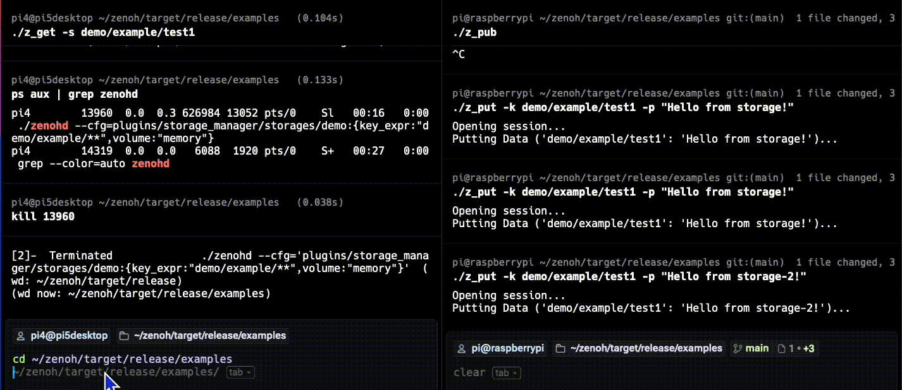

## Computation on query 

This example demonstrates Zenoh's queryable capability, which lets a node respond to incoming data requests by computing results in real time, rather than returning previously stored values.

Unlike `zenohd` which simply returns stored data, a queryable node can register to handle a specific key expression and generate responses at runtime. This is ideal for distributed computing at the edge, where lightweight devices, such as Raspberry Pi nodes, can respond to requests with calculated values. This enables sensor fusion, AI inference results, and diagnostics.

### Use case: estimate battery health on demand

Imagine a robot fleet management system where the central planner queries each robot for its latest battery health score, which is not published continuously but calculated only when queried.

This reduces bandwidth usage and enables edge-side optimization using Zenoh's queryable feature.

### Launch a queryable node

On one Raspberry Pi device, run the `z_queryable` Zenoh example to register a queryable handler.

```bash
cd ~/zenoh/target/release/examples
./z_queryable
```

You'll see the output:

```output
Opening session...
Declaring Queryable on 'demo/example/zenoh-rs-queryable'...
Press CTRL-C to quit...
```

The node is now ready to accept queries on the key `demo/example/zenoh-rs-queryable` and respond with a predefined message.

### Trigger a query from another node

On the other Raspberry Pi device, run the `z_get` example.

```bash
cd ~/zenoh/target/release/examples
./z_get -s demo/example/zenoh-rs-queryable
```

You should see:

```output
Opening session...
Sending Query 'demo/example/zenoh-rs-queryable'...
>> Received ('demo/example/zenoh-rs-queryable': 'Queryable from Rust!')
```

The result is shown below:



The value you receive is generated in real time by the function defined in the queryable handler, not from pre-stored data.


### Real-world application: distributed inference and computation

This model enables edge-based intelligence, such as:
- Executing custom logic in response to a query such as “calculate load average”
- Triggering ML inference such as “classify image X on demand”
- Decentralized diagnostics such as “report actuator status”

Queryable is a key feature for data-in-use scenarios, allowing fine-grained, on-demand compute inside your Zenoh-powered architecture.

## What's next

In the next example, you'll extend this queryable pattern to support **runtime parameters**, such as battery level and temperature, allowing each node to return a calculated health score on demand.

