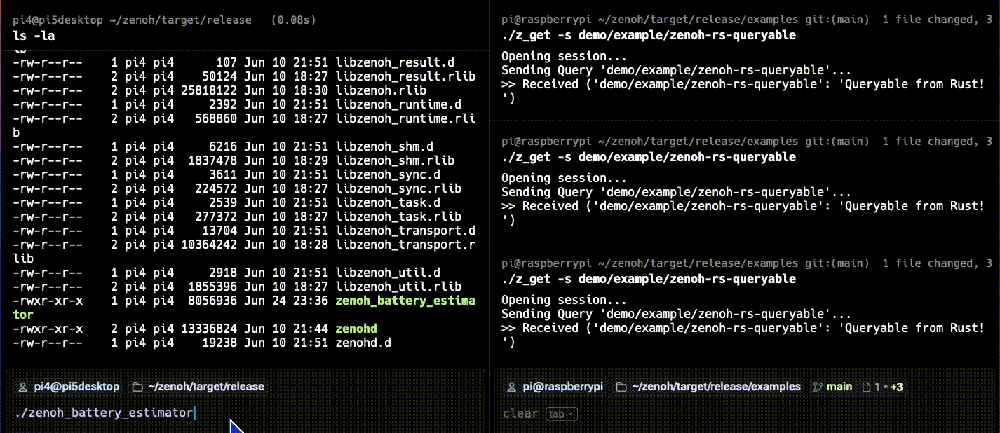

## Parameterized battery health estimation with Zenoh queryable

Finally, you’ll combine pub/sub, storage, and queryable components to simulate a distributed computation flow—demonstrating how Zenoh enables intelligent, coordinated edge systems.

You’ll learn how to use Zenoh's Queryable API in Rust to build a parameterized query system for estimating battery health at the edge. 

This extends a previous example by supporting runtime query parameters like battery level and temperature.

## Use Case: Real-time battery health via computation

In robotic fleet management, a central controller may need to assess each robot’s battery health on demand. 

Instead of streaming data continuously, robots expose a queryable endpoint that returns a real-time health score based on current battery level and temperature. 

This saves bandwidth and enables lightweight edge-side decision-making.

### Step 1: Create a new Zenoh rust project

On any Raspberry Pi:

```bash
cd ~/zenoh
cargo new zenoh_battery_estimator
```

Update following dependencies setting by editing the file  `$HOME/zenoh/zenoh_battery_estimator/Cargo.toml`

```toml
[dependencies]
zenoh = { path = "../zenoh" }
tokio = { version = "1", features = ["full"] }
url = "2"
```

### Step 2: Implement the queryable node

Next, log in to the other Raspberry Pi.

Replace the contents of `$HOME/zenoh/zenoh_battery_estimator/src/main.rs` with the code below.

```rust
use zenoh::{open, Config};
use std::collections::HashMap;
use url::form_urlencoded;

#[tokio::main]
async fn main() -> zenoh::Result<()> {
    let session = open(Config::default()).await?;

    let _queryable = session
        .declare_queryable("robot/battery/estimate")
        .callback(|query| {
            tokio::spawn(async move {
                let selector = query.selector();
                let key = selector.key_expr();

                let params = selector.parameters().as_str();

                let decoded: HashMap<_, _> =
                    form_urlencoded::parse(params.as_bytes()).into_owned().collect();

                let battery = decoded
                    .get("level")
                    .unwrap_or(&"50".to_string())
                    .parse::<u32>()
                    .unwrap_or(50);

                let temp = decoded
                    .get("temp")
                    .unwrap_or(&"25".to_string())
                    .parse::<u32>()
                    .unwrap_or(25);

                let health_score = 100 - (100 - battery) - ((temp.saturating_sub(25)) / 2);
                let response = format!("Estimated battery health: {}%", health_score);

                let _ = query.reply(key, response).await;
            });
        })
        .await?;

    println!("Queryable running on 'robot/battery/estimate'");
    tokio::signal::ctrl_c().await.unwrap();
    Ok(())
}
```

This edge node responds to real-time queries using Zenoh's Queryable API. It listens for requests on the robot/battery/estimate key and returns a calculated battery health score based on provided input parameters.

The program starts by establishing a Zenoh session using open(Config::default()). It then registers a queryable resource on the robot/battery/estimate key. Whenever this key is queried, a callback function is invoked asynchronously using tokio::spawn.

Inside the callback:
- Query parameters are extracted from the URL-style selector string.
- Two main parameters are used: level (battery percentage) and temp (temperature in Celsius).
- A health score is computed from these inputs.
- The result is sent back to the querying client using query.reply().

This design pattern enables efficient, on-demand data exchange with minimal bandwidth usage. This is ideal for edge computing scenarios where resources and connectivity are constrained.

The health score is calculated using the following logic:

```rust
let health_score = 100 - (100 - battery) - ((temp.saturating_sub(25)) / 2);
```

This formula estimates battery health as a percentage, considering both battery level and temperature:
- battery: Current battery level (default 50%)
- temp: Current temperature (default 25°C)

The health estimation logic begins with the battery level as the baseline score. 
If the temperature rises above 25°C, the score is adjusted downward—specifically, for every 2°C above this threshold, the health is reduced by 1%. 

To ensure the calculation remains safe even when the temperature is below 25°C, the code uses saturating_sub(25), which prevents the result from becoming negative and avoids potential underflow errors.

For example, if battery = 88 and temp = 32, then:
- Temperature offset = (32 - 25) / 2 = 3
- Health = 88 - 3 = 85%

### Step 3: Build and run

```bash
cd $HOME/zenoh/zenoh_battery_estimator
cargo build --release
```

After the build process, you will see:

```output
   Compiling zenoh_battery_estimator v1.4.0 (/home/ubuntu/zenoh_v1.4/zenoh_battery_estimator)
    Finished `release` profile [optimized] target(s) in 1m 22s
```

### Step 4: Query it with parameters

Run it on the Raspberry Pi you used for the build run: 

```bash
cd $HOME/zenoh/target/release/
./zenoh_battery_estimator
```

You can reuse the built-in Zenoh `z_get` CLI from the other Raspberry Pi.

```bash
cd ~/zenoh/target/release/examples
./z_get -s "robot/battery/estimate?level=88&temp=32"
```

The result is shown below:



The excepted output is:

```output
>> Received ('robot/battery/estimate': 'Estimated battery health: 85%')
```

You’ve just built a responsive, parameterized edge compute service using Zenoh's Queryable API in Rust. It's lightweight but a powerful pattern for real-time intelligence at the edge.

This approach not only minimizes network overhead but also enables each device to process and respond to context-aware queries on demand. 

It’s a strong foundation for building scalable, event-driven IoT systems that can adapt dynamically to operational needs.
