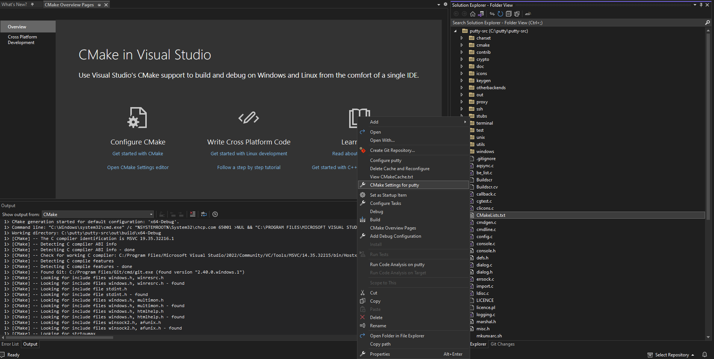

---
# User change
title: "Build a native windows application using LLVM for Windows on Arm"

weight: 2

layout: "learningpathall"
---

## Before you begin

Any Windows on Arm computer which has the required tools installed can be used for this learning path.

Follow the links to install the required tools. 

* [Visual Studio 2022 or higher](/install-guides/woa/#visual-studio). Install [LLVM support](https://learn.microsoft.com/en-us/cpp/build/clang-support-msbuild?view=msvc-170#install-1) in Visual Studio.
* [Strawberry Perl](https://strawberryperl.com/) 

For Windows on Arm computers, using the native toolchain is much faster than running an x86 build of Clang under emulation. 

## Compiling PuTTY natively on Windows on Arm with Clang

This section of the learning path describes how to use Clang to compile and build an application for Windows on Arm. The example application used in this learning path is PuTTY, an open-source SSH and telnet client.

To compile PuTTY on a Windows on Arm device, follow the steps outlined below:

1. Open a `Windows Powershell` prompt on your Windows machine.

2. Create a directory to use for the build, for example `C:\putty` and move into that directory.

```console
mkdir C:\putty
cd C:\putty
```
3. Download the PuTTY source archive into your build directory and unzip, using the command below
```console
wget https://the.earth.li/~sgtatham/putty/latest/putty-src.zip  -o putty-src.zip
Expand-Archive putty-src.zip
```

4. PuTTY uses a `cmake` build system. You can use Visual Studio's native support for CMake to build the PuTTY cmake project.
Open Microsoft Visual Studio. Select the `Open a Local folder` option. Browse and select the putty source directory (C:\putty\putty-src) which contains the `CmakeLists.txt` file.

 

The `Solution Explorer` pane in Visual Studio will display the folder structure and files in the putty source directory.

5. Visual Studio will run CMake and generate the CMake cache file `CMakeCache.txt` for the default configuration in the project which is `x64-Debug`. You need to change the configuration to build for Arm64 instead.
Right click on the `CMakeLists.txt` file in the `Solution Explorer` pane. Then, from the menu select `CMake settings for putty`. This opens up the `CMake Settings`. You can now add your new configuration to build PuTTY on your Windows Arm machine using the LLVM toolchain installed using the Visual Studio Installer. 



6. In `CMake Settings`, click on `+` sign to `Add a New Configuration`. Select `Arm64-Clang-Debug`. 


7. With the `Arm64-Clang-Debug` configuration selected, change the Toolset from the drop-down menu to `clang_cl_arm64`. 


8. Under `CMake variables and Cache` click on `Save and generate CMakeCache to load variables`. This will generate the `CMakeCache.txt` file for your new `Arm64-Clang-Debug` configuration.
   In the output window, you will see messages similar to:

```output
1> CMake generation started for configuration: 'arm64-Clang-Debug'.
1> Environment settings:
1>     CXXFLAGS=--target=arm64-pc-windows-msvc -fdiagnostics-absolute-paths
1>     CFLAGS=--target=arm64-pc-windows-msvc -fdiagnostics-absolute-paths
1> Command line: "C:\Windows\system32\cmd.exe" /c "%SYSTEMROOT%\System32\chcp.com 65001 >NUL && "C:\PROGRAM FILES\MICROSOFT VISUAL STUDIO\2022\COMMUNITY\COMMON7\IDE\COMMONEXTENSIONS\MICROSOFT\CMAKE\CMake\bin\cmake.exe"  -G "Ninja"  -DCMAKE_BUILD_TYPE:STRING="Debug" -DCMAKE_INSTALL_PREFIX:PATH="C:\putty\putty-src\out\install\arm64-Clang-Debug" -DCMAKE_C_COMPILER:FILEPATH="C:/PROGRAM FILES/MICROSOFT VISUAL STUDIO/2022/COMMUNITY/VC/Tools/Llvm/bin/clang-cl.exe"  -DCMAKE_MAKE_PROGRAM="C:\PROGRAM FILES\MICROSOFT VISUAL STUDIO\2022\COMMUNITY\COMMON7\IDE\COMMONEXTENSIONS\MICROSOFT\CMAKE\Ninja\ninja.exe" "C:\putty\putty-src" 2>&1"
1> Working directory: C:\putty\putty-src\out\build\arm64-Clang-Debug
1> [CMake] -- The C compiler identification is Clang 15.0.1 with MSVC-like command-line
1> [CMake] -- Detecting C compiler ABI info
1> [CMake] -- Detecting C compiler ABI info - done
```
From these messages, you can see that the Compiler being used to build the PuTTY application is Clang 15.0.1. This is the version of the LLVM toolchain installed with Visual Studio 2022. 

You can proceed and build your application with this LLVM toolchain version. Optionally, if you would like to build with a different version of LLVM installed on your machine, you will need to make a change in the CMake settings. At the time of writing, the latest version with Windows on Arm support is LLVM 16.0.0. Follow step 9, if you would like to build this application with LLVM 16.0.0. Otherwise, skip to step 10.

9. (Optional) Ensure you have downloaded and installed [LLVM 16.0.0](/install-guides/woa/#llvm-toolchain)

On `CMake Settings` page in Visual Studio, select the `Show advanced variables`checkbox under `CMake variables and cache`.
Change the value of `CMAKE_C_COMPILER` to point to the location where you have installed LLVM 16.0.0. For example: `C:\Program Files\LLVM\bin\clang-cl.exe`. Click on the `Save to JSON` checkbox next to this field and `Save`.

 

Saving this change will automatically trigger the CMake cache variables to be re-generated and loaded. You should see output similar to what is shown below:

```output
1> [CMake] -- The C compiler identification is Clang 16.0.0 with MSVC-like command-line
1> [CMake] -- Detecting C compiler ABI info
1> [CMake] -- Detecting C compiler ABI info - done
```
Notice, the Clang version is now 16.0.0.

10. In `Solutions Explorer` navigate to `cmake`-> `platforms` directory and open the `windows.cmake` file. 

Search for `/C1252` in this file and replace with `-c1252`

After the change, it should look like:
```output
  set(CMAKE_RC_FLAGS "${CMAKE_RC_FLAGS} /nologo -c1252")
```
The cmake helper tool `cmcldeps.exe` has an issue understanding the entire command-line syntax with "/" used to to pass a command-line option. So we switch to use "-" instead to pass the command line option.

11. Finally, select `Build->Build-All`.

When the build process completes, there will be a new executable putty.exe in your configuration build folder (C:\putty\putty-src\out\build\arm64-Clang-Debug). This is the PuTTY application that you natively compiled on your Windows Arm machine with the LLVM toolchain. Double-click it to run and check that it works on your Windows on Arm device. 

If you right click on the PuTTY application and select `Properties`, on the `Compatibility` tab you will see the `Windows on Arm` emulation settings are disabled. This shows the application was natively built for Windows on Arm.


