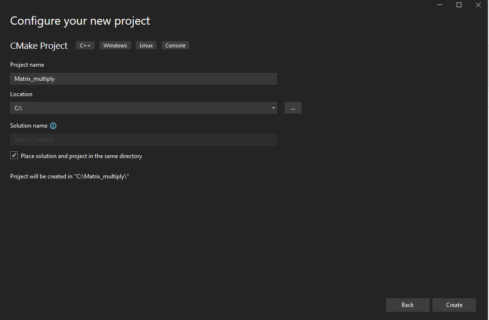
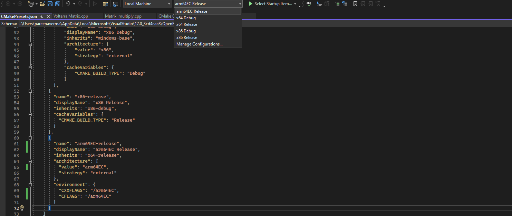
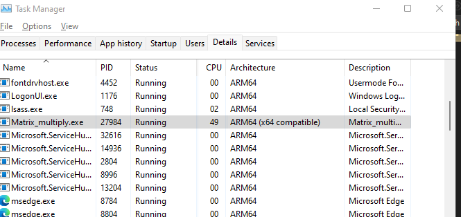

## Before you begin

You will need a Arm computer running Windows 11 to use Arm64EC.

You also need to [install Visual Studio 2022 or higher](/install-guides/vs-woa) on your machine.

## Overview of Arm64EC

Arm64EC (Emulation Compatible) is an application binary interface for applications running on Arm devices with Windows 11. 

With Arm64EC, you can build new native applications and migrate existing x86 or x64 applications to devices using the Arm architecture. Traditionally, applications are compiled for a specific target architecture and require integration of third party libraries. This makes migrating an application built for the x86 or x64 architecture to the Arm architecture difficult as you have to recompile the entire application and its dependencies. 

Arm64EC makes this process easier as it gives you the capability to rebuild parts of your application that don't support Arm yet as Arm64EC. Code built as Arm64EC is interoperable with code built as x64 running under emulation and lets you take advantage of the native speed and performance of Arm based devices.

## Use Arm64EC with a C++ application

In this Learning Path, you will build and run a C++ application on a Windows 11 Arm machine using Arm64EC. 

1. Launch Visual Studio. From the Get started options, select **Create a new project**. Select the **CMake Project** template and click **Next**:


2. Enter a Project Name (Matrix_multiply) and select the Location where you want to save your new project. You can also select the checkbox to **Place solution and project in the same directory** as shown and then click **Create**:



3. A project will be created and the CMake generation will automatically start for the default configuration: `x64 Debug`. 

Visual Studio adds 4 configurations to your project:

- x64 Debug
- x64 Release
- x86 Debug
- x86 Release

You can check the configurations by inspecting the `CMakePresets.json` file in your project.

4. Open up the `Matrix_multiply.cpp` file from the `Solution Explorer` pane on the right.

Delete all the code in this file, and copy the code shown below into the file instead:

```console
#include "Matrix_multiply.h"
#include <chrono>
#include <random>

using namespace std;

double** generateRandomSquareMatrix(int size) {
    // Initialize random number generator
    random_device random_device;
    default_random_engine engine(random_device());

    // Prepare uniform distribution 
    uniform_real_distribution uniform_distribution;

    // Generate matrix
    double** matrix = new double*[size];

    for (int i = 0; i < size; i++) {
        matrix[i] = new double[size];

        for (int j = 0; j < size; j++) {
            matrix[i][j] = uniform_distribution(engine);
        }
    }

    return matrix;
}

void printSquareMatrix(double** matrix, int size) {
    for (int i = 0; i < size; i++) {

        for (int j = 0; j < size; j++) {
            cout << fixed << setprecision(4) << matrix[i][j] << " ";
        }

        cout << endl;
    }
}

double** squareMatrixProduct(double** matrix1, double** matrix2, int size)
{
    double** result = new double*[size];

    for (int i = 0; i < size; i++) {
        result[i] = new double[size];

        for (int j = 0; j < size; j++) {

            result[i][j] = 0;

            for (int k = 0; k < size; k++) {
                result[i][j] += matrix1[i][k] * matrix2[k][j];
            }
        }
    }

    return result;
}

void releaseSquareMatrix(double** matrix, int size) {
    for (int i = 0; i < size; i++) {
        delete[] matrix[i];
    }

    delete[] matrix;
}

void simpleTest() {
    const int size = 3;

    double** matrix1 = generateRandomSquareMatrix(size);
    double** matrix2 = generateRandomSquareMatrix(size);

    cout << "Matrix1:" << endl;
    printSquareMatrix(matrix1, size);

    cout << endl << "Matrix2:" << endl;
    printSquareMatrix(matrix2, size);

    cout << endl << "Product:" << endl;
    double** product = squareMatrixProduct(matrix1, matrix2, size);
    printSquareMatrix(product, size);

    releaseSquareMatrix(matrix1, size);
    releaseSquareMatrix(matrix2, size);
    releaseSquareMatrix(product, size);
}

double msElapsedTime(chrono::system_clock::time_point start) {
    auto end = chrono::system_clock::now();

    return chrono::duration_cast<chrono::milliseconds>(end - start).count();
}

chrono::system_clock::time_point now() {
    return chrono::system_clock::now();
}

void performanceTest(int size, int trialCount) {
    double** matrix1, ** matrix2, ** product;

    auto start = now();

    for (int i = 0; i < trialCount; i++) {
        matrix1 = generateRandomSquareMatrix(size);
        matrix2 = generateRandomSquareMatrix(size);

        product = squareMatrixProduct(matrix1, matrix2, size);

        releaseSquareMatrix(matrix1, size);
        releaseSquareMatrix(matrix2, size);
        releaseSquareMatrix(product, size);
    }

    auto elapsedTime = msElapsedTime(start);

    cout << "Matrix size: " << size << "x" << size
        << ", Trial count: " << trialCount 
        << ", Elapsed time [s]: " << fixed << setprecision(2) << elapsedTime / 60 << endl;
}

int main(int argc, char** argv)
{
    //simpleTest();
  
    // Performance testing
    if (argc < 2)
    {
        cout << "Trial count is missing." << endl;
        return 0;
    }

    const int szCount = 5;
    int size[szCount] {100, 200, 300, 400, 500};

    int trialCount = stoi(argv[1]);

    for (int i = 0; i < szCount; i++) {
        performanceTest(size[i], trialCount);
    }

    cout << endl;

	return 0;
}
```

Save the changes. 

The function `performanceTest` calculates the product of two pseudo-randomly generated square matrices of different sizes and measures the execution time. You will use the execution time to compare the performance of the application built with different configurations in future steps.

5. Select the `x64 Release` configuration option from the drop-down menu on top. This will automatically trigger the CMake generation for this x64 Release configuration.

The output is shown below:

```output
[CMake] -- Generating done
1> [CMake] -- Build files have been written to: C:/Matrix_multiply/out/build/x64-release
1> Extracted CMake variables.
1> Extracted source files and headers.
1> Extracted code model.
1> Extracted toolchain configurations.
1> Extracted includes paths.
1> CMake generation finished. 
``` 

6. Select Build-> Build All.

The output is shown below:

```output
>------ Build All started: Project: Matrix_multiply, Configuration: x64-release ------
  [1/2] Building CXX object CMakeFiles\Matrix_multiply.dir\Matrix_multiply.cpp.obj
C:\Matrix_multiply\Matrix_multiply.cpp(92): warning C4244: 'return': conversion from '_Rep' to 'double', possible loss of data
          with
          [
              _Rep=__int64
          ]
  [2/2] Linking CXX executable Matrix_multiply.exe

Build All succeeded.
```
You will run the `x64 Release` executable in a future step.

7. Open up the `CMakePresets.json` file from the Solution explorer pane. Add a new configuration `arm64EC-release` to the end of this file by copying the code below into the file:

```console
{ 
      "name": "arm64EC-release", 
      "displayName": "arm64EC Release", 
      "inherits": "x64-release", 
      "architecture": { 
        "value": "arm64EC", 
        "strategy": "external" 
      }, 
      "environment": { 
        "CXXFLAGS": "/arm64EC", 
        "CFLAGS": "/arm64EC" 
      } 
    } 
```
{}
Make sure to add a comma at the end of the previous configuration in the file otherwise the code gets highlighted with syntax errors.
The default ninja generator requires the `CXXFLAGS` and `CFLAGS` environment variables to be set with the values as shown to build the code as Arm64EC.
{}

Save the changes to the file. A new configuration name called `arm64EC Release` will show up on the drop-down list of configurations as shown:



8. Select this new configuration `arm64EC Release` from the drop-down configurations menu. This will automatically trigger the CMake generation for the new configuration

You should see output as shown below:

```output
1> [CMake] -- Build files have been written to: C:/Matrix_multiply/out/build/arm64EC-release
1> Extracted CMake variables.
1> Extracted source files and headers.
1> Extracted code model.
1> Extracted toolchain configurations.
1> Extracted includes paths.
1> CMake generation finished.
```

9. Select `Build->Build All` with this configuration selected.

You should see the following output:

```output
>------ Build All started: Project: Matrix_multiply, Configuration: arm64EC-release ------
  [1/2] Building CXX object CMakeFiles\Matrix_multiply.dir\Matrix_multiply.cpp.obj
C:\Matrix_multiply\Matrix_multiply.cpp(92): warning C4244: 'return': conversion from '_Rep' to 'double', possible loss of data
          with
          [
              _Rep=__int64
          ]
  [2/2] Linking CXX executable Matrix_multiply.exe

Build All succeeded.
```
You have now successfully built this application with the `arm64EC Release` configuration.

10. You can now run the same application you built with two different configurations: `x64 Release` and `arm64EC Release` on your Windows 11 Arm machine and compare the performance.

{}
Change the path below if you created the project in a different location. 
{}

Open a Windows PowerShell prompt and navigate to the build directory with the 2 configurations:

```console
 cd C:\Matrix_multiply\out\build 
```

Run the application built with `x64 Release` configuration. Pass a command line argument for the number of times you want to perform the calculations (50 in this example):

```console
.\x64-release\Matrix_multiply.exe 50
```

The output will be similar to:

```output
Matrix size: 100x100, Trial count: 50, Elapsed time [s]: 1.52
Matrix size: 200x200, Trial count: 50, Elapsed time [s]: 6.67
Matrix size: 300x300, Trial count: 50, Elapsed time [s]: 21.55
Matrix size: 400x400, Trial count: 50, Elapsed time [s]: 50.53
Matrix size: 500x500, Trial count: 50, Elapsed time [s]: 193.53
```

11. Now run the same application built with the `arm64EC Release` configuration. Pass the same count as before for the number of calculations:

```console
.\arm64EC-release\Matrix_multiply.exe 50
``` 

While the application is running, open up the Windows Task Manager. Click on the `Details` tab and look for the `Matrix_multiply.exe` application. Under the Architecture column it shows as `Arm64(x64 compatible)`:



The output from the application will be similar to:

```output
Matrix size: 100x100, Trial count: 50, Elapsed time [s]: 0.93
Matrix size: 200x200, Trial count: 50, Elapsed time [s]: 5.52
Matrix size: 300x300, Trial count: 50, Elapsed time [s]: 20.00
Matrix size: 400x400, Trial count: 50, Elapsed time [s]: 46.32
Matrix size: 500x500, Trial count: 50, Elapsed time [s]: 133.90
```
{}
The time taken will vary based on the machine you are using. The output shown is from the application running on a Lenovo ThinkPad X13s.
Notice the performance improvement from running the application as Arm64EC versus x64.
{}

You have successfully created and run an application using Arm64EC. 
