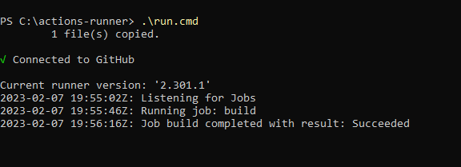
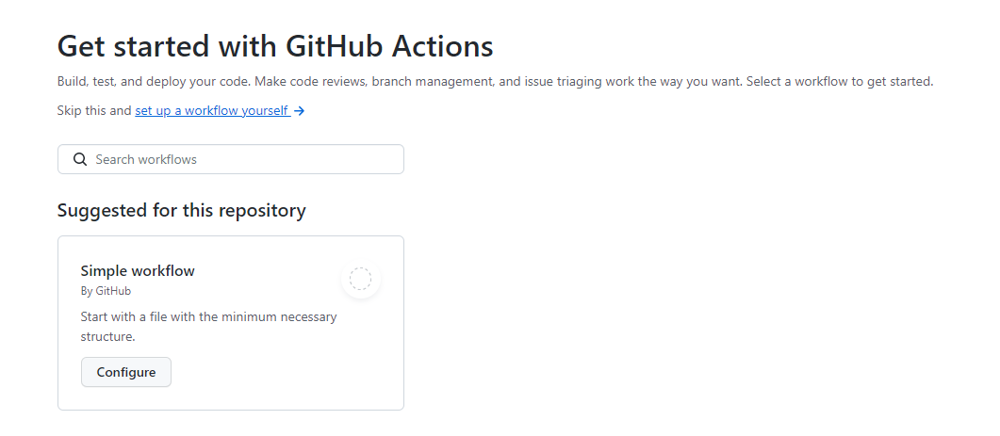

---
# User change
title: "Setup your Windows on Arm Virtual machine in Azure as a GitHub self-hosted runner"

weight: 3 # 1 is first, 2 is second, etc.

# Do not modify these elements
layout: "learningpathall"
---
You will learn how to setup the Windows Virtual Machine you previously created as a GitHub self-hosted runner"

## Prerequisites

A valid [GitHub](https://github.com) account.

GitHub requires that a [Personal Access Token](https://docs.github.com/en/authentication/keeping-your-account-and-data-secure/creating-a-personal-access-token) be set. If you do not have this on your account
already, navigate to `Settings` > `Developer Settings` > `Personal Access Tokens`, click on `Generate new token`, and save the token locally.

## Create a new GitHub repository 

We will create a new repository in GitHub to test a simple hello world commnd running on the Windows Arm VM using GitHub Actions for CI/CD.

Log in using your GitHub account. Select the [New Button](https://github.com/new) to create a new repository. Give the repository a name. Then select `Create Repository`. 

## Setup the Windows on Arm virtual machine as a GitHub self-hosted runner

Select the `Settings` tab in your currently empy repository. Now on the left pane, select `Actions->Runners`. On the `Runners` page, select the `New self-hosted runner` button. You will be presented with options to choose the Operating system and architecture for your runner. Select `Windows` and `ARM64`. The instructions to download and configure your Windows Arm runner are displayed. Copy each of the commands under the `Download` and `Configure` section.

Open a Windows PowerShell on your Windows Arm VM you have connected to via the Remote Desktop Application. In your PowerShell window, paste each of the commands you copied. On the execution of the last command `./run.cmd` you will output similar to what is shown below.



Return to the `Actions->Runners` page in your GitHub repository and you should now see your runner displayed similar to what is shown below


You are now ready to test a simple CI/CD GitHub Actions workflow on your Windows on Arm runner.

## Create and run a simple CI/CD GitHub Actions workflow on your Windows on Arm VM

To test this CI/CD workflow, select `Actions`. You will be presented with the option to start with a Simple workflow that gives you a file with the minimum necessary structure to build, test and deploy your code. Select the `Configure` button.



A file named `blank.yml` will be created for you under <your-repo-name>/.github/workflows/. This simple workflow file contains the minimal steps that you will need to test and deploy a hello world command on a GitHub runner. Runners are the machines that execute the jobs in the GitHub Actions workflow.

In the `blank.yml` file, look out for the following line:

```console
runs-on: ubuntu-latest
```
This line specifies the type of machine or runner that will be used to execute the job. In the default case, this is an Ubuntu machine provided by GitHub. We want to test our CI workflow on the Windows Arm VM we configured as a GitHub Actions runner. To do that, change the `runs-on` on `self-hosted` as shown in `blank.yml`

```console
runs-on: self-hosted
```

With this change made, go ahead and select `Start commit` button followed by `Commit new file`.

This commit will trigger the GitHub Actions workflow on the Windows Arm virtual machine. You can now check the status of your workflow on the `Actions` tab in your repository. You should see it successfully complete. Congratulations, you have successfully run a simple GitHub Actions CI/CD workflow on your Windows on Arm virtual machine.


