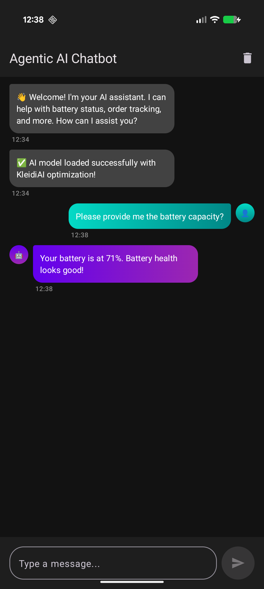

## Preparing for Production Deployment

Now that you have a working Agentic AI chatbot, let's discuss how to deploy it to real users on Android devices.

## 1. Model Packaging and Asset Management

### Bundling the Model with Your App

The `.pte` model file is typically 500MB-2GB. You have several options:

#### Option A: Bundle in APK (Small Models Only)
For models under 100MB, include in `app/src/main/assets/`:

```
app/
  src/
    main/
      assets/
        llama3_1B_kleidiai.pte
        tokenizer.bin
```

**Pros:** No download required  


#### Option B: On-Demand Download (Recommended)
Download the model on first launch using Android's Asset Delivery:

```kotlin
// ModelDownloader.kt
class ModelDownloader(private val context: Context) {
    
    suspend fun downloadModel(): Result<File> = withContext(Dispatchers.IO) {
        try {
            val modelUrl = "https://your-cdn.com/models/llama3_1B_kleidiai.pte"
            val modelFile = File(context.filesDir, "llama_model.pte")
            
            if (modelFile.exists()) {
                return@withContext Result.success(modelFile)
            }
            
            // Download with progress
            val request = DownloadManager.Request(Uri.parse(modelUrl))
                .setDestinationUri(Uri.fromFile(modelFile))
                .setTitle("Downloading AI Model")
                .setDescription("Setting up your AI assistant...")
                
            val downloadManager = context.getSystemService(Context.DOWNLOAD_SERVICE) as DownloadManager
            downloadManager.enqueue(request)
            
            Result.success(modelFile)
        } catch (e: Exception) {
            Result.failure(e)
        }
    }
}
```


## 2. Memory Management

### Handling Low-Memory Devices

Not all Android devices have 16GB RAM. Implement graceful degradation:

```kotlin
// MemoryManager.kt
class MemoryManager(private val context: Context) {
    
    fun getRecommendedModelSize(): ModelSize {
        val activityManager = context.getSystemService(Context.ACTIVITY_SERVICE) as ActivityManager
        val memInfo = ActivityManager.MemoryInfo()
        activityManager.getMemoryInfo(memInfo)
        
        val totalRamGB = memInfo.totalMem / (1024.0 * 1024.0 * 1024.0)
        
        return when {
            totalRamGB >= 12 -> ModelSize.LARGE_3B  // Llama 3.2 3B
            totalRamGB >= 8 -> ModelSize.MEDIUM_1B  // Llama 3.2 1B
            else -> ModelSize.SMALL_500M            // Fallback to smaller model
        }
    }
    
    fun monitorMemoryUsage() {
        val runtime = Runtime.getRuntime()
        val usedMemory = (runtime.totalMemory() - runtime.freeMemory()) / (1024 * 1024)
        
        if (usedMemory > 1500) { // Over 1.5GB
            Log.w("MemoryManager", "High memory usage: ${usedMemory}MB")
            // Consider unloading model temporarily
        }
    }
}
```

### Model Unloading

Unload the model when the app goes to background:

```kotlin
// MainActivity.kt
override fun onStop() {
    super.onStop()
    if (isFinishing) {
        modelRunner.unloadModel()
    }
}
```

## 3. Battery Optimization

AI inference is power-intensive. Implement battery-aware features:

```kotlin
// BatteryOptimizer.kt
class BatteryOptimizer(private val context: Context) {
    
    fun shouldThrottleInference(): Boolean {
        val batteryManager = context.getSystemService(Context.BATTERY_SERVICE) as BatteryManager
        val batteryLevel = batteryManager.getIntProperty(BatteryManager.BATTERY_PROPERTY_CAPACITY)
        val isCharging = batteryManager.isCharging
        
        return when {
            batteryLevel < 15 && !isCharging -> true  // Critical battery
            batteryLevel < 30 && !isCharging -> true  // Low battery
            else -> false
        }
    }
    
    fun getInferenceConfig(): InferenceConfig {
        return if (shouldThrottleInference()) {
            InferenceConfig(
                maxTokens = 50,           // Shorter responses
                temperature = 0.0,        // Greedy decoding (faster)
                enableKVCache = true      // Reuse cache
            )
        } else {
            InferenceConfig(
                maxTokens = 200,
                temperature = 0.7,
                enableKVCache = true
            )
        }
    }
}
```

## 4. Privacy and Security

### On-Device Processing Benefits
- No data sent to cloud
- Works offline


### Secure Storage

If storing conversation history, encrypt it:

```kotlin
// SecureStorage.kt
class SecureStorage(private val context: Context) {
    
    private val masterKey = MasterKey.Builder(context)
        .setKeyScheme(MasterKey.KeyScheme.AES256_GCM)
        .build()
    
    private val sharedPreferences = EncryptedSharedPreferences.create(
        context,
        "chat_history",
        masterKey,
        EncryptedSharedPreferences.PrefKeyEncryptionScheme.AES256_SIV,
        EncryptedSharedPreferences.PrefValueEncryptionScheme.AES256_GCM
    )
    
    fun saveConversation(userId: String, messages: List<Message>) {
        val json = Gson().toJson(messages)
        sharedPreferences.edit().putString(userId, json).apply()
    }
}
```

## 5. Error Handling and Fallbacks

### Graceful Degradation

```kotlin
// AgentOrchestrator.kt (Enhanced)
suspend fun chat(userMessage: String): String {
    return try {
        // Attempt agentic response
        val response = performAgenticInference(userMessage)
        response
    } catch (e: OutOfMemoryError) {
        // Fallback: Unload model and show error
        modelRunner.unloadModel()
        "I'm experiencing memory issues. Please restart the app."
    } catch (e: ModelInferenceException) {
        // Fallback: Use cached responses or simple rules
        getCachedResponseOrFallback(userMessage)
    } catch (e: Exception) {
        Log.e("AgentOrchestrator", "Unexpected error", e)
        "I encountered an error. Please try again."
    }
}

private fun getCachedResponseOrFallback(query: String): String {
    // Simple rule-based fallback
    return when {
        query.contains("battery", ignoreCase = true) -> 
            "Please check your battery settings in the system menu."
        query.contains("order", ignoreCase = true) -> 
            "Please check your order status in the Orders section."
        else -> 
            "I'm currently unable to process your request. Please try again later."
    }
}
```

## 6. Performance Monitoring

### Track Key Metrics

```kotlin
// PerformanceMonitor.kt
class PerformanceMonitor {
    
    data class InferenceMetrics(
        val latency: Long,           // ms
        val tokensGenerated: Int,
        val tokensPerSecond: Double,
        val memoryUsed: Long,        // MB
        val batteryDrain: Int        // %
    )
    
    fun logInference(metrics: InferenceMetrics) {
        // Send to analytics (Firebase, etc.)
        FirebaseAnalytics.getInstance(context).logEvent("ai_inference") {
            param("latency_ms", metrics.latency)
            param("tokens_per_sec", metrics.tokensPerSecond)
            param("memory_mb", metrics.memoryUsed)
        }
        
        // Log locally for debugging
        Log.d("Performance", "Inference: ${metrics.tokensPerSecond} tok/s, ${metrics.latency}ms")
    }
}
```

## 7. User Experience Enhancements

### Loading States

```kotlin
// ChatViewModel.kt
sealed class ChatState {
    object Idle : ChatState()
    object Loading : ChatState()
    data class Thinking(val action: String) : ChatState()  // "Checking battery..."
    data class Success(val message: String) : ChatState()
    data class Error(val error: String) : ChatState()
}

fun sendMessage(input: String) {
    viewModelScope.launch {
        _chatState.value = ChatState.Loading
        
        val response = agentOrchestrator.chat(input)
        
        _chatState.value = ChatState.Success(response)
    }
}
```

### Show Agent Actions to User

When the agent calls a tool, show it in the UI:

```kotlin
// In AgentOrchestrator.kt
if (response.contains("ACTION:")) {
    val toolName = extractToolName(response)
    
    // Notify UI
    onAgentAction?.invoke("🔧 $toolName")  // "🔧 Checking battery status..."
    
    val toolResult = toolRegistry.execute(response)
    // ... continue
}
```

## 8. Testing on Real Devices

### Device Testing Matrix

Test on a variety of devices:

| Device | Chipset | RAM | Expected Performance |
|--------|---------|-----|---------------------|
| Pixel 8 Pro | Tensor G3 | 12GB | ~35 tok/s |
| OnePlus 11 | Snapdragon 8 Gen 2 | 16GB | ~40 tok/s |


### Beta Testing Checklist

- [ ] Model loads successfully on first launch
- [ ] Inference works offline
- [ ] Battery drain is acceptable (<5% per 10 messages)
- [ ] App doesn't crash on low-memory devices
- [ ] Tool calling works reliably
- [ ] UI remains responsive during inference
- [ ] Conversation history persists across sessions


### App Description Template

```
🤖 AI Assistant - Your Personal On-Device AI

Experience the power of AI without compromising privacy. Our chatbot runs 
entirely on your device using advanced Arm optimization (KleidiAI + ExecuTorch).

- 100% Private - No data sent to cloud
- Works Offline - No internet required after setup
- Fast & Efficient - Optimized for Arm processors
- Agentic AI - Can check battery, orders, and more

Powered by Meta's Llama 3.2 and Arm's KleidiAI technology.
```

## Summary

Agentic AI Chatbot is now production-ready with:
- Optimized model deployment
- Memory and battery management
- Privacy-first architecture
- Robust error handling
- Performance monitoring
- Excellent user experience


