# Using Edge Impulse to Train TinyML Models

Now that the foundational concepts of TinyML and Edge AI are clear, it's time to move from theory to practice. One of the most accessible and easy to use platforms for training TinyML models is **Edge Impulse**. It provides an intuitive, end-to-end pipeline for collecting data, designing features, training models, and deploying them to edge devices. In this section, we will explore how Edge Impulse is used to train models specifically for ultra-low-power microcontrollers, bridging the gap between machine learning and real-world embedded applications.

## What is Edge Impulse?

**Edge Impulse** is a development platform designed to simplify the process of building, training, and deploying machine learning (ML) models on **embedded systems and edge devices**, such as microcontrollers, sensors, and single-board computers (e.g., Raspberry Pi, Arduino).

## Key Features of Edge Impulse

| Feature               | Description                                                                                         |
|-----------------------|-----------------------------------------------------------------------------------------------------|
| **Data Collection**   | Collects data from sensors (e.g., accelerometers, microphones, cameras) in real time.              |
| **Preprocessing**     | Provides tools for signal processing and feature extraction tailored for embedded systems.          |
| **Model Training**    | Supports built-in ML algorithms and integrates with frameworks like TensorFlow.                     |
| **Edge Optimization** | Automatically optimizes models to run efficiently on low-power edge hardware.                      |
| **Deployment**        | Enables seamless deployment to microcontrollers, RTOS-based boards, and Linux devices.             |
| **Web-Based Platform**| Fully browser-based interface for managing projects and workflows without needing local setup.     |

---

## Why It’s Important in Edge AI and TinyML

- **Bridges the gap** between machine learning and embedded development.
- **Accelerates prototyping** and deployment of AI features directly on hardware.
- **Supports TinyML** applications that run on devices with very limited memory and compute power.
- Works with popular hardware platforms like **Arduino**, **Raspberry Pi**, **Nordic**, **STMicroelectronics**, and more.

## Getting Started with Edge Impulse

To begin working with TinyML models, visit the **[Edge Impulse](https://edgeimpulse.com)**. You’ll need to create a free account to access the full platform. In the following sections, you will walk through each key page on the Edge Impulse platform using the attached snapshots as guide. These will help you understand what actions to take and how each part of the interface contributes to building and deploying your machine learning model.

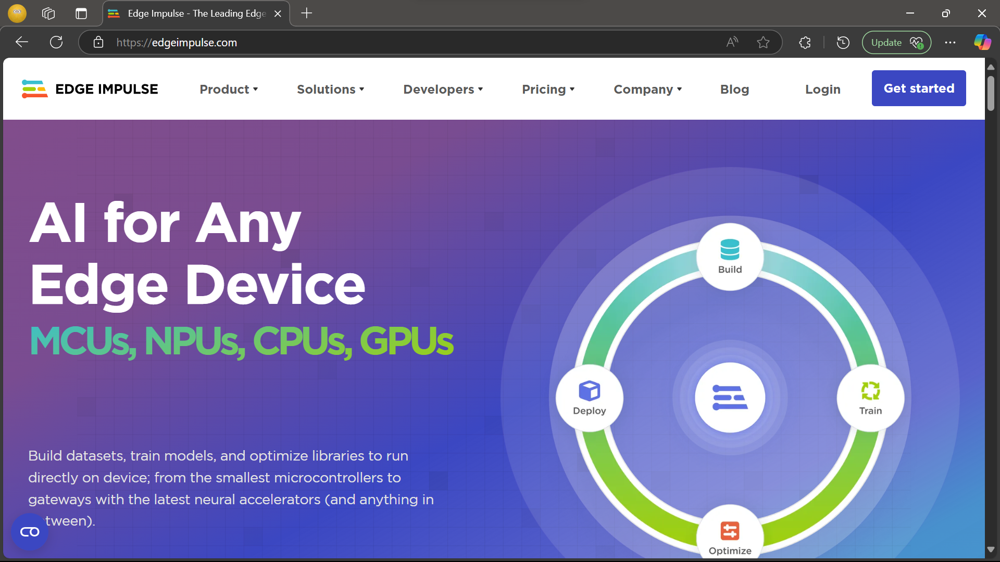

### Step 1: Create a New Project

Once you’ve created your account and logged in, the first step is to **create a new project**. Give your project a name that clearly reflects its purpose—this helps with easy identification, especially if you plan to build multiple models later on. For example, if you're building a keyword spotting model, you might name it "Wake Word Detection". You’ll also need to select the appropriate **project type** and **project setting**, as shown in the snapshot below.

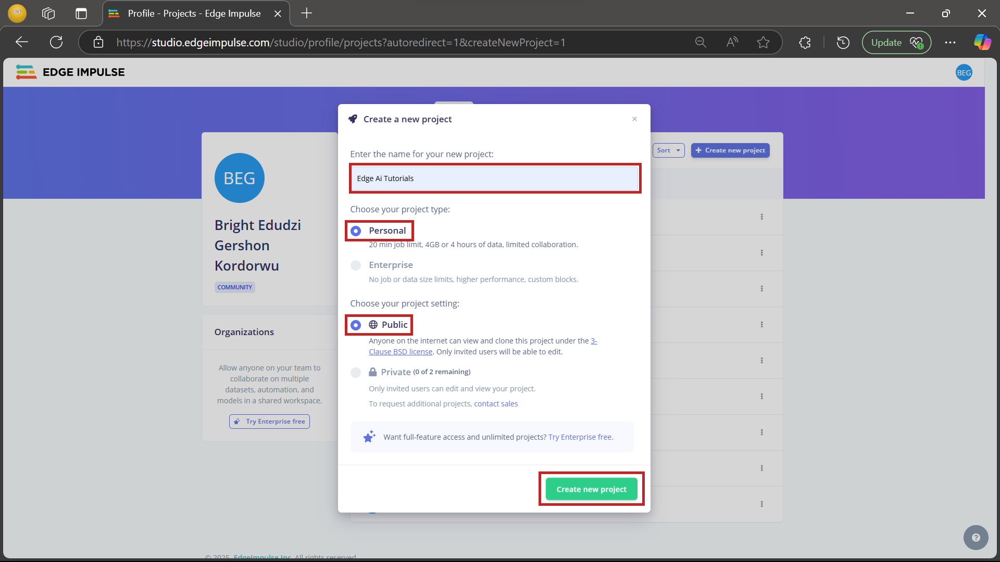

### Step 2: Configure the Target Device

After creating your project, the next step is to **configure the target device**. Since we are using the **Arduino Nano RP2040 Connect**, click the highlighted button to begin device configuration, as shown in the snapshot below. This ensures that the data collection, model training, and deployment steps are optimized for your specific hardware.

The specifications of the Arduino Nano RP2040 Connect board can be found on [Arduino’s official page](https://store.arduino.cc/products/arduino-nano-rp2040-connect).

Follow the exact settings in the attached snapshot to complete the configuration.

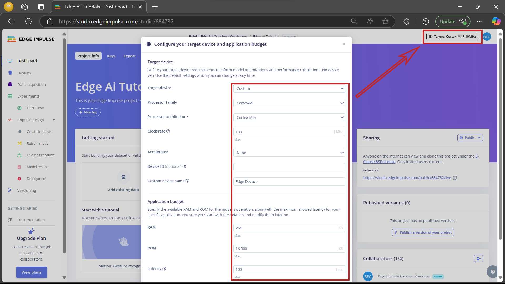

### Step 3: Add the Dataset

With your device configured, the next step is to **add your dataset** to the project. Click on the **"Add existing data"** button and follow the configuration settings shown in the attached snapshot. This allows you to upload pre-recorded data instead of collecting it live, which can save time during the development phase.

The dataset for this project can be downloaded from the following link: [Download Dataset](https://github.com/e-dudzi/Learning-Path.git). The Dataset has already been splitted into **trainig** and **testing**.

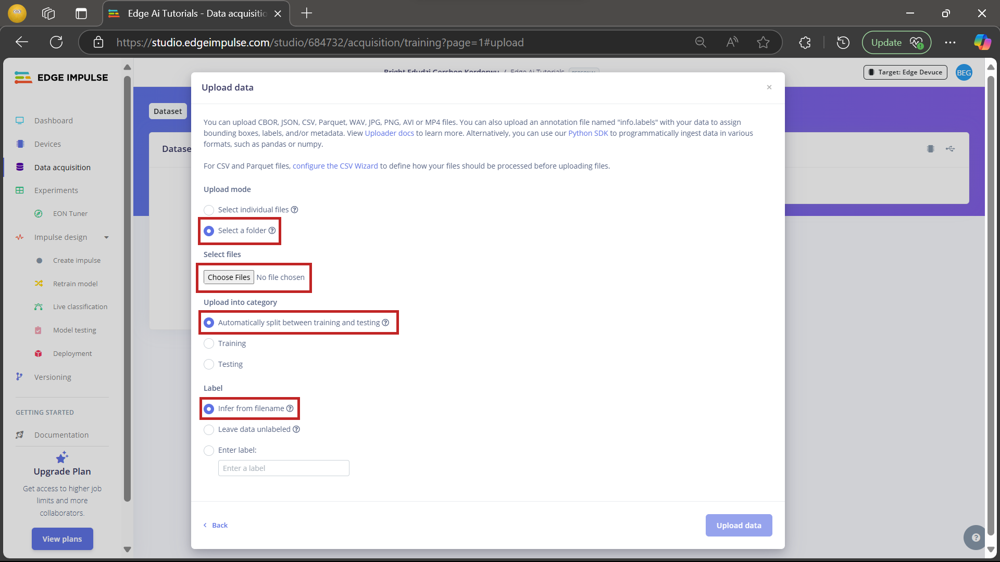

{}
Do **not** check the **Green** highlighted area during upload. The dataset already includes metadata. Enabling that option may result in **much slower upload times** and is unnecessary for this project.
{}

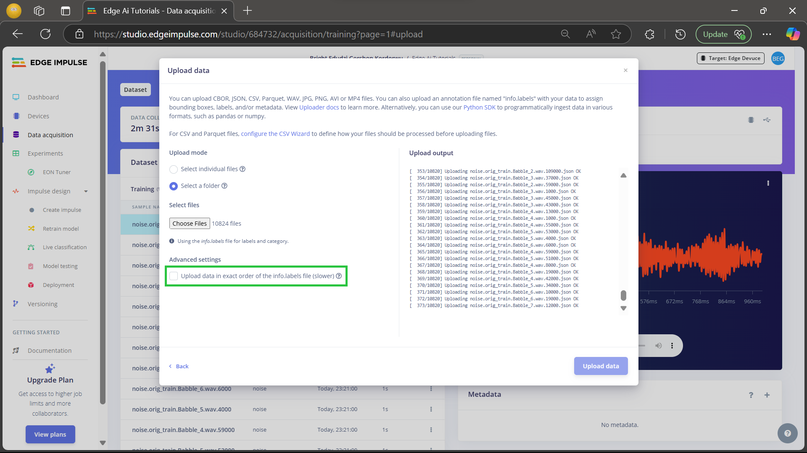

### Dataset Uploaded Successfully

This is what you should see after the dataset has been successfully uploaded. The data samples will appear in the **Data acquisition** tab, categorized by their respective labels. You can click on each sample to inspect the raw signal, view metadata, and even **listen to the audio recordings** directly within the Edge Impulse interface. This helps verify that the uploaded data is accurate and usable for training.

{}
This dataset is made up of **four labels**: `on`, `off`, `noise`, and `unknown`.
{}

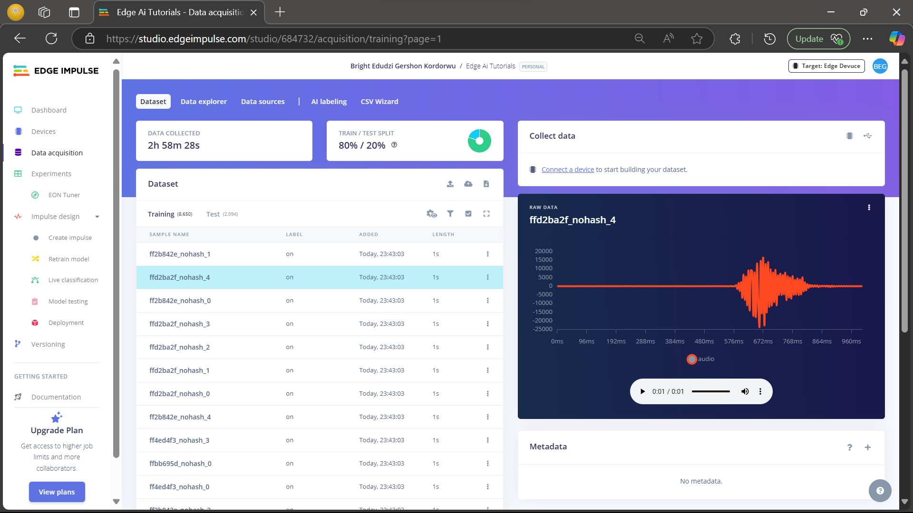

### Step 4: Create the Impulse

Now that your data is ready, it's time to create the **impulse**, which defines the flow of data from input to output through processing blocks. Click on the **"Create Impulse"** button in the menu and configure it exactly as shown in the snapshot below. This typically includes setting the input data type (e.g., audio), adding a **processing block** (such as MFCC for audio), and a **learning block** (such as a neural network classifier).

After configuring everything, **don’t forget to save your impulse**.

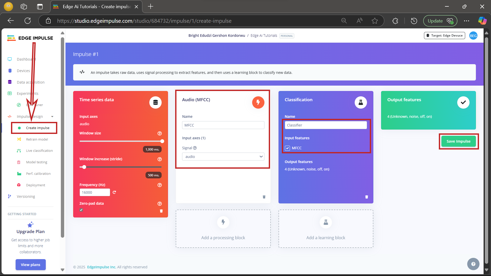

### Step 5: Configure the MFCC Block

Next, you'll configure the **MFCC (Mel Frequency Cepstral Coefficients)** processing block, which transforms the raw audio data into features suitable for model training. Click on **"MFCC"** in the left-hand menu under the **"Impulse Design"** section.

Set the parameters exactly as shown in the snapshot below. These settings determine how the audio input is broken down and analyzed. Once you're done, be sure to **save the parameters**. These parameters are chosen for this path. Modifications can be made once you are familiar with Edge Impulse.

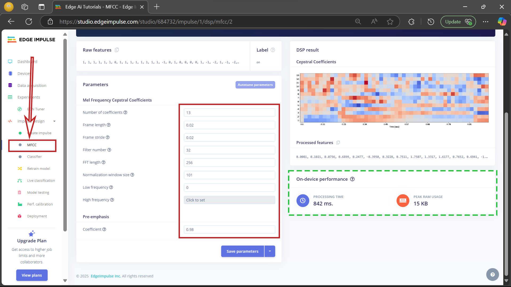

{}
The **green highlighted section** on the MFCC configuration page gives an estimate of how the model will perform **on the target device**. This includes information like memory usage (RAM/Flash) and latency, helping you ensure the model fits within the constraints of your hardware.
{}

### Step 6: Generate Features

After saving the MFCC parameters, the next step is to generate features from your dataset. Click on the **"Generate features"** button highlighted. Edge Impulse will process all your data samples using the MFCC configuration and create a set of features suitable for training a machine learning model.

Once the feature generation is complete, you'll see a **2D visualization plot** that shows how the dataset is distributed across the four labels: `on`, `off`, `noise`, and `unknown`. This helps to visually confirm whether the different classes are well-separated and learnable by the model.

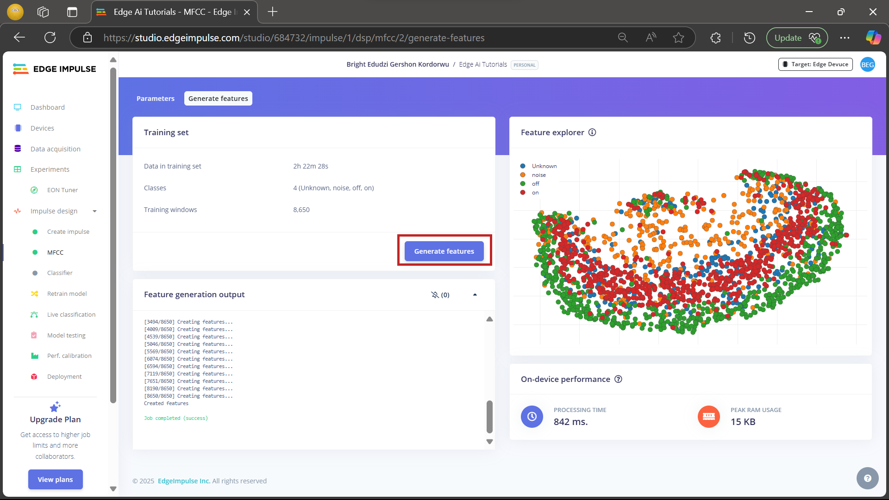

### Step 7: Setting Up the Classifier

Now it's time to configure the **neural network classifier**, which will learn to recognize the different audio commands. Click on the **"Classifier"** button in the left-hand menu under **Impulse Design** and set the parameters exactly as shown in the snapshot below.

{}
For this learning path, a learning rate of `0.002` was chosen, although the snapshot shows a value of `0.005`. You are free to experiment with different values to improve model accuracy. However, using `0.002` is recommended as a good starting point.
{}

Once all the parameters are set, click on **"Save and train"** to start training your model.

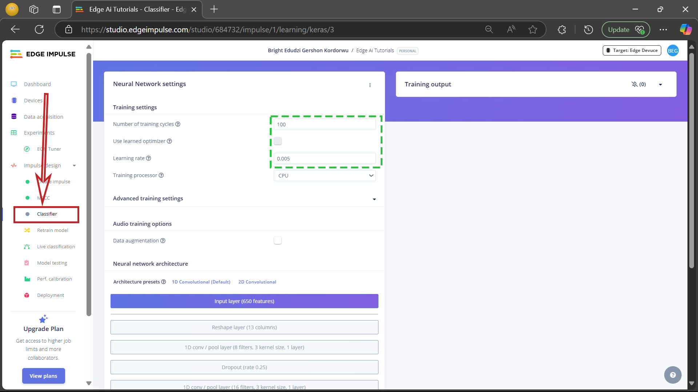

### Step 8: Reviewing Model Performance

After the training process is complete, Edge Impulse will display the **model's performance**, including its overall **accuracy**, **loss**, and a **confusion matrix**.

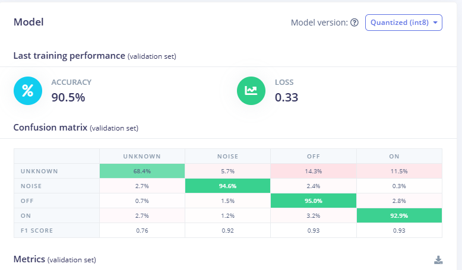

- **Accuracy** reflects how often the model predicts the correct label.
- **Loss** indicates how far the model’s predictions are from the actual labels during training — a lower loss generally means better performance.
- The **confusion matrix** shows how well the model predicted each of the four labels (`on`, `off`, `noise`, `unknown`), and can help identify patterns of misclassification.

Review these metrics to determine if the model is learning effectively. If needed, adjust the model parameters or revisit earlier steps to improve performance.

**On-Device Performance (EON Compiler - RAM Optimized):**

| Metric             | Value     |
|--------------------|-----------|
| Inference Time     | 6 ms      |
| Peak RAM Usage     | 12.5 KB   |
| Flash Usage        | 49.7 KB   |

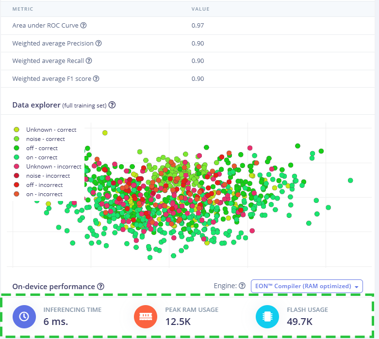

You can also [download](https://github.com/e-dudzi/Learning-Path.git) a pre-trained model and continue from here.

### Final Step: Deploying the Model

To use the trained model on your Arduino Nano RP2040, follow the steps below to export it as an Arduino library.

1. Click on the **Deployment** tab from the menu.
2. In the **search bar**, type **"Arduino"** to filter the export options.
3. Select **Arduino library** from the list.
4. The export process will start automatically, and the model will be downloaded as a `.zip` file.

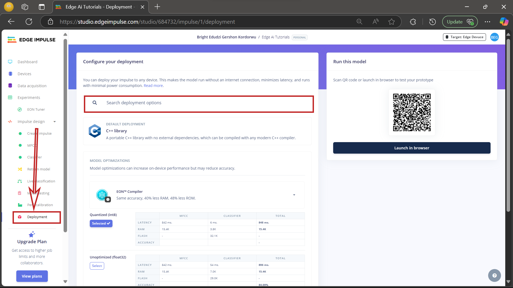

## Next Steps

In the following steps, you will move from model training to real-world deployment. Specifically, we will:

- Connect an **LED** to the **Arduino Nano RP2040** board.
- Set up the **Arduino IDE** for development.
- Program the board and **deploy the trained model** to recognize voice commands which will be used to turn `ON` and `OFF` the LED
