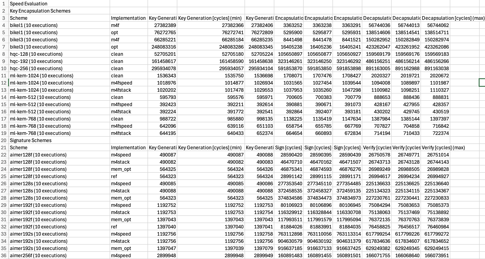

### Testing and Benchmarking

After building pqm4, multiple binaries are generated for each scheme and implementation.  
These binaries are used to verify correctness, measure performance, and analyze resource usage.

For example, for a KEM such as **ML-KEM-768**, the following binaries are generated: 

#### 1. Test Binary

```bash
bin/crypto_kem_ml-kem-768_m4_test.bin
```
This binary verifies that the scheme works correctly.

For KEMs:
* Generates a keypair
* Performs encapsulation
* Performs decapsulation
* Verifies that both parties derive the same shared secret

It also checks failure cases such as :
* invalid secret key
* invalid ciphertext

Expected Output :

```python
==========================
DONE key pair generation!
DONE encapsulation!
DONE decapsulation!
OK KEYS

+
...
OK invalid sk_a

+
OK invalid ciphertext

+
#
```

#### 2. Speed Binary

```bash
bin/crypto_kem_ml-kem-768_m4_speed.bin
```
This binary measures execution time (in CPU cycles) for :
* crypto_kem_keypair
* crypto_kem_enc
* crypto_kem_dec

This is used to evaluate performance on embedded hardware.

Expected Output : 

```python
==========================
keypair cycles:
123456

encaps cycles:
234567

decaps cycles:
210000
=
```

#### 3. Hashing Binary

```bash
bin/crypto_kem_ml-kem-768_m4_hashing.bin
```
This measures how many cycles are spent in:
* SHA-2
* SHA-3
* AES

This helps analyze how much of the algorithm cost comes from symmetric cryptography.

Expected Output :

```python
==========================
keypair hash cycles:
50000

encaps hash cycles:
80000

decaps hash cycles:
75000
=
```

#### 4. Stack Binary

```bash
bin/crypto_kem_ml-kem-768_m4_stack.bin
```
This measures stack memory usage of:
* keypair
* encapsulation
* decapsulation

Note: On some boards, stack measurement **may not work correctly** due to platform-specific memory layout.

Note: Memory allocated outside functions (e.g., public keys, ciphertexts) is not included.

Expected Output :

```python
==========================
keypair stack usage:
2048

encaps stack usage:
3072

decaps stack usage:
2800
#
```

#### 5. Test Vectors Binary

```bash
bin/crypto_kem_ml-kem-768_m4_testvectors.bin
```
This generates deterministic test vectors using a fixed random seed.

These vectors are used to:
* validate correctness
* compare different implementations

#### 6. Host Test Vectors

```bash
bin-host/crypto_kem_ml-kem-768_m4_testvectors
```

This runs on the host (PC) and generates the same deterministic test vectors for comparison.

### Running Binaries Manually 

To test a binary on the board:

#### Flash the binary

```bash
st-flash write bin/<binary_name>.bin 0x8000000
```

Example 

```bash
st-flash write bin/crypto_kem_ml-kem-768_m4_test.bin 0x8000000 
```
#### Read output from the board

```bash
python3 hostside/host_unidirectional.py
```
    note: Press the RESET button on the board to see the output.


### Automated Testing and Benchmarking

pqm4 provides Python scripts to automate testing and benchmarking.

#### 1. Run Functional Tests

```bash
python3 test.py -p <platform> --uart <serial_port> <scheme>
```

Example for NUCLEO-L476RG Board : 

```bash
python3 test.py -p nucleo-l476rg --uart /dev/tty.usbmodemXXXX ml-kem-768
```

This will:
* **Flash** test binaries
* **Run** them on the board
* **Check** correctness automatically

Expected Output :
```python
ml-kem-768 - m4fspeed SUCCESSFUL                                                                                                                                                                                                                                                                                                                                          
ml-kem-768 - m4fstack SUCCESSFUL                                                                                                                                                                                                                                                                                                                                          
ml-kem-768 - clean SUCCESSFUL                                                                                                                                                                                                                                                                                                                                             
test: 100%|█████████████████████████████████████████████| 3/3 [00:12<00:00,  4.29s/it, ml-kem-768 - clean]

```


#### 2. Run Test Vectors

```bash
python3 testvectors.py -p <platform> --uart <serial_port> <scheme>
```
Example for NUCLEO-L476RG Board :

```bash
python3 testvectors.py -p nucleo-l476rg --uart /dev/tty.usbmodemXXXX ml-kem-768
```
This will:
* **generates** test vectors on the board
* **compares** them with host-side results

Expected Output :

```python
ml-kem-768 - m4fspeed SUCCESSFUL                                                                                                                                                                                                                                                                                                                                          
ml-kem-768 - m4fstack SUCCESSFUL                                                                                                                                                                                                                                                                                                                                          
ml-kem-768 - clean SUCCESSFUL   

test: 100%|█████████████████████████████████████████████| 3/3 [00:12<00:00,  4.29s/it, ml-kem-768 - clean]
```

#### 2. Run Benchmarks

```bash
python3 benchmarks.py -p <platform> --uart <serial_port> <scheme>
```
Example for NUCLEO-L476RG Board :

```bash
python3 benchmarks.py -p nucleo-l476rg --uart /dev/tty.usbmodemXXXX ml-kem-768
```
This will :
* runs speed and stack benchmarks
* stores results in **benchmarks/**

Expected Output :

```python
speed:  33%|███████████████▍              | 1/3 [00:20<00:40, 20.00s/it, ml-kem-768 - m4fspeed]
speed:  66%|██████████████████████████▊   | 2/3 [00:40<00:20, 20.00s/it, ml-kem-768 - m4fstack]
speed: 100%|██████████████████████████████| 3/3 [01:00<00:00, 20.00s/it, ml-kem-768 - clean]
```

Expected output of the benchmark results is stored in the **benchmarks.csv** file



Note : On some boards, stack measurement may not work correctly due to platform-specific memory layout.

### Uisng QEMU(Optional)

For the mps2-an386 platform, binaries can be executed in QEMU:

```bash
qemu-system-arm -M mps2-an386 -nographic -semihosting -kernel elf/<binary>.elf
```

Example : 

```bash
qemu-system-arm -M mps2-an386 -nographic -semihosting -kernel elf/crypto_kem_ml-kem-512_m4_test.elf
```

To exit QEMU :
* Press Ctrl + A, then X