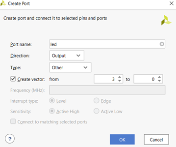
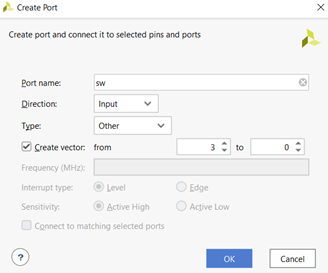
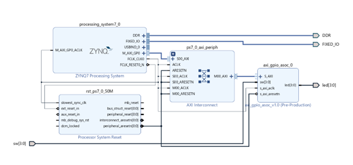
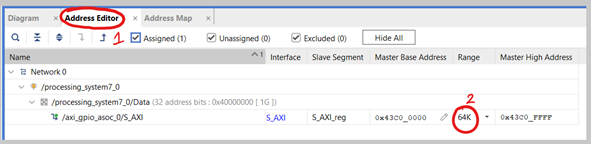
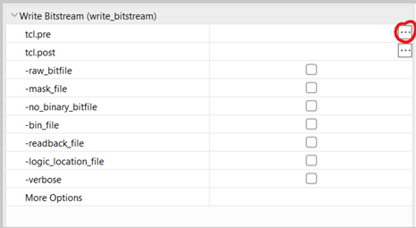
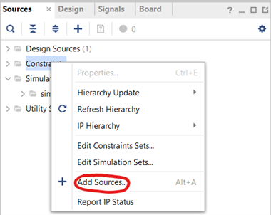
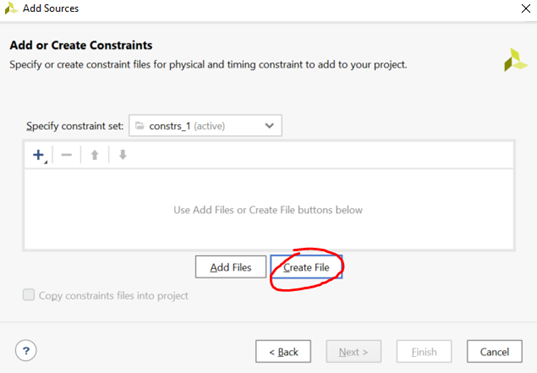
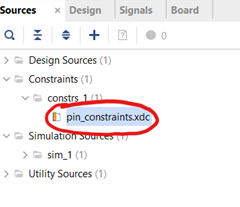

---
# User change
title: "Connect AXI4 Peripheral to ZYNQ Processing System" 

weight: 4 # 1 is first, 2 is second, etc.

# Do not modify these elements
layout: "learningpathall"
---

Follow the steps outline below to connect the AXI4 peripheral you created in the previous section to the ZYNQ Processing System.

1. Right-click on the empty space again in the diagram and choose “Create Port...” (Ctrl+K). Create 2 ports with the following settings and names: 

     

    *Figure 3.1. Creating output port*

     

    *Figure 3.2. Creating input port*

2. Wire the “sw[3:0]” input to the “sw[3:0]” port of the “axi_gpio_asoc_0” block and the same for the “led[3:0]” output to the equivalent port of the block as shown in the diagram below. This connects them to external ports of the ZYNQ chip:

     

    *Figure 3.3. Vivado block diagram*

3. Two IP blocks will be generated automatically. The “Processor System Reset” IP is used to generate reset signals for different peripherals. The “AXI Interconnect” IP here is used to interconnect AXI4-Lite Subordinate and AXI Manager. Select the “Address Editor” tab next to “Diagram” and change the “64K” to “4K”. Save all your progress.

     

    *Figure 3.4. Changing peripheral address settings*

4. Create a new file called “pins.tcl” using a text editor of your choice within your workspace. Add the following two lines of code within it. These two lines inform Vivado to ignore the unspecified I/O Pin warnings.
    ```
    set_property  SEVERITY {Warning} [get_drc_checks NSTD-1]
    set_property  SEVERITY {Warning} [get_drc_checks UCIO-1]
    ```

5. Right-click the “Generate Bitstream” option in the “Flow Navigator” on the left and select “Bitstream settings”. Click the three dots next to “tcl.pre”:

     

    *Figure 3.5. Changing bitstream settings*

6. Select the “New Script” option, click the three dots next to the empty box, choose the “pins.tcl” file you created earlier and click “Ok” on all windows.
Right-click the “Constraints” under the sources tab and select “Add sources”:

     

    *Figure 3.6. Adding sources*

7. Select “Add or create constraints” and click “Next”. Select “Create File”, give any name to the file for example pin_constraints, and click “Finish”:

     

    *Figure 3.7. Creating a constraints file*

8. Expand the “Constraints” folder within the “Sources” tab and double-click the file you just created to open it. Add the following constraints from [Digilent/Zybo-Z7-10-Pmod-VGA/blob/master/src/constraints/Zybo-Z7-Master.xdc](https://github.com/Digilent/Zybo-Z7-10-Pmod-VGA/blob/master/src/constraints/Zybo-Z7-Master.xdc), and save the file: 

     

    *Figure 3.8. Editing constraints file*

9. Ensure that your XDC files have the following constraints uncommented:

    ```
    ##Switches
    set_property -dict { PACKAGE_PIN G15   IOSTANDARD LVCMOS33 } [get_ports { sw[0] }]; #IO_L19N_T3_VREF_35 Sch=sw[0]
    set_property -dict { PACKAGE_PIN P15   IOSTANDARD LVCMOS33 } [get_ports { sw[1] }]; #IO_L24P_T3_34 Sch=sw[1]
    set_property -dict { PACKAGE_PIN W13   IOSTANDARD LVCMOS33 } [get_ports { sw[2] }]; #IO_L4N_T0_34 Sch=sw[2]
    set_property -dict { PACKAGE_PIN T16   IOSTANDARD LVCMOS33 } [get_ports { sw[3] }]; #IO_L9P_T1_DQS_34 Sch=sw[3]
    ```
    ```
    ##LEDs
    set_property -dict { PACKAGE_PIN M14   IOSTANDARD LVCMOS33 } [get_ports { led[0] }]; #IO_L23P_T3_35 Sch=led[0]
    set_property -dict { PACKAGE_PIN M15   IOSTANDARD LVCMOS33 } [get_ports { led[1] }]; #IO_L23N_T3_35 Sch=led[1]
    set_property -dict { PACKAGE_PIN G14   IOSTANDARD LVCMOS33 } [get_ports { led[2] }]; #IO_0_35 Sch=led[2]
    set_property -dict { PACKAGE_PIN D18   IOSTANDARD LVCMOS33 } [get_ports { led[3] }]; #IO_L3N_T0_DQS_AD1N_35 Sch=led[3]
    ```

You are now ready to generate the bitstream for this project. Continue to the steps in the next section.
