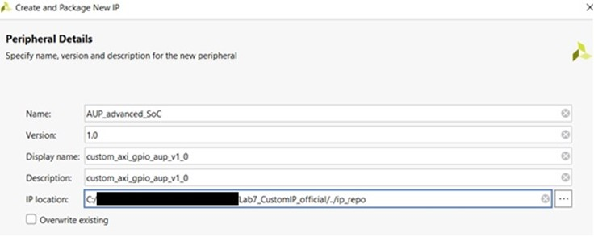
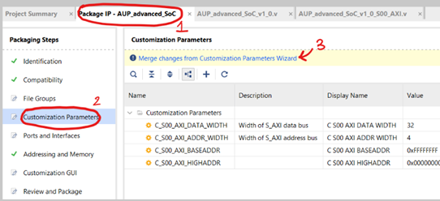
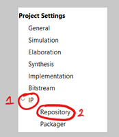
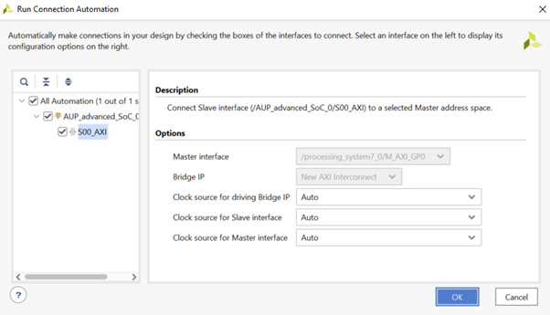

---
# User change
title: "Create a custom AXI4 Peripheral" 

weight: 3 # 1 is first, 2 is second, etc.

# Do not modify these elements
layout: "learningpathall"
---

The Xilinx Vivado tools provide a simplified way to create an AXI4 peripheral. You can follow the steps outlined below to create the peripheral.

1. Start by clicking “Tools” -> “Create and Package New IP”. Click “Next” and choose the following option:

<<<<<<< HEAD
     
=======
     
>>>>>>> 5f2151168 (Changed model to Tiny Rock–Paper–Scissors CNN)

    *Figure 2.1. Creating AXI4 peripheral*

2. Give the following name to the IP (you may keep the IP location path as provided by default):

<<<<<<< HEAD
     
=======
     
>>>>>>> 5f2151168 (Changed model to Tiny Rock–Paper–Scissors CNN)

    *Figure 2.2. Adding peripheral details*

3. You need a Subordinate interface and four 32-bit registers for the switches and LEDs.

<<<<<<< HEAD
     
=======
     
>>>>>>> 5f2151168 (Changed model to Tiny Rock–Paper–Scissors CNN)

    *Figure 2.3. Peripheral settings for Subordinate interface*

4. On the last page, choose “Edit IP” and click “Finish”. In the “Sources” window, you will see two Verilog files in Design Sources: 
- A top file, i.e., AUP_advanced_SoC_v1_0.v  
- A filename that ends with “S00_AXI”, i.e., AUP_advanced_SoC_v1_0_S00_AXI.v  

These are the basic template files generated for an AXI-Lite peripheral. You can now implement custom GPIO logic by making some changes to these template files. 

5. Double-click to open the top-level Verilog file called “AUP_advanced_SoC_v1_0.v”:

<<<<<<< HEAD
     
=======
     
>>>>>>> 5f2151168 (Changed model to Tiny Rock–Paper–Scissors CNN)

    *Figure 2.4. Editing top-level Verilog file*

6. Add the following lines of code below the comment “// Users to add ports here”:

    ```
    // Users to add ports here
    input wire [3:0] sw,
    output wire [3:0] led,
    ```

7. Also add sw and led when instantiating the AXI Bus Interface S00_AXI, so the code looks like the following:

    ```
    // Instantiation of Axi Bus Interface S00_AXI
        AUP_advanced_SoC_v1_0_S00_AXI # ( 
            .C_S_AXI_DATA_WIDTH(C_S00_AXI_DATA_WIDTH),
            .C_S_AXI_ADDR_WIDTH(C_S00_AXI_ADDR_WIDTH)
        ) AUP_advanced_SoC_v1_0_S00_AXI_inst (
                .sw(sw),
                .led(led),
            .S_AXI_ACLK(s00_axi_aclk),
    ...
    ...
    ```
8. Save the changes in the file (Ctrl+S). Next, expand and open the other Verilog file (AUP_advanced_SoC_v1_0_S00_AXI.v) shown below:

<<<<<<< HEAD
     
=======
     
>>>>>>> 5f2151168 (Changed model to Tiny Rock–Paper–Scissors CNN)

    *Figure 2.5. Edit the second Verilog file*

9. Add the following lines of code below the comment “// Users to add ports here”:

    ```
    // Users to add ports here
    input wire [3:0] sw,
    output wire [3:0] led,
    ```

10. Scroll down the file and search (Ctrl+F) for “// Address decoding for reading registers”. Then update the code so that it looks like the following:

    ```
    // Address decoding for reading registers
    case ( axi_araddr[ADDR_LSB+OPT_MEM_ADDR_BITS:ADDR_LSB] )
    2'h0   : reg_data_out <= {slv_reg0[C_S_AXI_DATA_WIDTH-1:4], sw[3:0]};
    ```

11. Scroll down the file and search (Ctrl+F) for “// Add user logic here”. Then update the code so that it looks like the following:

    ```
    // Add user logic here
    assign led[3:0] = slv_reg1[3:0];
    ```

12. Save the changes in the file (Ctrl+S). Next, go to the “Package IP – AUP_advanced_SoC” tab, choose the “Customization Parameters” option on the left and click “Merge Changes from Customization Parameters Wizard” to update the IP package with the changes made in HDL files:

<<<<<<< HEAD
     
=======
     
>>>>>>> 5f2151168 (Changed model to Tiny Rock–Paper–Scissors CNN)

    *Figure 2.6. Saving all the changes*

13. Click “Review and Package” on the left and select “Re-Package IP” at the bottom of the page. A prompt will appear – select “Yes” to close the project. 

14. Go to the AXI4 peripheral folder you created earlier <IP location folder>\drivers\<AUP_advanced_SoC_v1_0>\src and locate a Makefile. In that Makefile, update the contents so that it is the following:
    ```
    COMPILER=
    ARCHIVER=
    CP=cp
    COMPILER_FLAGS=
    EXTRA_COMPILER_FLAGS=
    LIB=libxil.a
    RELEASEDIR=../../../lib
    INCLUDEDIR=../../../include
    INCLUDES=-I./. -I${INCLUDEDIR}
    INCLUDEFILES=*.h
    LIBSOURCES= $(wildcard *.c)
    OUTS = *.o
    OBJECTS = $(addsuffix .o, $(basename $(wildcard *.c)))
    ASSEMBLY_OBJECTS = $(addsuffix .o, $(basename $(wildcard *.S)))
    libs:
        echo "Compiling axi_gpio_asoc..."
        $(COMPILER) $(COMPILER_FLAGS) $(EXTRA_COMPILER_FLAGS) $(INCLUDES) $(LIBSOURCES)
        $(ARCHIVER) -r ${RELEASEDIR}/${LIB} ${OBJECTS} ${ASSEMBLY_OBJECTS}
        make clean
    include:
        ${CP} $(INCLUDEFILES) $(INCLUDEDIR)
    clean:
        rm -rf ${OBJECTS} ${ASSEMBLY_OBJECTS}
    ```
15. Then, click on “Settings” (under “Project Manager”) in the “Flow Navigator” menu on the left. Expand the “IP” section in the new window that appears and choose the “Repository” option. 

<<<<<<< HEAD
     
=======
     
>>>>>>> 5f2151168 (Changed model to Tiny Rock–Paper–Scissors CNN)

    *Figure 2.7. Adding IP Repository*

16. Click the “+” option under “IP Repositories” on the right and choose the AXI4 peripheral folder you created earlier (if it hasn’t already appeared) and click “Ok”. Right-click in the empty space of the “Diagram” box again and choose “Add IP”. Type “custom” in the search box and choose “custom_axi_gpio_asoc_v1_0” from the options. 

17. Click “Run Connection Automation” and then click “OK” to connect the AXI-Lite Subordinate interface on GPIO peripheral to the AXI Manager interface on Arm processor.

<<<<<<< HEAD
     
=======
     
>>>>>>> 5f2151168 (Changed model to Tiny Rock–Paper–Scissors CNN)

    *Figure 2.8. Connect AXI-Lite Subordinate interface (Custom IP) to AXI Manager interface*

Now that you have created the custom AXI4 peripheral which will control the GPIO, you will connect it up to the ZYNQ Processing System in the next section.
