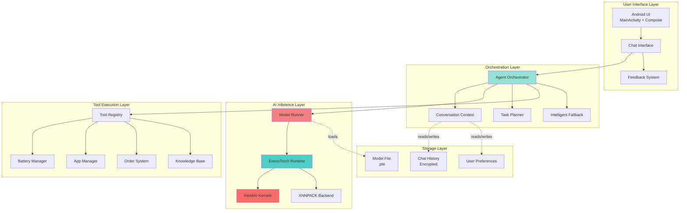
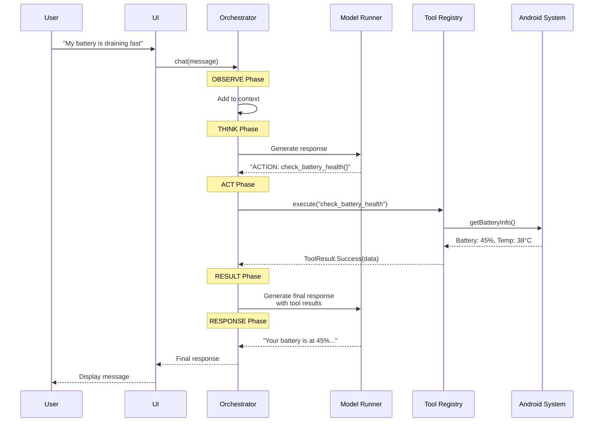
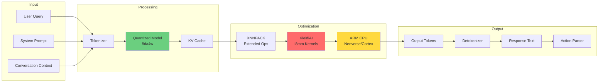
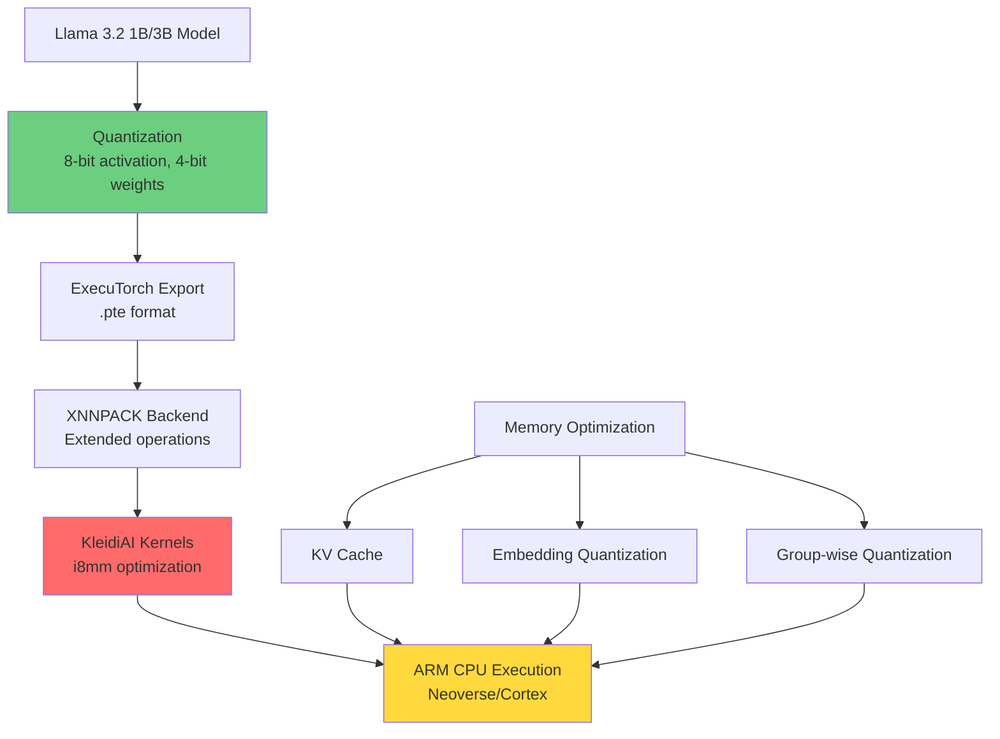
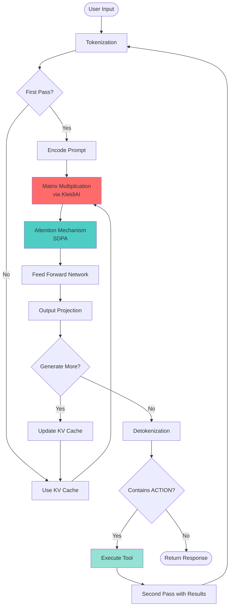
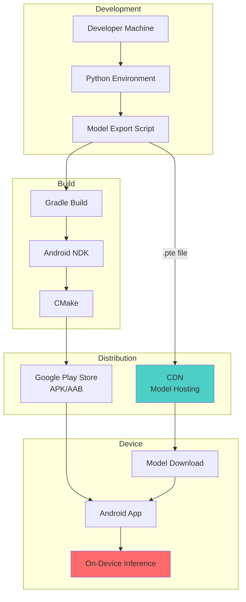
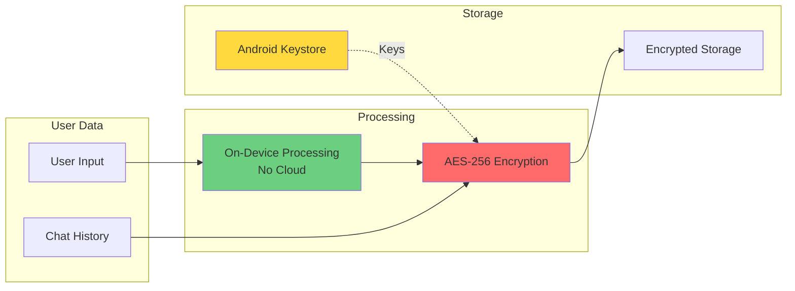

## Complete System Architecture

Understanding the architecture of your Agentic AI Chatbot is crucial for successful implementation. This section provides a comprehensive overview of all components and their interactions.

## High-Level Architecture Diagram



## Agentic Loop Flow



## Data Flow Architecture



## Component Responsibilities

### 1. **User Interface Layer**
- **MainActivity**: Entry point, lifecycle management
- **Chat Interface**: Message display, user input
- **Feedback System**: Collect user ratings and feedback

**Key Files:**
- `MainActivity.kt`
- `ChatAdapter.kt`
- `MessageItem.kt`

### 2. **Orchestration Layer**
- **Agent Orchestrator**: Core agentic loop (Observe → Think → Act → Result → Response)
- **Conversation Context**: Maintains chat history and user preferences
- **Task Planner**: Breaks down complex goals into steps
- **Intelligent Fallback**: Handles uncertain or failed responses

**Key Files:**
- `AgentOrchestrator.kt`
- `ConversationContext.kt`
- `TaskPlanner.kt`
- `IntelligentFallback.kt`

### 3. **AI Inference Layer**
- **Model Runner**: Wrapper around ExecuTorch for inference
- **ExecuTorch Runtime**: PyTorch mobile runtime
- **KleidiAI**: Arm-optimized kernels (2-3x speedup)
- **XNNPACK**: Neural network operator library

**Key Files:**
- `ModelRunner.kt`
- `llama3_1B_kv_sdpa_xnn_kleidiai_qe_4_64_1024.pte` (model file)
- `tokenizer.bin`

### 4. **Tool Execution Layer**
- **Tool Registry**: Maps ACTION commands to Kotlin functions
- **Battery Manager**: Device battery information
- **App Manager**: Running applications info
- **Order System**: Mock order tracking
- **Knowledge Base**: FAQ and product information

**Key Files:**
- `ToolRegistry.kt`
- `AdvancedToolRegistry.kt`
- `BatteryTools.kt`
- `OrderTools.kt`

### 5. **Storage Layer**
- **Model File**: Quantized .pte model (~500MB-2GB)
- **Chat History**: Encrypted conversation logs
- **User Preferences**: Settings and personalization

**Key Files:**
- `SecureStorage.kt`
- `chat_history.json` (encrypted)
- `user_prefs.json`

## Performance Optimization Stack



## Memory Layout

```
┌─────────────────────────────────────────┐
│         Android App Memory              │
├─────────────────────────────────────────┤
│  UI & App Logic          ~50-100 MB     │
├─────────────────────────────────────────┤
│  Model Weights           ~500-1500 MB   │
│  (Quantized 4-bit)                      │
├─────────────────────────────────────────┤
│  KV Cache                ~100-200 MB    │
│  (Dynamic, grows with context)          │
├─────────────────────────────────────────┤
│  Activation Buffers      ~50-100 MB     │
│  (Temporary during inference)           │
├─────────────────────────────────────────┤
│  Chat History            ~5-10 MB       │
├─────────────────────────────────────────┤
│  System Overhead         ~100-200 MB    │
└─────────────────────────────────────────┘
Total: ~800-2000 MB (depending on model size)
```

## Inference Pipeline



## Deployment Architecture



## Security Architecture



## Key Design Decisions

### 1. **Why ExecuTorch?**
- Optimized for mobile/edge devices
- Small binary size (~2MB)
- Supports quantization out-of-the-box
- Active development by Meta/PyTorch team

### 2. **Why KleidiAI?**
- 2-3x performance improvement on Arm CPUs
- Leverages hardware features (i8mm)
- Optimized for quantized models
- Low power consumption

### 3. **Why On-Device?**
- Privacy: No data leaves the device
- Offline: Works without internet
- Latency: No network round-trip
- Cost: No API fees

### 4. **Why Agentic Architecture?**
- Autonomous: Can perform actions
- Contextual: Understands user intent
- Extensible: Easy to add new tools
- Intelligent: Multi-step reasoning

## Performance Characteristics

| Metric | Value | Notes |
|--------|-------|-------|
| **Model Size** | 500MB - 1.5GB | Depends on Llama variant |
| **First Token Latency** | 500-1000ms | With KleidiAI |
| **Tokens/Second** | 30-40 tok/s | On modern Arm devices |
| **Memory Usage** | 800MB - 2GB | Peak during inference |
| **Battery Drain** | ~3-5% per 10 msgs | Typical usage |
| **Cold Start** | 2-5 seconds | Model loading time |

## Summary

This architecture provides:
- **Scalable**: Easy to add new tools and capabilities
- **Performant**: Optimized with KleidiAI for Arm
- **Private**: All processing on-device
- **Intelligent**: True agentic behavior with multi-step reasoning
- **Production-Ready**: Robust error handling and fallbacks

Understanding this architecture will help you customize and extend the chatbot for your specific use case.
