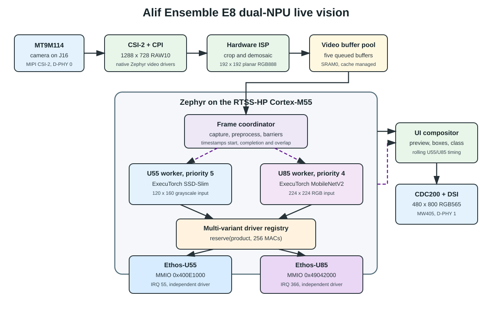
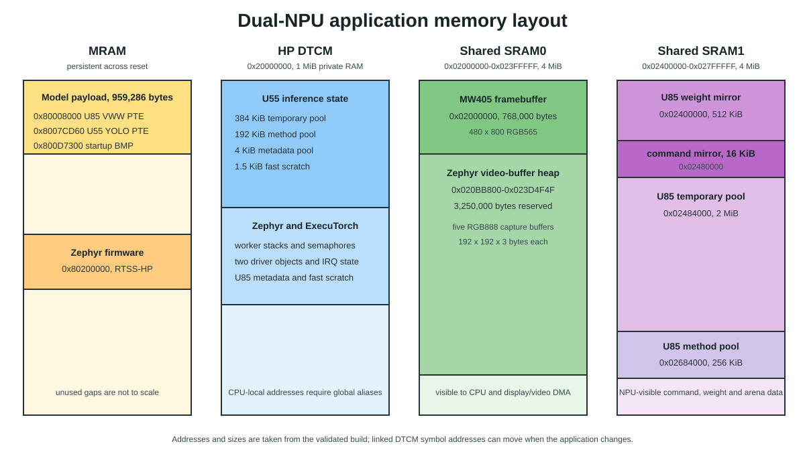

The Alif Ensemble E8 combines two Arm Cortex-M55 cores with two different Ethos-U NPUs. This demo runs on the high-performance Cortex-M55 core and assigns one model to each NPU:

| Workload | NPU | Input tensor | Output |
| --- | --- | --- | --- |
| YOLO-Fastest face detection | Ethos-U55-256 | 1 x 1 x 192 x 192 int8 grayscale | Two detection heads and decoded face boxes |
| Visual Wake Words | Ethos-U85-256 | 1 x 1 x 128 x 128 int8 RGB | Person and no-person scores |

## Reduce the system power cost

Power-constrained embedded products often need more than one machine learning
workload, but adding another MCU also adds its active and idle power. It can
also add external memory, interprocessor communication, and board-level power
domains. The E8 avoids that duplication by letting one Cortex-M55 coordinate
both on-chip NPUs. Camera capture, preprocessing, result fusion, and the user
interface stay on one MCU while each NPU runs the workload it handles best.

This arrangement does not make two active NPUs consume less instantaneous
power than one active NPU. It reduces system-level overhead compared with a
design that needs a separate MCU or application processor for each NPU. It can
also finish concurrent workloads sooner, allowing the system to return to an
idle or lower-power state earlier. Measure energy on the final hardware to
quantify the saving for a specific duty cycle.

The application uses the native Zephyr drivers in the Alif SDK ``main`` branch;
the MT9M114, ISP, and MW405 changes were merged through pull request 879. The
following diagram extends the original multi-NPU prototype with the live
camera, ISP, and display pipeline used by this demo.

## Separate the hardware responsibilities

One Zephyr application owns two driver objects, two register windows, two interrupt handlers, and two timing records:

| Resource | Ethos-U55 | Ethos-U85 |
| --- | ---: | ---: |
| MMIO base | `0x400E1000` | `0x49042000` |
| NVIC interrupt | 55 | 366 |
| Worker priority | 5 | 4 |
| Primary workload | YOLO-Fastest | Visual Wake Words |
| Method pool | 192 KiB in HP DTCM | 256 KiB in SRAM1 |
| Temporary pool | 384 KiB in HP DTCM | 2 MiB in SRAM1 |

The two interrupt service routines call `ethosu_irq_handler()` with the matching driver. A U85 completion therefore cannot release the U55 wait object, and a U55 completion cannot change the U85 timing record.

## Select the NPU from model metadata

The application enables the Ethos-U core driver's multi-variant support with
`ETHOSU_MULTI_VARIANT`. This support is part of the core-driver ``main``
branch. During initialization, `ethosu_init_ex()` registers both physical
devices with their product descriptors.

The main motivation for this multi-variant driver support is to let one MCU
manage different Ethos-U products in the same system. Without it, software
integration tends toward separate driver instances or separate processing
domains for each NPU variant. A common registry keeps device discovery,
interrupt handling, and workload dispatch in one Zephyr application. This
supports the lower-overhead system architecture described earlier.

Vela stores a COP1 optimizer record in each delegated program. The record identifies the target product and MAC configuration:

| Optimizer value | Selection |
| --- | --- |
| Product 0, log2 MACs 8 | Ethos-U55 with 256 MACs |
| Product 2, log2 MACs 8 | Ethos-U85 with 256 MACs |

The ExecuTorch backend parses this record and asks the registry for a compatible free driver. Device selection is therefore a property of the compiled PTE model, not a hard-coded assumption in the worker thread.

## Follow one frame through the application

The camera and display use different MIPI D-PHY instances so they can operate at the same time. The J16 MT9M114 camera uses D-PHY 0, while the MW405 display uses D-PHY 1.

For every live frame, the application performs these steps:

1. The MT9M114 sends 1288 x 728 RAW10 data over MIPI CSI-2.
2. The hardware ISP crops and demosaics the image into a 192 x 192 planar RGB888 buffer.
3. Zephyr maintains five video buffers so capture continues while one frame is processed.
4. The coordinator creates a 192 x 192 grayscale YOLO tensor and a 128 x 128 RGB Visual Wake Words tensor.
5. The coordinator releases both persistent worker threads through separate semaphores.
6. Each worker copies its input into its prepared ExecuTorch method and submits the delegated command stream.
7. The coordinator waits for both completion semaphores, records timing, and returns the captured buffer to the ISP queue.
8. The UI compositor draws a 352 x 352 RGB565 preview, face boxes, result indicators, and rolling timing values in the 480 x 800 framebuffer.

ExecuTorch program and method construction is serialized because that setup path contains shared runtime state. After setup, each worker retains an independent immutable `Method`, allocator set, and NPU backend. Only prepared model execution runs in parallel; camera capture, preprocessing, result fusion, and display updates remain coordinated by the Cortex-M55.

## Coordinate the workers

The coordinator uses three synchronization stages:

1. Each worker signals that its `Program` and `Method` are prepared.
2. The coordinator gives both execute semaphores for the current frame.
3. Each worker signals once it has copied the input and again after inference completes.

The early input-copy signal lets the coordinator return the camera buffer to the ISP queue without waiting for both NPUs. The later completion signal protects result processing and timing calculations.

The application records execution start and end cycles inside each worker, close to `Method::execute()`. It derives four live metrics:

| Metric | Calculation |
| --- | --- |
| U55 | U55 end minus U55 start |
| U85 | U85 end minus U85 start |
| Span | Latest end minus earliest start |
| Overlap | Earlier end minus later start, or zero when executions do not overlap |

These measurements isolate delegated execution from camera capture and UART output. They do not represent complete camera-to-display latency.

## Understand the memory layout

The application separates persistent artifacts, CPU-private state, display and video buffers, and U85-visible working memory.

### Persistent MRAM payload

SEToolKit writes the compact model payload at `0x80008000` and the Zephyr image at `0x80200000`:

| Address range | Size | Contents |
| --- | ---: | --- |
| `0x80008000`-`0x8007CD5F` | 478,560 bytes | Ethos-U85 Visual Wake Words PTE |
| `0x8007CD60`-`0x800D72FF` | 370,080 bytes | Ethos-U55 YOLO-Fastest PTE |
| `0x800D7300`-`0x800F2335` | 110,646 bytes | Startup test image |
| From `0x80200000` | Build-dependent | RTSS-HP Zephyr firmware |

The combined `u85_model.bin` payload is 959,286 bytes. Its name reflects the flash package object retained during development, but it contains both NPU models and the startup image.

### HP DTCM

The 1 MiB HP DTCM region starts at `0x20000000`. It contains the U55 method and temporary pools, both 4 KiB metadata pools, the fast-scratch arrays, Zephyr worker stacks, semaphores, driver objects, and ISP library state. The linker can move individual symbols as code changes, so the application fixes their sizes rather than their exact DTCM addresses.

### Shared SRAM0

SRAM0 spans `0x02000000`-`0x023FFFFF`:

| Address range | Reserved size | Use |
| --- | ---: | --- |
| `0x02000000`-`0x020BB7FF` | 768,000 bytes | CDC200 480 x 800 RGB565 framebuffer |
| `0x020BB800`-`0x023D4F4F` | 3,250,000 bytes | Zephyr video-buffer heap |

The configured video heap can hold five buffers of up to 650,000 bytes. The active ISP output uses five 192 x 192 x 3-byte RGB888 buffers, so each captured frame occupies 110,592 bytes. The larger reservation leaves room for the Alif video allocator and alternative formats.

### Shared SRAM1

SRAM1 spans `0x02400000`-`0x027FFFFF` and holds the U85-visible working set:

| Address range | Size | Use |
| --- | ---: | --- |
| `0x02400000`-`0x0247FFFF` | 512 KiB | U85 weight mirror |
| `0x02480000`-`0x02483FFF` | 16 KiB | U85 command-stream mirror |
| `0x02484000`-`0x02683FFF` | 2 MiB | U85 temporary allocator pool |
| `0x02684000`-`0x026C3FFF` | 256 KiB | U85 ExecuTorch method pool |

The backend copies delegated command or weight data into the mirrors when its original address is not directly usable by U85. Shared SRAM also avoids consuming the limited HP DTCM with the larger U85 working set.

## Maintain cache and address visibility

The Cortex-M55 data cache is not coherent with the camera, display controller, or either NPU. The application follows two rules:

- Clean or flush CPU-written input tensors and framebuffer pixels before a device reads them.
- Invalidate captured frames and NPU-written output tensors before the CPU reads them.

The U55 and U85 also require system-visible addresses. The platform layer translates CPU-local addresses to their Alif global aliases and selects the correct AXI memory attributes for MRAM, HP DTCM, SRAM0, and SRAM1. Incorrect address translation or memory attributes can produce an NPU bus error even when the CPU can read the same bytes.

The next section prepares the board and a clean west workspace for this architecture.
