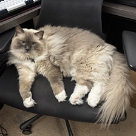

## Image requirements

MobileNetV2 expects a specific input format:

- **Resolution**: 224 x 224 pixels
- **Color**: RGB (3 channels)
- **Normalization**: ImageNet mean/std
- **Layout**: NCHW at runtime (`1 x 3 x 224 x 224`). The generated header stores the image in CHW order.
- **Data type**: int8 (stored in the header, converted to float32 at runtime)

You use a Python script to convert any JPEG or PNG image into a C header that the firmware includes at compile time.

## Set up a Python environment

Create a lightweight virtual environment on your development machine:

```bash
cd ~/alif
python3 -m venv venv_image_prep
source venv_image_prep/bin/activate
pip install --upgrade pip
pip install numpy pillow
```

## Create the preprocessing script

Create a directory for the image and script:

```bash
mkdir -p ~/alif/image
```

Place a test image in this directory. You can use any JPEG or PNG image. This Learning Path uses the provided `cat.jpg` image as the example:



Create a file called `image/prepare_image.py` with the following content:

```python
from PIL import Image
import numpy as np

IMG_SIZE = 224

img = Image.open("cat.jpg").convert("RGB")
img = img.resize((IMG_SIZE, IMG_SIZE))

x = np.asarray(img).astype(np.float32)

# ImageNet normalization
mean = np.array([0.485, 0.456, 0.406]) * 255
std  = np.array([0.229, 0.224, 0.225]) * 255
x = (x - mean) / std

# HWC -> CHW
x = np.transpose(x, (2, 0, 1))

# Quantize to int8
x = np.clip(x, -128, 127).astype(np.int8)

# Emit C array
with open("input_image.h", "w") as f:
    f.write("#include <stdint.h>\n\n")
    f.write("const int8_t input_image[3][224][224] = {\n")
    for c in range(3):
        f.write("{\n")
        for row in x[c]:
            f.write("{" + ",".join(map(str, row)) + "},\n")
        f.write("},\n")
    f.write("};\n\n")
    f.write("const unsigned int input_image_len = 3 * 224 * 224;\n")
```

The script resizes the image to 224 x 224 pixels and applies ImageNet normalization by subtracting the dataset mean and dividing by the standard deviation. It then transposes the layout from HWC (height, width, channels) to CHW (channels, height, width) format. The batch dimension is added later in the application. Finally, it quantizes the values to int8 range (-128 to 127) and writes the pixel data to a C header as a constant array.

## Run the script

From the image directory, run the preprocessing script:

```bash
cd ~/alif/image
python prepare_image.py
```

This generates `input_image.h` in the same directory. The file is approximately 349 KB.

## Copy the header to the project

```bash
cp ~/alif/image/input_image.h \
   ~/alif/alif_vscode-template/mv2_runner/assets/
```

{}
The image data is stored as int8 in the header, but the model expects float32 input. The application code handles this conversion at runtime. The model's first operator (`cortex_m::quantize_per_tensor`) then re-quantizes the float values back to int8 for the NPU. Storing as int8 in the header saves approximately 450 KB of flash compared to storing as float32.
{}

## Try a different image

To classify a different image, change the filename in `prepare_image.py`:

```python
img = Image.open("dog.jpg").convert("RGB")
```

Re-run the script and copy the updated header to the project. Rebuild and flash to see the new classification result.

The model classifies among 1000 ImageNet categories. Some common class ranges:
- **Cats**: 281-285 (281=tabby, 282=tiger cat, 283=Persian cat, 284=Siamese, 285=Egyptian cat)
- **Dogs**: 151-268 (various breeds)
- **Birds**: 7-23
- **Vehicles**: 407=ambulance, 436=beach wagon, 511=convertible, 609=jeep, 817=sports car

For a complete list, search for "ImageNet 1000 class labels" online.

The test image is ready. The next section covers building, flashing, and verifying the inference output.

## What you've learned and what's next

You've created a Python script that converts a test image into a C header with the proper normalization and quantization for MobileNetV2 input.

Next, you'll build the complete firmware, flash it to the DevKit, and verify the inference results using SEGGER RTT Viewer.
