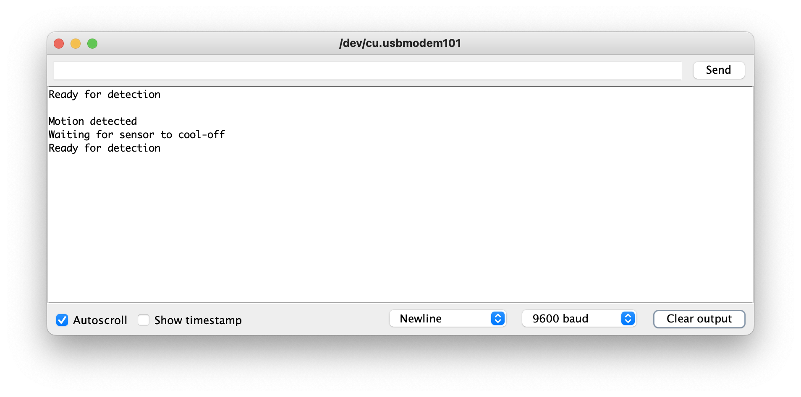

---
# User change
title: "Program your smart device prototype"

weight: 7 # 1 is first, 2 is second, etc.

# Do not modify these elements
layout: "learningpathall"
---

## Arduino IDE

To program your device you will use the Arduino IDE. In addition to being a nice simple code editor, the Arduino IDE will also handle device communication for you, and will build a compatible binary executable for your device.

Follow the [Arduino core for the Raspberry Pi Pico](/install-guides/arduino-pico/) install guide to get the Arduino IDE and device packages installed on your computer and the Arduino embedded OS installed on your Raspberry Pi Pico.

## Load the PIR sensor sketch

This Learning Path provides a complete sketch that you can upload onto your Raspberry Pi Pico. A step-by-step guide is provided below. 

First, open the sketch in the Arduino IDE:

1. Right click and select `Save Link As` to save the [pir_sensor.ino](/learning-paths/embedded-and-microcontrollers/arduino-pico/pir_sensor_1.ino) sketch to your computer
2. In the Arduino IDE, go to `File -> Open`
3. Find and select the `pir_sensor.ino` file that you just downloaded to your computer and click `Open`

## Code walk-through

You should review the code and learn about what it does.

### Define which pins your components are connected to

The first few lines of the code define new variables that will store the number of the pins that are connected to your physical components:


```arduino {linenos=table,linenostart=2}
// This is the pin that the motion sensor is connected to
int motionPin = 28;

// This is the pin that the buzzer is connected to
int buzzerPin = 19;

// This is the pin that connects to the build-in LED
int ledPin = 25;
```

The first variable, `motionPin`, holds the number for the data connection on your PIR sensor, which is connected to pin #28.

The second variable, `buzzerPin`, holds the number for the peizo electric buzzer's input voltage pin, which is connected to pin #19

The last variable, `ledPin`, holds the pin number for the LED that is built into the Raspberry Pi Pico, which is pin #25

### Define runtime variables

The next few lines define the variables that the program uses to store its internal state:

```arduino {linenos=table,linenostart=12}
// This variable will hold the current value of the motion detection pin's charge
// LOW means no motion is detected, HIGH means motion is detected
int motionState = LOW;

// This variable will hold the read value on each iteration of the loop
int val = 0;

// This variable will keep track of how many times motion has been detected
int counter = 0;
```

The `motionState` variable holds the value from the `motionPin` between checks, so you know what the previous value was. The default value for this variable is `LOW`, which corresponds to no motion detected.

The `val` variable holds the current value from the `motionPin` after each check.

Finally, the `counter` variable holds the number of times motion was detected since the device was turned on.

### Helper functions

To make the code easier to read and maintain there are a few helper functions called from the main code:

```arduino {linenos=table,linenostart=23}
// Beep the buzzer twice in quick succession
void doBeep() {
      digitalWrite(buzzerPin, HIGH); // On for 0.1 seconds
      delay(100);
      digitalWrite(buzzerPin, LOW); // Off
      delay(100);
      digitalWrite(buzzerPin, HIGH); // On for 0.2 seconds
      delay(200);
      digitalWrite(buzzerPin, LOW); // Off
}

// Turn on the built-in LED
void ledOn() {
  digitalWrite(ledPin, HIGH);
}

// Turn off the built-in LED
void ledOff() {
  digitalWrite(ledPin, LOW);
}
```

The first is `doBeep()` which turns on and off power to the buzzer in a way that makes it play two short beeps.

The next two, `ledOn()` and `ledOff()`, set the LED pin's voltage to either `HIGH` or `LOW`, respectively, turning it either on or off.

Note that these functions use the pin variables defined at the start of the sketch.

### Setup

Now it's time to get into the actual program. 

The Arduino Core software expects your sketch to provide two functions, `setup()` and `loop()`.  The first of these, `setup()`, is called once and only once when your device is powered on. This is where you put code to initialize your environment and hardware: 

```arduino {linenos=table,linenostart=45}
void setup() {
  // Here we tell the board whether a pin will be used for reading (INPUT) or writing (OUTPUT)
  
  // This lets us write text over the USB connection to the Arduino IDE
  Serial.begin(9600);

  // We will read values from the motion sensor
  pinMode(motionPin, INPUT);
  
  // We will write values to the buzzer
  pinMode(buzzerPin, OUTPUT);

  // We will write values to the built-in LED
  pinMode(ledPin, OUTPUT);
  // We default to having the LED on, indicating a ready state
  ledOn();

  Serial.println("Beginning motion detection");
}
```

First, initialize the `Serial` interface so that you can write output over the USB connection. `Serial.begin(9600)` turns on the device's onboard serial interface with a baud rate of 9600 (which is low but more than enough for writing output messages).

Next, the sketch tells Arduino core how each of the pins will be used, either as `INPUT` for reading voltage or `OUTPUT` for setting voltage. The motion sensor is the only pin we will be getting input from, for the others we will be setting it.

Once setup is done, call the `ledOn()` helper function to turn on the board's LED, indicating that it's setup and ready to start detecting motion. Additionally, write a message to the USB serial connection with `Serial.println()` to indicate the setup is complete.

### Loop

Once the `setup()` function finishes, the Arduino core software calls the `loop()` function and keeps on calling it over and over again, as fast as it can, which means many times per second. Not only is this unnecessary most of the time, it'll also result in a much higher energy use which will drain the battery very quickly.

```arduino {linenos=table,linenostart=66}
void loop() {
  // put your main code here, to run repeatedly:

  // Every iteration of the loop has a half-second delay, this reduces the processing load on the device
  delay(500);
```

To avoid unnecessary execution, there is a half-second delay into each call of the `loop()` function. The `delay(ms)` function pauses execution for the defined number of milliseconds (`ms`), and then execution continues.

#### Motion detected

Next, review the logic of the motion detector. The first thing to do is read the state of the motion detector. This is done with the `digitalRead()` function provided by Arduino core. If the value (`val`) read is a high voltage, that means the detector has registered motion. 

```arduino {linenos=table,linenostart=72}
  // In every iteration of the loop we start by checking the current value from the PIR sensor
  val = digitalRead(motionPin);

  // A HIGH value means the sensor is detecting motion, so we do our motion-handling
  if (val == HIGH) {
```

Note that because of the nature of the passive infrared sensor and the fact that the code is running twice per second, it's possible that you will read a `HIGH` value multiple times for the same motion event. But you really only want to respond once per event.

So, in order to determine if this is a new motion event or not, you need to check the `motionState` variable that stores the detection value between calls to `loop()`.

##### No previous motion

```arduino {linenos=table,linenostart=78}
    // If we had previously been in a LOW state (no motion) then this is a new detection!
    if (motionState == LOW) { 
      // First we write to the USB console that motion was detected
      Serial.println("Motion detected");
      // Next we turn the LED off, indicating that we're not longer in the waiting state
      ledOff();
      // Then we trigger the beep
      doBeep();
      // And increment our counter
      counter++;
      Serial.print("Counter is now at ");
      Serial.println(counter);
      // Finally we save the fact that we're in a motion detecting state
      motionState = HIGH;
```

If the value of `motionState` is `LOW`, it means there wasn't any motion detected in the previous iteration of our loop, so this is a new motion event and it generates a response.

The first thing the code does is print a message to the USB output, using the same `Serial.println()` used in `setup()`, to indicate that a new motion event has happened.

Next, call the `ledOff()` and `doBeep()` helper functions for visual and audible indications of motion being detected. Also, increase the number in the `counter` variable and print the new value to the USB output.

Lastly, set `motionState` to `HIGH`, so that in the next iteration of `loop()` the motion event has been responded to. 

##### Previous motion

If, however, `motionState` was not `LOW`, then the `HIGH` value from the sensor isn't a new event, and there is therefore no need to respond to it: 

```arduino {linenos=table,linenostart=93}
    // If we had previously been in a HIGH state (motion detected) then we're seeing the same motion event we've already handled
    } else {
      // PIR sensors can retain a HIGH state for several seconds after motion has stopped
      // So we're adding in a 10 second cooling off period to let it return to a LOW state
      Serial.println("Waiting for sensor to cool-off");
      delay(5000);
    }
```

Instead, simply print a message to the USB output indicating it wait for the next event and add a further 5 second delay to the `loop()` so that the sensor has a chance to revert back to the no-motion state (this takes 3-5 seconds for these sensors).

#### No Motion Detected

If the sensor returns a `LOW` value, it means it's not currently detecting motion. When this happens, only respond if the previous call to `loop()` was detecting motion, indicating a change in state: 

```arduino {linenos=table,linenostart=101}
  // A LOW value means the sensor isn't detecting motion, so we enter a waiting state
  } else {

    // If we had previously been in a HIGH state, that means the PIR sensor has stopped registing motion
    if (motionState == HIGH) {

      // We save the fact that we're not in a non-motion detecting state
      motionState = LOW;
      // Next we turn on the LED to indicate that we've entered the motion detecting state
      ledOn();
      // Finally we write to the USB console that we're ready to detect motion
      Serial.println("Ready for detection");
      Serial.println();
    }
  }
```

All that needs to be done is to set `motionState` back to `LOW` so that any future motion detection will trigger a response. Also turn the board's LED back on to give a physical indication that it's in a ready state.

Finally, write a message to the USB output indicating that the device is once again ready to detect a motion event.

## Run your code

Now that you have a good understanding of the code, you should run it on your device. With your Raspberry Pi Pico board plugged in to your computer, and the [correct board and port selected in the Arduino IDE](/install-guides/arduino-pico), click the `Upload` button on the IDE to build and install it on your device.

If successful, you should see the LED on your board light up. If you wave your hand in front of the sensor, you should also hear a double beep and see the LED turn off for a few seconds.

You can further check that your code is running properly by opening the `Serial Monitor` from the `Tools` menu of the Arduino IDE. There you should see all of the output messages, including count of detected motion events, coming from your sketch.



Congratulations! You have successfully programmed your microcontroller and built a working, if simple, smart device. 

Continue on to see how to improve the application by replacing the `loop()` and `delay()` calls with interrupts. 
