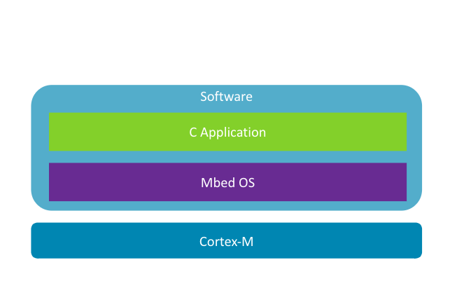
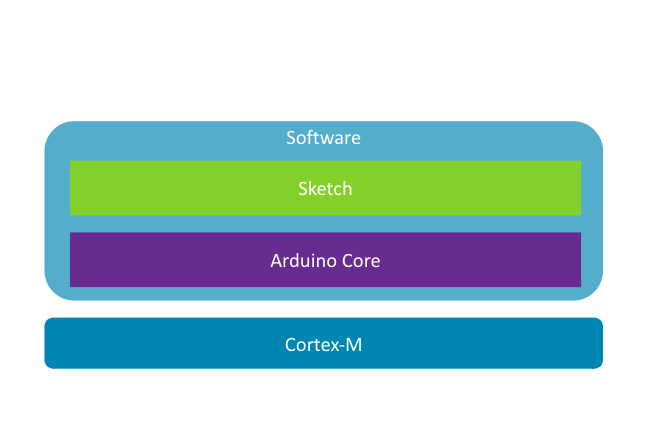

---
# User change
title: "Embedded Programming on Arm"

weight: 5 # 1 is first, 2 is second, etc.

# Do not modify these elements
layout: "learningpathall"
---

# Get started with Arm

Now that you know the differences between application and embedded programming, as well as the differences in the hardware and software stack, it's time to take your first steps into embedded software development!

A typical embedded project for Arm devices looks like this. For microcontrollers, you'll have a CPU in the Cortex-M family and, as your RTOS, you'll use something like Mbed OS, which is provided by Arm and used by default in Arm Developer Studio and Keil MDK.

On top of that you will write your application in C, using any number of the available supporting libraries depending on your specific needs and use case.

If this is your first step into embedded programming, you can start with something easier, Arduino. 

# Arduino

As you know, these small, cheap, development prototyping boards have been around for years, and many people have made them blink some LEDs before shoving them into a drawer and going back to application development.

But they're so much more than just a toy for making lights flash. They're a really great way to get started with embedded programming!

The latest generations of Arduino use Arm Cortex-M microprocessors, such as the Cortex-M0+ in the Arduino Nano RP2040, making that more powerful and capable than before, while still providing a very simple and straightforward programming experience.

## Arduino core

What you probably missed in your first Arduino experience is that you got more than just a physical board and an IDE. When you first connected your board to your computer and loaded up the IDE, in the background, it detected the specific board you had, downloading the Arduino core package specific to that board.

Arduino core is the RTOS for Arduino boards. Not only does it include the software and libraries needed to control the board, it also provides several APIs that make programming an Arduino board incredibly simple.

## Processing API

The first set of APIs that Arduino core provides is borrowed from the [Processing project](https://processing.org/). These include the default functions `setup()` and `loop()` that every Arduino application (which Arduino calls a sketch) starts with. It's also where you get the `delay()` function that lets you pause your application's execution for a set amount of time. All three of these functions can be found in just about every Arduino application/sketch.

## Wiring API

Of course, the most fun to be had with an Arduino isn't simply executing code, it's interacting with things that you connect to the physical pins. For that the Arduino core once again borrows APIs, this time from the [Wiring project](https://wiring.org.co/), giving you functions like `pinMode()`, `digitalRead()`, and `digitalWrite()` that your sketch uses to read and write values (or rather, turn on or off voltage) to your Arduino's pins.

## Sketch

Finally, you have your sketch. Unlike a normal C application, your Arduino sketch doesn't start with a `main()` function. Instead the code you put inside `setup()` will be executed first and then the code you put inside `loop()` will be executed repeatedly after that. 

What's really happening when you click `Compile`, however, is that the Arduino IDE will generate C code with a `main()` function that calls `setup()` and `loop()` in your sketch. That C code is then combined with your sketch and the Arduino core RTOS into a single binary that gets flashed onto your board. So you still have everything that any other embedded program would have, it's just that Arduino has hidden most of it so that you can focus on your prototyping code.
