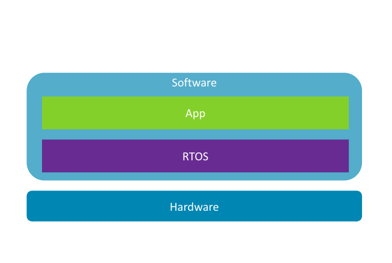

---
# User change
title: "Embedded Programming"

weight: 4 # 1 is first, 2 is second, etc.

# Do not modify these elements
layout: "learningpathall"
---

# Embedded Stack

While the embedded computing stack looks similar to an application stack, there are some important differences.

## Hardware

Just like in an application stack, you start with hardware on the lowest layer. But now you need to be aware of not just how fast the CPU is and how much memory is available, you also need to know what kind of microprocessor it has, what instruction set architecture (ISA) it runs, and what physical interconnects are available to you because this will determine what kinds of software it can run and what kinds of sensors and physical interfaces is can talk to.

## Software

The software part of the stack also looks very different. For starters you'll notice that there isn't a firmware layer to abstract the hardware layer for the software layer. Because of that, your software needs to know exactly what kind of hardware it's running on **before** you install it. And it needs to include all the drivers and libraries necessary to control that hardware.

### Realtime Operating Systems (RTOS)

And that's where your RTOS, such as Mbed OS, Zephyr, and FreeRTOS come in. These play the role of both the kernel and the operating system, with a modular system that will build a custom image specific to your hardware, replacing the need for a firmware.

An RTOS can range from very simple, doing little more than loading your application's code, all the way up to providing a robust multi-threaded environment capable of running multiple applications and driving a user interface.

### Application

In the embedded world, your application rarely exists independently of the RTOS. Instead, when you build your application, your tools will also build the RTOS, and combine both the RTOS and your application into a single binary image that can be flashed onto your device's storage. That means that every time you build your application, you have to tell your build system exactly what hardware you're building it for. Fortunately, the tools for embedded software development make this easy for you, even going so far as to detect your hardware when it is connected to your development machine, and doing the necessary configurations to target that hardware automatically.
