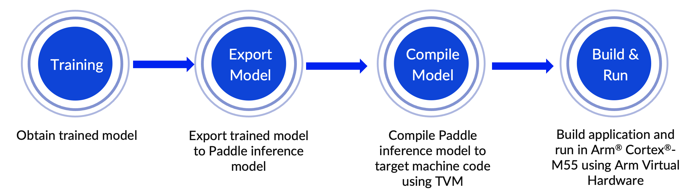

---
# User change
title: "Deploy the PaddleOCR model"

weight: 3 # 1 is first, 2 is second, etc.

# Do not modify these elements
layout: "learningpathall"
---

## Try the end-to-end workflow

This section provides hands-on instructions for you to deploy pre-trained PaddlePaddle models on the Corstone-300 Fixed Virtual Platform (FVP) included with Arm Virtual Hardware.

The steps involved in the model deployment are shown in the figure below:



## Deploy PaddleOCR text recognition model on the Corstone-300 FVP included with Arm Virtual Hardware

Start by launching the [Arm Virtual Hardware AMI](/install-guides/avh/).

Alternatively, you can also download the Corstone-300 FVP from the [Arm Ecosystem FVP](https://developer.arm.com/downloads/-/arm-ecosystem-fvps) page. For installation instructions see [Arm Ecosystem FVPs](/install-guides/fm_fvp/eco_fvp/).

The code for this [project](https://github.com/ArmDeveloperEcosystem/Paddle-examples-for-AVH/tree/main/OCR-example), is available to download from [ArmDeveloperEcosystem](https://github.com/ArmDeveloperEcosystem/Paddle-examples-for-AVH) GitHub repository as well as [PaddleOCR](https://github.com/PaddlePaddle/PaddleOCR/tree/dygraph/deploy/avh)’s GitHub repository (under the dygraph branch).

Start by cloning the code repository on your running AVH AMI instance:

```bash
git clone https://github.com/ArmDeveloperEcosystem/Paddle-examples-for-AVH.git
cd Paddle-examples-for-AVH
```
Run the setup scripts.
```bash
sudo bash scripts/config_cmsis_toolbox.sh
sudo bash scripts/config_tvm.sh
```
Now you can navigate to the text recognition example directory.

```bash
cd ./ocr/text_recognition/
```

In this directory, there is a script named [run_demo.sh](https://github.com/ArmDeveloperEcosystem/Paddle-examples-for-AVH/blob/main/OCR-example/run_demo.sh) that automates the entire process described in the End-to-end workflow diagram.

Update the FVP executable name in the `run_demo.sh` script. The `VHT_Platform` should match what is installed in the system. The executable starts with either `VHT_Corstone_SSE` or `FVP_Corstone_SSE`. Check which one is available in the `$PATH` by typing it out and using the Tab key to autocomplete. Then, using a code editor of your choice or `vim`, you can assign the correct executable:

```console
vim run_demo.sh
```

The final result should look something like this, with the right option uncommented:
```
if [ "$DEVICE" == "cortex-m55" ]; then
   RUN_DEVICE_NAME="M55"
#   VHT_Platform="FVP_Corstone_SSE-300"
   VHT_Platform="VHT_Corstone_SSE-300_Ethos-U55"
   TVM_TARGET="cortex-m55"
elif [ "$DEVICE" == "cortex-m85" ]; then
   RUN_DEVICE_NAME="M85"
#    VHT_Platform="FVP_Corstone_SSE-310"
   VHT_Platform="VHT_Corstone_SSE-310"
   TVM_TARGET="cortex-m85"
else
  echo 'ERROR: --device only support cortex-m55/cortex-m85' >&2
  exit 1
fi
```

The `run_demo.sh` script automatically builds and executes the English text recognition application on the Corstone-300 platform included with Arm Virtual Hardware. Here is a list of steps performed by this script:

- Step 1. Set up build environment
- Step 2. Download a trained PaddleOCR text recognition model
- Step 3. Use TVMC to compile the model and generate code for the Arm Cortex-M processor
- Step 4. Process resources for building the application image
- Step 5. Build the target application using Makefiles
- Step 6. Run application binary on Corstone-300 FVP included in AVH

Training the model usually takes a lot of time. In step 2, an already trained English text recognition model named [ocr_en.tar](https://paddleocr.bj.bcebos.com/tvm/ocr_en.tar) is used.

By default, the script uses the image shown below (QBHOUSE) as an example to verify the inference results on the Corstone-300 FVP with Arm Cortex-M55.


Make the script executable with `chmod`.

```bash
chmod 777 run_demo.sh
```

You can now run the trained PaddleOCR text recognition model on the Corstone-300 FVP included on the AVH AMI with the following command:

```console
./run_demo.sh --device cortex-m55 --model EN_PPOCRV3_REC
```

The output from running the application on the Corstone-300 FVP is shown below:

```output
Ethos-U rev 136b7d75 --- Feb 16 2022 15:47:15
    (C) COPYRIGHT 2019-2022 Arm Limited
    ALL RIGHTS RESERVED

Starting ocr rec inference
text: QBHOUSE, score: 0.986746
EXITTHESIM
Info: /OSCI/SystemC: Simulation stopped by user.
```
The text recognition results are consistent with the input image text content `QBHOUSE` and has a high confidence score of 0.986746.

You have successfully deployed a PP-OCRv3 English recognition model directly on the Corstone-300 FVP with the Arm Cortex-M55.


