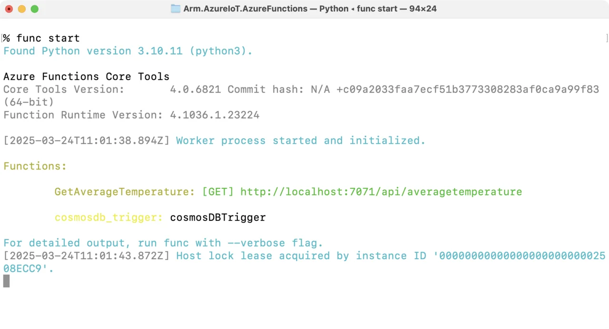
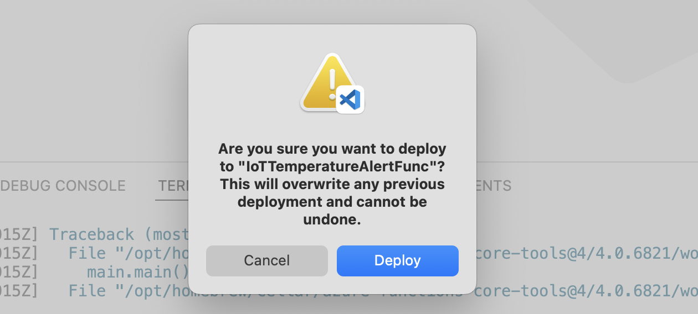
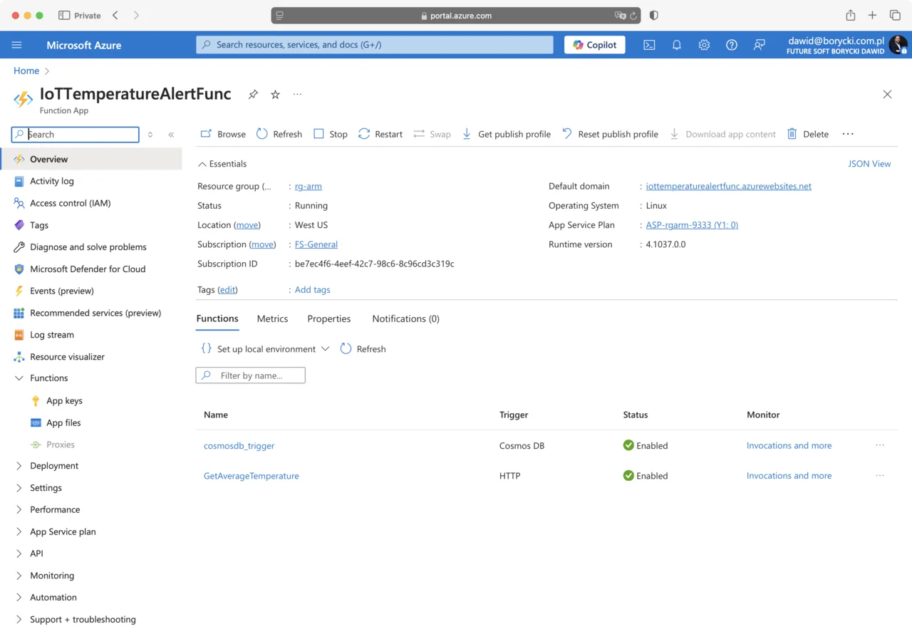
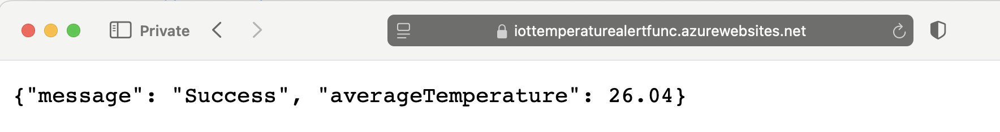

---
# User change
title: "Sensor Data Aggregation Using Azure Functions"

weight: 8

layout: "learningpathall"
---

In the previous section, you configured Azure Stream Analytics to securely store incoming IoT telemetry data in Azure Cosmos DB, making sensor data readily available for further processing. In this section, you will enhance your IoT solution by implementing real-time data aggregation capabilities using Azure Functions. Azure Functions is a powerful, event-driven, serverless compute service provided by Azure that allows you to execute custom code in response to scheduled events without managing infrastructure. You will create an Azure Function that periodically queries sensor data from Cosmos DB and computes aggregated metrics, such as average, minimum, and maximum values, enabling you to derive actionable insights and monitor sensor performance more effectively.

## Data Aggregation
As your IoT solution matures, the volume of sensor data continuously captured and securely stored in Azure Cosmos DB grows rapidly. However, raw telemetry data alone may not effectively communicate actionable insights, especially when quick decision-making and proactive management are required. Transforming this raw sensor data into meaningful, summarized information becomes essential for efficient monitoring, accurate analysis, and rapid response.

Aggregating sensor readings into various metrics such as average, minimum, and maximum values helps reveal underlying patterns, trends, and anomalies that might otherwise remain hidden. By identifying these trends early, you can proactively manage your devices, maintain optimal operational efficiency, and swiftly detect conditions that require immediate attention, such as overheating or other critical environmental issues.

In this section, you will leverage Azure Functions to implement a data aggregation. This Azure Function will respond to the HTTP trigger, and return aggregated sensor data.

### Azure Function with HTTP Trigger
Building upon the sensor data aggregation strategy, this section demonstrates how to implement a serverless Azure Function using an HTTP trigger to calculate real-time insights from sensor data stored in Azure Cosmos DB. Specifically, you will create an HTTP-triggered function that queries temperature readings from the past minute, computes the average temperature, and returns this aggregated value as a JSON response. This HTTP-triggered approach provides an on-demand method to access up-to-date metrics.

To implement this functionality open the `function_app.py` and modify it as follows:
1. Add the following import statements:
```python
from azure.cosmos import CosmosClient
import datetime
import json
```

2. Define the following constants:
```python
DATABASE_NAME = "IoTDatabase"
CONTAINER_NAME = "SensorReadings"
CONNECTION_ENV_VAR = "armiotcosmosdb_DOCUMENTDB"  
```

3. Add the following function:

```python
@app.function_name(name="GetAverageTemperature")
@app.route(route="averagetemperature", methods=["GET"], auth_level=func.AuthLevel.ANONYMOUS)
def get_average_temperature(req: func.HttpRequest) -> func.HttpResponse:
    """
    This HTTP-triggered Function queries Cosmos DB for documents 
    from the last 1 minute, calculates an average temperature, 
    and returns it as a JSON response.
    """
    logging.info("Received request for average temperature from the last minute.")

    cosmos_conn_str = os.environ.get(CONNECTION_ENV_VAR)
    if not cosmos_conn_str:
        logging.error(f"Environment variable '{CONNECTION_ENV_VAR}' not set.")
        return func.HttpResponse(
            "Internal server error: Missing Cosmos DB connection string.",
            status_code=500
        )

    # Initialize the Cosmos DB client and get the database and container clients.
    try:
        client = CosmosClient.from_connection_string(cosmos_conn_str)
        database = client.get_database_client(DATABASE_NAME)
        container = database.get_container_client(CONTAINER_NAME)
    except Exception as e:
        logging.error(f"Error initializing Cosmos DB client: {e}")
        return func.HttpResponse(
            "Internal server error: Failed to initialize Cosmos DB client.",
            status_code=500
        )

    # Calculate the epoch time (in seconds) for 1 minute ago using timezone-aware datetime
    one_minute_ago_epoch = int(
        (datetime.datetime.now(datetime.timezone.utc) - datetime.timedelta(minutes=1)).timestamp()
    )

    # Query for all documents where _ts >= one_minute_ago_epoch
    query = """
    SELECT VALUE c.temperature
    FROM c
    WHERE c._ts >= @minTs
    """
    parameters = [{"name": "@minTs", "value": one_minute_ago_epoch}]

    try:
        items = list(container.query_items(
            query=query,
            parameters=parameters,
            enable_cross_partition_query=True
        ))
    except Exception as e:
        logging.error(f"Error querying Cosmos DB: {e}")
        return func.HttpResponse(
            "Internal server error: Query to Cosmos DB failed.",
            status_code=500
        )

    if not items:
        response_body = {
            "message": "No temperature readings found in the last minute.",
            "averageTemperature": None
        }
        return func.HttpResponse(
            json.dumps(response_body),
            status_code=200,
            mimetype="application/json"
        )

    # Compute the average temperature safely
    try:
        average_temp = sum(items) / len(items)
    except Exception as e:
        logging.error(f"Error calculating average temperature: {e}")
        return func.HttpResponse(
            "Internal server error: Failed to compute average temperature.",
            status_code=500
        )

    response_body = {
        "message": "Success",
        "averageTemperature": round(average_temp, 2)
    }

    return func.HttpResponse(
        json.dumps(response_body),
        status_code=200,
        mimetype="application/json",
        headers={"Access-Control-Allow-Origin": "*"}
    )
```

The `GetAverageTemperature` function is triggered by an HTTP GET request sent to the route /averagetemperature. Upon invocation, it first logs that a request has been received for calculating the average temperature based on data from the last minute.

The function then retrieves the Cosmos DB connection string from an environment variable. If the connection string is not available, the function logs an error and returns a 500 Internal Server Error response, indicating that essential configuration details are missing.

Next, it initializes the Cosmos DB client using the provided connection string. It accesses the appropriate database (IoTDatabase) and container (SensorReadings) to perform the subsequent data retrieval. If there are issues initializing the Cosmos DB client, it logs an error and responds with a 500 Internal Server Error.

To determine the relevant data points, the function calculates a timestamp representing exactly one minute before the current UTC time. It then constructs and executes a query against Cosmos DB to retrieve temperature readings (temperature values) with a timestamp (_ts) greater than or equal to this calculated value, effectively fetching all recent temperature data from the last minute.

If no recent temperature data is found, the function returns a JSON response stating that no readings are available for that period, along with a 200 OK status and appropriate CORS headers. The CORS header, set as {"Access-Control-Allow-Origin": "*"}, is essential for allowing cross-origin requests from the portal, ensuring that the client-side application can access the response without any browser security issues.

When data points are available, the function computes the average temperature from the retrieved readings. In case of unexpected errors during calculation, it logs the issue and responds with a 500 Internal Server Error, while still including the necessary CORS headers so that the portal receives the error response correctly.

Finally, if the average calculation succeeds, the function constructs a JSON response containing the calculated average temperature (rounded to two decimal places) along with a success message. It then sends this response back to the caller with a status code of 200 OK and the configured CORS header {"Access-Control-Allow-Origin": "*"}, which is required to ensure that the portal can successfully retrieve and display the data from the function.

Before running the function, dependencies need to be added and installed. Open the `requirements.txt` file and include the following lines:

```json
azure-cosmos
datetime
```

Save the file and open your command prompt, then execute the following command to install the dependencies:

```console
pip install -r requirements.txt
```

You are now ready to launch the function. Run the following command:

```console
func start
```

Once running, observe the HTTP trigger endpoint, which should appear similar to the following:


Next, start the simulator to stream sensor data and open the HTTP trigger endpoint URL in your web browser. You will see the calculated average temperature displayed:


## Deploy to Azure Function App
Now that your Azure Function is fully tested and ready, it's time to deploy it to Azure, making it accessible online and available for integration with other services and applications. Visual Studio Code provides an easy and efficient way to deploy Azure Functions directly from your local development environment. Follow these steps to deploy your function
1. In Visual Studio Code, open the Command Palette (Ctrl+Shift+P on Windows/Linux, or Cmd+Shift+P on macOS) and search for "Azure Functions: Deploy to Function App":

2. The deployment wizard will guide you through the following selections:
* Subscription: choose the Azure subscription you wish to use,
* Select a function app: Select the Function App that you previously created in Azure (in this example, "IoTTemperatureAlertFunc")
* Confirm your deployment:

3. Wait for the deployment to complete. This process typically takes a few moments. Once deployed, your Azure Function is hosted in Azure and ready for use.
4. Open the Azure Portal, and go to your function app (in this example, "IoTTemperatureAlertFunc"). You will see the deployed functions:


## Configure Function App Settings
You have just deployed the functions to Azure. Previously, when testing the functions locally, you used the `local.settings.json` file to store the Cosmos DB connection string. However, this local configuration file is not deployed to Azure. Therefore, you need to update the corresponding settings directly within the Azure portal.

Azure Function App settings, which are also known as application settings or environment variables, are designed to securely store sensitive configuration information, such as database connection strings, API keys, and other confidential details. Storing the Cosmos DB connection string as an app setting in Azure ensures secure management of your database credentials, allowing your function to safely access Cosmos DB without exposing sensitive information within your source code.

Follow these steps to configure the Cosmos DB connection string
1. In the Azure Portal navigate to Azure Function App.
2. Click **Environmental variables** (under **Settings**).
3. Click the **+ Add** button.
4. Enter the name you used in your code (such as "armiotcosmosdb_DOCUMENTDB").
5. Paste the Cosmos DB connection string into the Value field:

6. Click **Apply** to add the setting.
7. Click **Apply** at the bottom to apply changes. Then, confirm to save changes

## Testing the Azure Function
Once you've configured the connection string, test your deployed Azure Function as follows:
1. Return to the Overview page of your Azure Function App.
2. Click on your HTTP-triggered function (GetAverageTemperature).
3. Click Get function URL and copy the displayed URL (under default):

4. Open this URL in your web browser.
5. Start your IoT simulator to begin streaming telemetry data to Cosmos DB.
6. Refresh or access the function URL again, and you should see the calculated average temperature displayed:


This confirms your Azure Function successfully connects to Cosmos DB, retrieves real-time data, and calculates the average temperature as intended

## Next Steps
In this section, you created an HTTP-triggered Azure Function that retrieves and aggregates records from Cosmos DB. You then deployed your Azure Function to Azure, configured secure application settings to safely store the Cosmos DB connection string, and verified the functionality.

In the next step, you will create a static website that leverages this HTTP-triggered function to display the average temperature in a web-based portal, thus completing your IoT solution.
