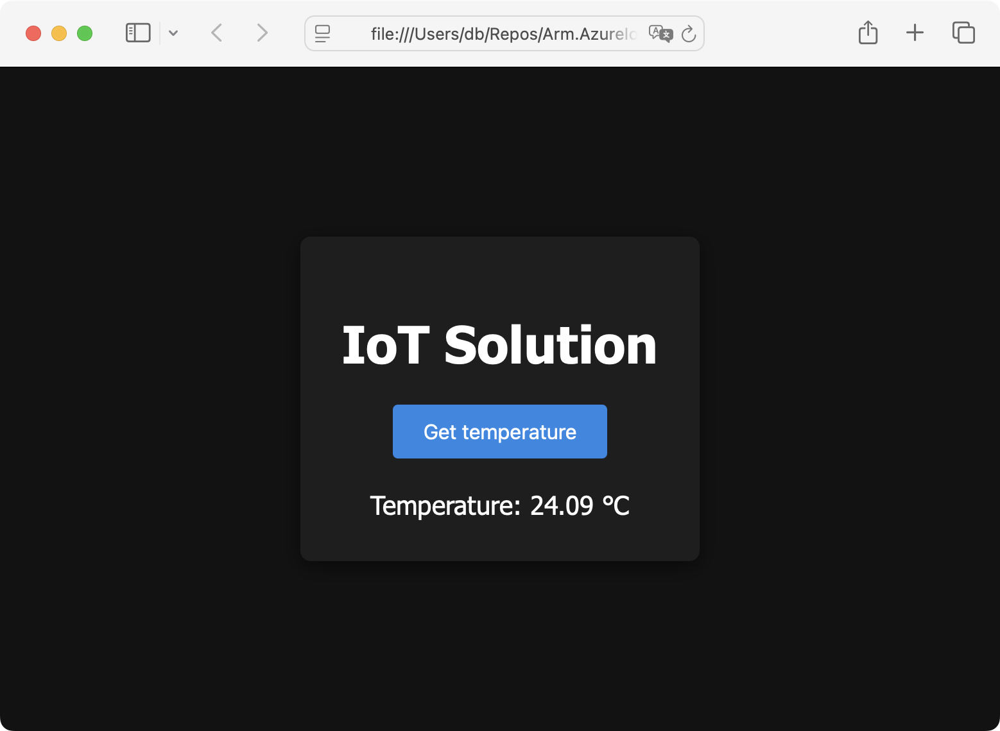
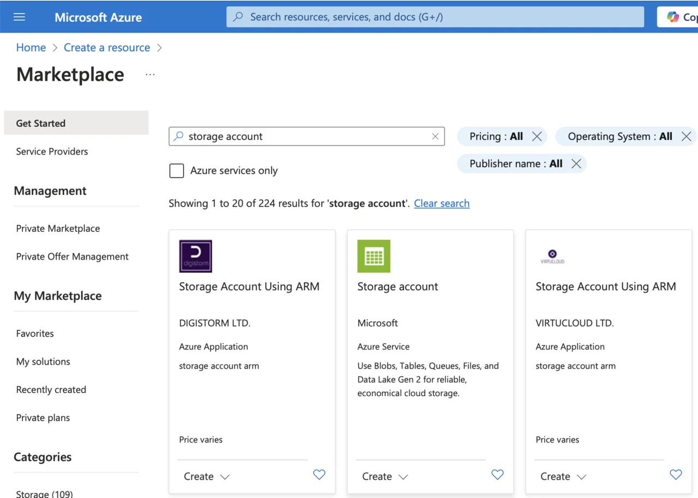
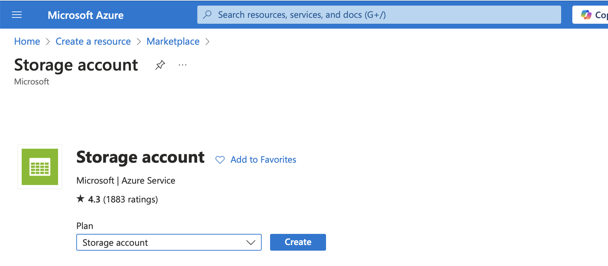
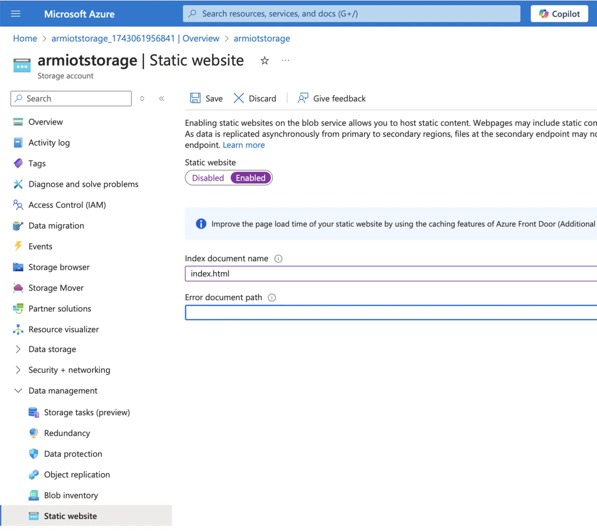
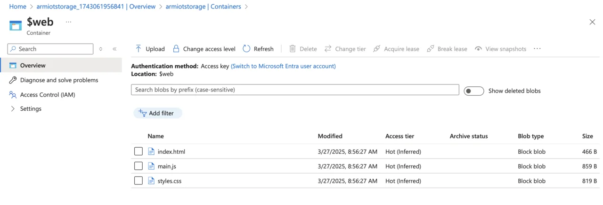
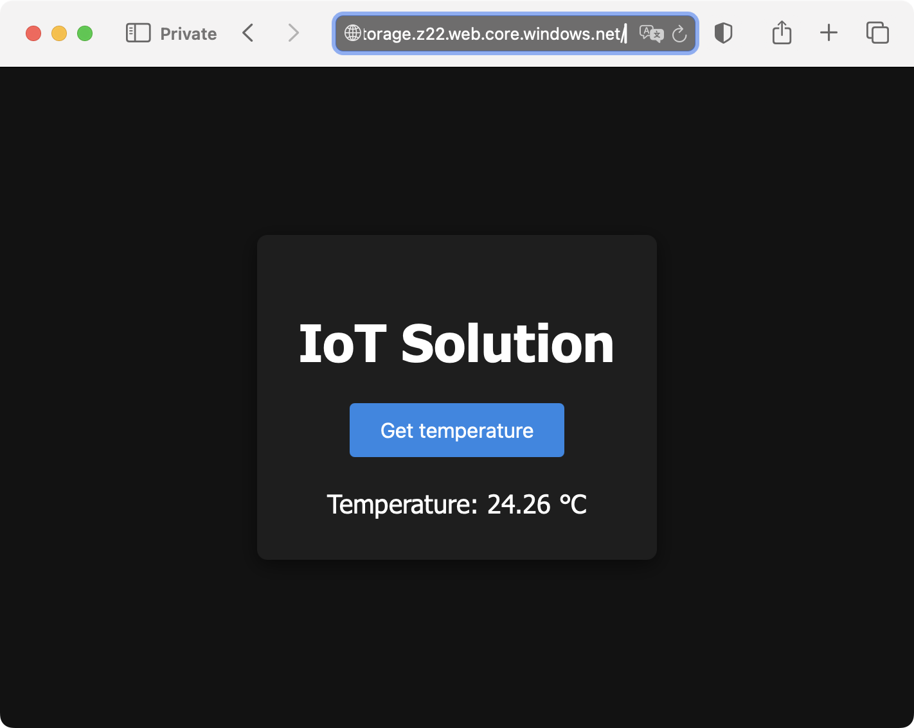

---
# User change
title: "IoT Portal"

weight: 9

layout: "learningpathall"
---

## Objective
You have successfully established the core backend components for our IoT solution. An IoT simulator continuously generates sensor data, streaming it securely to the cloud via Azure IoT Hub. These sensor readings are stored in Cosmos DB, ensuring data persistence and scalability. Additionally, you have implemented an Azure Function that can be triggered through HTTP requests to query Cosmos DB and calculate the average temperature from recent sensor data. With these underlying services fully operational, you can now build a web portal that will visually present real-time temperature information to end users.

## Website
Start by creating a new folder named `Arm.AzureIoT.Portal`, inside which you will create three files: `index.html`, `main.js`, and `styles.css`. 

   *`index.html` will define the structure of the webpage, and contain the HTML markup and links to the JavaScript and CSS files. 

   *`main.js` will include the logic and interactivity of the webpage. In this project, it will handle fetching temperature data from your Azure Function and updating the displayed content dynamically. 

   *`styles.css` will contain all the styling information, controlling the visual appearance of your webpage. 

### styles.css
Modify your `styles.css` file by adding the following CSS:
```css
body, html {
    margin: 0;
    padding: 0;
    font-family: 'Segoe UI', Tahoma, Geneva, Verdana, sans-serif;
    background-color: #121212;
    color: #ffffff;
    height: 100%;
    display: flex;
    justify-content: center;
    align-items: center;
  }
  .container {
    text-align: center;
    padding: 2rem;
    border-radius: 8px;
    box-shadow: 0 4px 15px rgba(0, 0, 0, 0.5);
    background-color: #1e1e1e;
  }
  h1 {
    margin-bottom: 1.5rem;
    font-size: 2.5rem;
  }
  button {
    background-color: #1e88e5;
    color: #ffffff;
    border: none;
    padding: 0.75rem 1.5rem;
    font-size: 1rem;
    border-radius: 4px;
    cursor: pointer;
    transition: background-color 0.3s ease;
  }
  button:hover {
    background-color: #1565c0;
  }
  .result {
    margin-top: 1.5rem;
    font-size: 1.25rem;
  }
```

The provided CSS sets a modern, dark-themed appearance for your IoT portal webpage. Here is a breakdown of its styling:

   * body and html. The styles remove default margins and paddings, define a dark background color (#121212), set the text color to white for high contrast, and center content both horizontally and vertically using Flexbox.
   * `.container` - this creates a central container element with padding for spacing, rounded corners (border-radius: 8px) for a softer look, a subtle shadow effect for depth, and a slightly lighter dark background (#1e1e1e) to distinguish the content area from the main page background.
   * `h1` - this defines the main title style with increased font size (2.5rem) and additional spacing below to clearly separate the title from other content.
   * `button` - styles the interactive “Get Temperature” button, giving it a blue color (#1e88e5), white text for readability, rounded corners for a friendly appearance, and smooth color-transition effects when hovered to improve user experience.
   * `.result` - formats the text area where the temperature reading will appear, adding sufficient margin for clear spacing and slightly larger text size to make the results easily readable.

### main.js
Now, open your `main.js` file and update it with the following JavaScript code:
```JavaScript
const functionUrl = "<YOUR_FUNCTION_URL_GOES_HERE>";

document.getElementById("getTempBtn").addEventListener("click", async () => {
   const resultElement = document.getElementById("result");
   resultElement.textContent = "Fetching temperature...";
   try {
     const response = await fetch(functionUrl);
     if (!response.ok) {
       throw new Error("Network response was not ok");
     }
     const data = await response.json();
     if (data && data.averageTemperature !== null) {
       resultElement.textContent = "Temperature: " + data.averageTemperature + " °C";
     } else {
       resultElement.textContent = "No temperature data available.";
     }
   } catch (error) {
     console.error("Error fetching temperature:", error);
     resultElement.textContent = "Error fetching temperature.";
   }
});
```

This JavaScript provides the interactive functionality for the webpage. It connects the portal to the Azure Function previously deployed. Here's how it works step-by-step. First, replace the placeholder "<YOUR_FUNCTION_URL_GOES_HERE>" with the actual URL of your Azure Function that calculates and returns the average temperature. The code uses event listener for the button. Specifically, it attaches a click event listener to your button (getTempBtn). Each time the button is clicked, it triggers the async JavaScript function that retrieves data.

When the button is clicked, the label (element with id "result") displays a temporary message—“Fetching temperature...”. It is used to inform the user that the request is in progress. The script sends a GET request to your Azure Function URL. If the request succeeds, it parses the JSON response. If the response contains valid temperature data (averageTemperature), it updates the label to show the current temperature. If no data is returned, it notifies the user accordingly.

If any error occurs (e.g., network issues, or a problem in fetching or parsing the data), the script logs the error to the browser console and updates the UI to inform the user (“Error fetching temperature.”).

### index.html
Finally, open the index.html file and replace its content with the following HTML code:
```HTML
<!DOCTYPE html>
<html lang="en">
<head>
  <meta charset="UTF-8" />
  <meta name="viewport" content="width=device-width, initial-scale=1.0" />
  <title>IoT Solution</title>
  <link rel="stylesheet" href="styles.css" />        
</head>
<body>
  <div class="container">
    <h1>IoT Solution</h1>
    <button id="getTempBtn">Get temperature</button>
    <div class="result" id="result">Temperature: -- °C</div>
  </div>
  <script src="main.js"></script>
</body>
</html>
```

This HTML file represents the main structure and entry point of your IoT web portal. It is divided into Head and Body sections: The head body defines basic metadata such as character set (UTF-8) and viewport configuration for responsive design. Then, it sets the title of your webpage to "IoT Solution" and links your CSS stylesheet (styles.css), which defines the appearance of the page.

In the body section, you will see:
* a centered container (div) with a clear heading (h1) labeled "IoT Solution".
*  a button (id="getTempBtn") that users click to trigger the JavaScript logic retrieving temperature data from your Azure Function.
* a placeholder label (div) with the id "result" initially showing "Temperature: -- °C". The JavaScript updates this label dynamically with the actual temperature retrieved from your backend.

Finally, the `index.html` includes the JavaScript file (main.js) placed at the end of the body to ensure the HTML elements are fully loaded before executing scripts.

## Testing the Implementation:
Make sure you have saved all three files (index.html, main.js, and styles.css). Next:
1. Start the IoT Simulator to begin streaming data to the Azure IoT Hub.
2. Open the index.html file locally in your web browser.
3. Click the **Get temperature** button.

You should now see real-time temperature readings displayed:



## Deployment to Azure Blob Storage
You will now deploy the web portal you have created to Azure Blob Storage, making it accessible online.

### Create and Configure Azure Blob Storage
1. Sign in to the Azure Portal.
2. Create a Storage Account:
* Click **Create a resource**.
* Search for “Storage account”.

* Click **Create**.

3. Provide the required details:
* Subscription, resource group, and storage account name (e.g. armiotstorage).
* For Primary service, choose **Azure Blob Storage** or **Azure Data Lake Storage Gen 2**.
* Select **Standard performance** and **Locally-redundant storage (LRS)**.

* Click "Review + create", then "Create".
3. Enable Static Website Hosting:
* Navigate to your newly created storage account.
* Under Data management, click **Static website**.
* Select **Enabled**.
* Set index.html as the index document name.

* Click **Save**.

After saving, Azure provides you with a URL like: https://<storage-account-name>.z22.web.core.windows.net/. 
Save this URL, as it will serve as the public endpoint for your website.

### Upload Files to Azure Blob Storage
You can upload your website files directly using the Azure Portal or via Azure Storage Explorer. Here, use the Azure Portal:
1. Navigate to your storage account.
2. Under Data storage, select **Containers**.
3. Open the container named ”$web” (created automatically when enabling static websites).
4. Click **Upload** and select your three website files (index.html, main.js, styles.css), and upload them.



### Verify the Deployment
After uploading your files, open a browser and navigate to https://<storage-account-name>.z22.web.core.windows.net/. 

Your static website should load, allowing you to test the **Get temperature** button (to see temperatures make sure to start the IoT simulator):



## Summary
In this Learning Path, you successfully built a complete, end-to-end prototype of an IoT solution. You started with a simulator streaming realistic telemetry data to Azure through IoT Hub. You used Azure Stream Analytics to process and route this streaming data directly into Cosmos DB, providing scalable and reliable storage. Additionally, you developed two Azure Functions: the first continuously monitors incoming temperature readings, sending email notifications whenever the temperature exceeds a predefined threshold, ensuring proactive alerts. The second Azure Function aggregates recent temperature data from the last minute and provides this information via an HTTP endpoint. Finally, you utilized this aggregation function within our user-friendly web portal, enabling real-time visualization of temperature data, thus building out a complete IoT solution.
