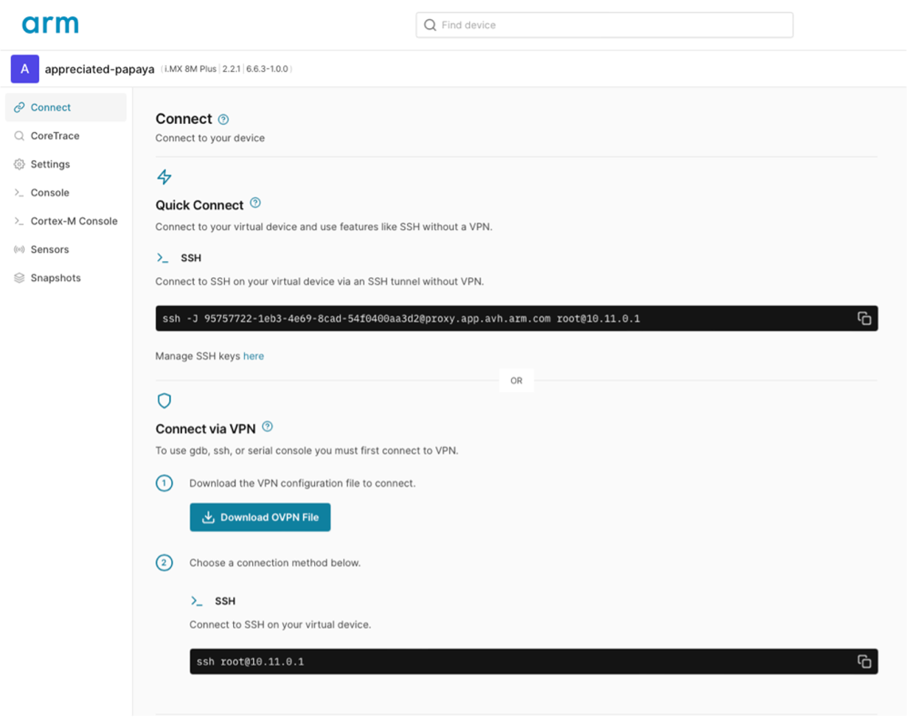

## Setup i.MX 8M Plus model

AVH offers a 30-day free trial to use.
-	Create an account in [Arm Virtual Hardware](https://app.avh.arm.com/login)
-	Once logged in, you should see a similar screen as shown in the image below. Click on **Create device**:
  

- Next, click on **Default Project**:
  

- Select the **i.MX 8M Plus** device. The platform runs four Cortex-A53 processors:


- Select the Yocto Linux (full) (2.2.1) image and click **Select**:
  
 (2.2.1) image")
- Click on **Create device** (note that this could take few minutes):


-	A console to Linux running on the Cortex-A should appear. Use “root” to login.

-	Find the IP address for the board model by running the following command (this will be needed to access the device using SSH):
```bash
ip addr
```


{}
The GUI on the right side may not work. You can safely ignore the error you see in the picture above and continue with the learning path.
{}

### Useful AVH tips

The **Connect** pane shows the different ways that you can connect to the simulated board. The IP address specified should be the same as that visible in the output of the `ip addr` command.



**Quick Connect** lets you connect SSH to the AVH model without having to use a VPN configuration. Similarly, you can replace `ssh` for `scp` to copy files from and to the virtual device. In order to use Quick Connect, it is necessary to add your public key via the **Manage SSH keys here** link.


To generate an SSH key, you can run the following command on your machine:
```bash
ssh-keygen -t ed25519
```


## Download the pre-built hybrid-runtime

Once your AVH model is set up, you can download the pre-built hybrid-runtime. This GitHub package contains the runtime and some necessary scripts:

```console
wget https://github.com/smarter-project/hybrid-runtime/releases/download/v1.5/hybrid.tar.gz
```

Extract the files to /usr/local/bin using:
```console
tar -C /usr/local/bin/ -xvf hybrid.tar.gz
```
{}
If you want to build the hybrid-runtime on your own, instructions can be found in the section of this learning path called [Building the hybrid-runtime and container image](/learning-paths/embedded-and-microcontrollers/cloud-native-deployment-on-hybrid-edge-systems/build-runtime/).
{}

## Download Firmware container image

For this learning path, there is also a pre-built lightweight Docker container image available on GitHub. You can use it for the `i.MX8M-PLUS-EVK` board. The container image contains a simple FreeRTOS hello-world application built using the NXP SDK.

You can pull the pre-built image onto the AVH model by running the following command:

```console
ctr image pull ghcr.io/smarter-project/hybrid-runtime/hello_world_imx8mp:latest
```
Make sure the container image was pulled successfully. An image with the name *ghcr.io/smarter-project/hybrid-runtime/hello_world_imx8mp:latest* should appear as an output to the following:

```console
ctr image ls
```

