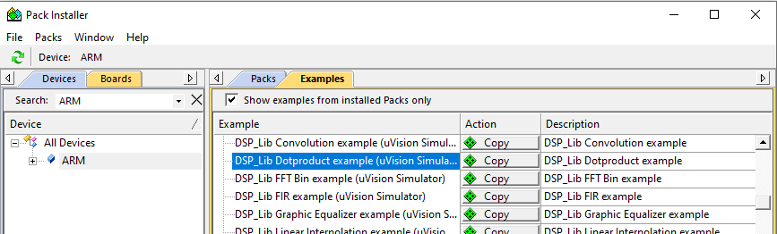
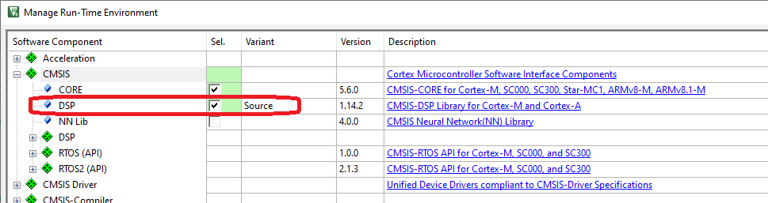
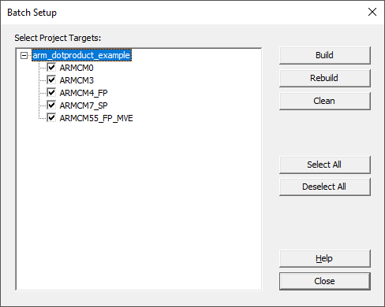
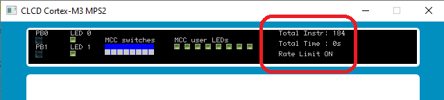

---
# User change
title: Build example with Keil μVision

weight: 4 # 1 is first, 2 is second, etc.

# Do not modify these elements
layout: "learningpathall"
---
{}
Screenshots below are from older versions of Keil μVision, and are for illustrative purposes only.

There may be slight differences with latest versions of tools and/or software packs.
{}

## Build example with Keil μVision

Open the `Pack Installer`, select `ARM` as the device, and locate `CMSIS-DSP DotProduct example` from the `Examples` tab.

Click `Copy`, and save the project to an appropriate location on your host.

The project contains build targets for different Cortex-M processors.

### CMSIS-DSP Software Pack

The example is already configured to use the CMSIS-DSP software pack. To see this, open the `Manage Run-Time Environment` pane, and see `CMSIS` > `DSP`.

### Rebuild

Open the `Project` > `Batch Setup` pane from the menu bar, and select (at least) `ARMCM3` and `ARMCM55_FP_MVE` targets. Click `Rebuild`.

## Run example on Cortex-M3 FVP

From the `Select Target` pulldown, highlight the `ARMCM3` target (build for Cortex-M3).

The project is already configured for the supplied Fixed Virtual Platforms (`FVPs`). See the `Options` > `Debug` pane.

{}
Depending on the version of MDK you have installed the path to FVP executable may need to be updated.

* MDK versions before 5.37:     `Keil_v5/ARM/FVP`

* MDK versions 5.38, 5.39:     `Keil_v5/ARM/VHT`

* MDK version 5.40 or later:   `Keil_v5/ARM/avh-fvp/bin/models`

{}

Start a debug session (`Ctrl+F5`) to load the image to the Cortex-M3 FVP, and run to `main`.

Note the number of instructions executed to this point, as shown in the FVP display (`184` in the example below):

If not already set, place a breakpoint at the `while(1);` statement at the end of the `main` function.

Click `Run` (or press `F5`) to run the example to this breakpoint, and stop.

Note the number of instructions executed, and subtract the initialization cycle count.

Terminate the debug session.

## Run example on Cortex-M55 FVP

From the `Select Target` pulldown, highlight the `ARMCM55_FP_MVE` target (build for Cortex-M55).

This build makes use of the [Helium](https://www.arm.com/technologies/helium) vectorizing extensions that Cortex-M55 supports.

Repeat the steps above to run on the Corstone-300 FVP, and note the number of instructions executed, which should be a dramatic improvement over Cortex-M3.

{}
The FVPs are instruction accurate but not cycle accurate.

The instruction count is used here to illustrate relative performance to a high granularity.
{}
