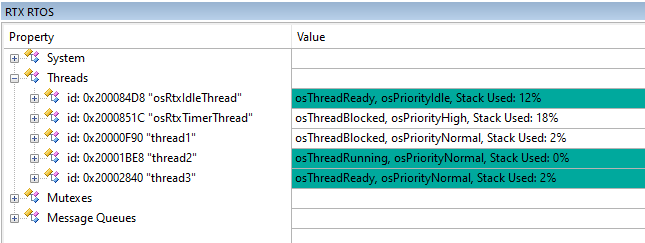
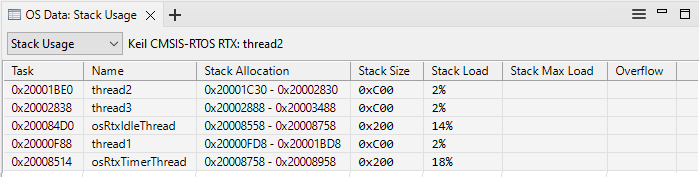
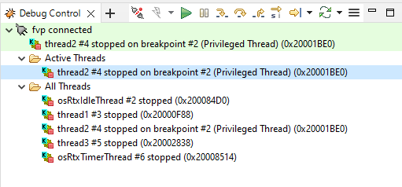

---
# User change
title: "Build and run the application"

weight: 5 # 1 is first, 2 is second, etc.

# Do not modify these elements
layout: "learningpathall"
---
You are now ready to build and run the application.

The method and capabilities of [Keil MDK](#mdk) and [Arm Development Studio](#armds) are quite different. Refer to the appropriate section below.

## Build and run the example (Keil MDK) {#mdk}

Save all files, and click `build` (`F7`) the example.

Click `Debug` (`Ctrl+F5`) to launch the FVP, and put the IDE into debug mode.
* Use the menu (`View` > `Watch Windows` > `RTX RTOS`) to observe the RTOS features.
* Use the menu (`View` > `Serial Windows` > `Debug (printf)`) to observe the printf output.

Click `Run` (`F5`) to start the application, and after a short time, click `Stop`.

Observe in the `RTX RTOS` view that the threads have been created. Two other threads, `osRtxIdleThread` and `osRtxTimerThread` will also be created.



However no output is seen in the `printf viewer`. This is because semihosting is not supported. You will learn how to address this in the next section.

Exit the debug session (`Ctrl+F5`).

## Build and run the example (Arm Development Studio) {#armds}

Save all files, then right-click on the project, and select `Build Project`.

A `.axf` file will be generated in the `Configuration Name` folder.

You must now create a `Debug Configuration`:
  * Navigate the menu to `File` > `New` > `Model Connection`.
  * Create a Debug connection, and associate it with your project.
  * Select the `MPS2_Cortex-M4` from the selection of FVPs Installed with Arm DS.
  * In the Debug configuration view:
    * In `Files` tab, browse for your `.axf` image.
	* In `Debugger` tab, select `Debug from symbol (main)`
	* In `OS Awareness` tab, select `Keil CMSIS-RTOS RTX` from the pull-down.
	* Click `Apply` to save all settings, then click `Debug`.
	  * Subsequent debug sessions can be invoked directly from the `Debug Control` pane.

When debugging, use the `OS Data` view to observe RTOS information. Open from the `Window` > `Show View` menu. Use the pull down to select different categories.



For thread aware debug, right-click on the debug connection in the `Debug Control` view, and select `Display threads`.



You will see the printf() output in `Target Console` pane.
```
hello from thread 1
hello from thread 2
hello from thread 3
hello from thread 1
hello from thread 2
...
```