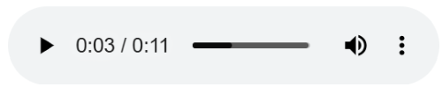
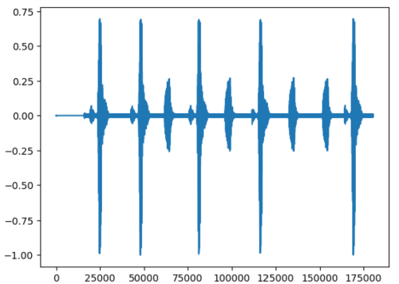

## Load and screen audio file

You'll use a sample audio file from an Arm demo repository on GitHub:

```python
test_pattern_url = "https://github.com/ARM-software/VHT-SystemModeling/blob/main/EchoCanceller/sounds/yesno.wav?raw=true"
f = urlopen(test_pattern_url)
filedata = f.read()
```

Play the audio in your Jupyter notebook:

```python
audio = Audio(data=filedata,autoplay=False)
audio
```

An audio widget will appear:



You'll hear a sequence of the words "yes" and "no" with background noise. The goal of this Learning Path is to design an algorithm that removes that noise.

### Convert the Audio to a NumPy Array

Convert the audio into a NumPy array so it can be processed with CMSIS-DSP:

```python
data, samplerate = sf.read(io.BytesIO(filedata))
if len(data.shape) > 1:
    data = data[:, 0]
data = data.astype(np.float32)
data = data / np.max(np.abs(data))
dataQ15 = fix.toQ15(data)
```

The code above does the following:
- Converts the audio to a NumPy array.
- Keeps only one channel if the audio is stereo.
- Normalizes the audio to ensure no value exceeds 1.
- Converts the audio to Q15 fixed-point representation to enable the use of CMSIS-DSP fixed-point functions.

### Plot the audio signal

Now, plot the audio waveform:

```python
plt.plot(data)
plt.show()
```

You'll see:



The waveform shows a sequence of words. Between the words, the signal is not zero; there is some noise.

### Prepare for block-based processing

In real applications, audio streams are processed in real time. Processing can either be sample-based or block-based. For this Learning Path, the processing is block-based.

Before you can move to the next step, this signal must be split into overlapping blocks. The processing will occur on small blocks of samples of a given duration, known as windows.

```python
winDuration = 30e-3 / 6
winOverlap = 15e-3 / 6

winLength = int(np.floor(samplerate*winDuration))
winOverlap = int(np.floor(samplerate*winOverlap))
slices = sliding_window_view(data,winLength)[::winOverlap,:]
slices_q15 = sliding_window_view(dataQ15,winLength)[::winOverlap,:]
```

Refer to the [NumPy documentation](https://numpy.org/doc/stable/reference/generated/numpy.lib.stride_tricks.sliding_window_view.html) for details about `sliding_window_view`. It's not the most efficient function, but it is sufficient for this tutorial. The signal is split into overlapping blocks: each block reuses half of the samples from the previous block as defined by the `winOverlap` variable.

By running that last block, you have an audio signal that has been split into overlapping blocks. 

The next step is to do some processing on those blocks.
