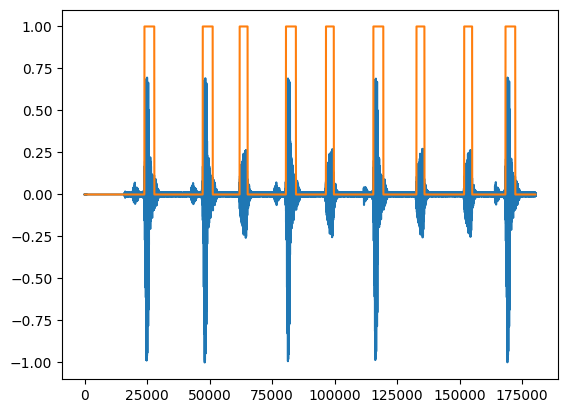

## Write a simple voice activity detection

To remove the noise between speech segments, you need to detect when voice is present. Voice activity detection (VAD) can be complex, but for this Learning Path, you'll implement a simple energy-based approach. The idea is that if the environment isn't too noisy, speech should have more energy than noise.

The detection relies on a comparison with a threshold that must be manually tuned. That threshold is hard-coded, which might not work in a real-life use case, but is a sufficient solution for this Learning Path. 

You'll first implement a version of the VAD with NumPy, which serves as a reference. Then you'll implement the same version using CMSIS-DSP with the Q15 fixed-point format.

Throughout this section, you should copy the code blocks and run them in your Jupyter notebook.

### NumPy VAD

First, you need to compute the energy of the signal within a block of samples. You'll ignore any constant component and focus only on the varying part of the signal:

```python
# Energy of the window
def signal_energy(window):
    w = window - np.mean(window)
    return(10*np.log10(np.sum(window * window)))
```
Then, compare the energy to a threshold to determine whether the block of audio is speech or noise:

```python
def signal_vad(window):
    if signal_energy(window)>-11:
        return(1)
    else:
        return(0)
```

Additionally, you'll need another pass to clean up the detection signal.

```python
def clean_vad(v):
    v = np.hstack([[0],v,[0]])
    # Remove isolated peak
    vmin=[np.min(l) for l in sliding_window_view(v,3)]
    vmin = np.hstack([[0,0],vmin,[0]])
    # Remove isolated hole
    vmax=[np.max(l) for l in sliding_window_view(vmin,4)]
    return(vmax)
```

Now you can apply this algorithm to the audio signal and plot the VAD over it to see if it's working:

```python
_,ax=plt.subplots(1,1)
cleaned=clean_vad([signal_vad(w) for w in slices])
vad = np.array([[w]*(winLength-winOverlap) for w in cleaned]).flatten()
ax.plot(data)
ax.plot(vad)
```


This plot shows you that the reference implementation works. The next step is to implement a similar graph using CMSIS-DSP.

### CMSIS-DSP Q15 VAD

#### Energy
First, you need to compute the signal energy from audio in Q15 format using CMSIS-DSP.

If you look at the CMSIS-DSP documentation, you'll see that the `power` and `vlog` functions don't produce results in Q15 format. Tracking the fixed-point format throughout all lines of an algorithm can be challenging. 

In this example, this means that:

* Subtracting the mean to center the signal - as you did in the reference implementation - is handled in CMSIS-DSP by negating the mean and applying it as an offset to the window. Using CMSIS-DSP, `arm_negate_q15` is needed to avoid saturation issues that could prevent the value sign from changing (`0x8000` remaining unchanged as `0x8000`). In practice, the mean should be small, and there should be no difference between `-` and `dsp.arm_negate_q15`. However, it is good practice to avoid using `-` or `+` in a fixed-point algorithm when translating it to CMSIS-DSP function calls.
* The resulting `energy` and `dB` values are not in Q15 format because the `power` and `vlog` functions are used.
* The multiplication by 10 from the reference implementation is missing.

This means that the `signal_energy_q15` will have a different output than the above implementation. Instead of trying to determine the exact fixed-point format of the output and applying the necessary shift to adjust the output's fixed-point format, you will address it in the next step by tuning the threshold of the detection function:


```python
def signal_energy_q15(window):
    # Calculate window
    mean=dsp.arm_mean_q15(window)
    neg_mean=dsp.arm_negate_q15([mean])[0]
    window=dsp.arm_offset_q15(window,neg_mean)

    # Energy of the window
    energy=dsp.arm_power_q15(window)
    energy=dsp.ssat(energy>>20,16)
    dB=dsp.arm_vlog_q15([energy])

    return(dB[0])
```

#### VAD

The comparison function is similar to the NumPy reference, but the threshold is different:

```python
def signal_vad_q15(window):
    if signal_energy_q15(window)>fix.toQ15(-0.38):
        return(1)
    else:
        return(0)
```

{}
In C code, you can hard-code the output of `fix.toQ15(-0.38)`. `fix.toQ15` is a utility of the Python package to convert float to fixed-point, but it is not available in the CMSIS-DSP C implementation. CMSIS-DSP C provides functions like `arm_float_to_q15` which operate on arrays and are intended for use at runtime. To define a precomputed constant, use a utility function like `fix.toQ15` during development and copy the resulting value into your C code.
{}

#### Plot the Q15 implementation

The clean VAD function is now the same for both the NumPy and Q15 versions. You can check whether the Q15 version is working by plotting the signal and the output of the Q15 VAD algorithm:

```python
_,ax=plt.subplots(1,1)
cleaned=clean_vad([signal_vad_q15(w) for w in slices_q15])
vad_q15 = np.array([[w]*winOverlap for w in cleaned]).flatten()
ax.plot(data)
ax.plot(vad_q15)

```

Now that you have a working VAD implementation, move on to the next section to combine the principles into a Python class for noise suppression.