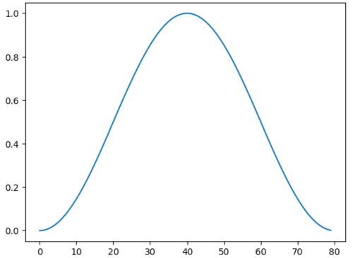
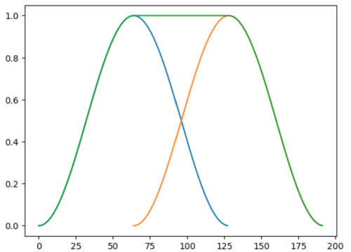
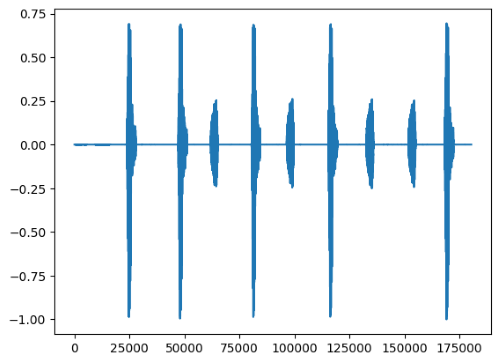

## Write a noise suppression algorithm

In this section, you will learn about the mathematics that serves as a basis for the use-case. Then, you will use those principles to create a reference implementation using NumPy.

### Overlapping windows

The blocks of audio samples you created in the previous steps will be multiplied by a Hanning window function, which you will achieve by running the following in the Jupyter notebook:

```python
window=dsp.arm_hanning_f32(winLength)
plt.plot(window)
plt.show()
```




The slices we created are overlapping. By applying a Hanning window function and summing the slices, you can reconstruct the original signal.

Indeed, summing two Hanning windows shifted by half the width of the sample block gives:


As result, if you multiply the overlapping blocks of samples by Hanning windows and sum the result, you can reconstruct the original signal:


```python
offsets = range(0, len(data),winOverlap)
offsets=offsets[0:len(slices)]
res=np.zeros(len(data))
i=0
for n in offsets:
    res[n:n+winLength] += slices[i]*window
    i=i+1
plt.plot(res)
plt.show()
```

You can now listen to the recombined signal:
```python
audio2=Audio(data=res,rate=samplerate,autoplay=False)
audio2
```


This means you can process each slice independently and then recombine them at the end to produce the output signal.

### Principle of the noise reduction

The algorithm works in the spectral domain, so a Fast-Fourier Transform (FFT) will be used.
When there is no speech (as detected with the VAD), the noise level in each frequency band is estimated.

When speech is detected, the noise estimate is used.

Noise filtering in each band uses a simplified Wiener filter.

A gain is applied to the signal, defined as follow:

$$H(f) = \frac{S(f)}{S(f) + N(f)}$$

- \(S(f)\) is the speech spectrum.
- \(N(f)\) is the noise spectrum.

$$H(f) = \frac{1}{1 + \frac{N(f)}{S(f)}}$$

For this tutorial, we assume a high Signal-to-Noise Ratio (SNR). The VAD relies on this assumption: the signal energy is sufficient to detect speech.
With a high SNR, the transfer function can be approximated as:

$$H(f) \approx 1 - \frac{N(f)}{S(f)}$$

You don't have access to \(S(f)\), only to the measured \(S(f) + N(f)\) which will be used under the assumption that the noise is small, making the approximation acceptable:

$$H(f) \approx 1 - \frac{N(f)}{S(f) + N(f)}$$


with \(S(f) + N(f) = E(f)\)

- \(E(f)\) is the observed energy in a frequency band.

It can be rewritten as:

$$H(f) \approx \frac{E(f) - N(f)}{E(f)}$$

- \(N(f)\) is estimated when there is no speech.

In the Python code below, you’ll see this formula implemented. Don’t run this snippet in your Jupyter notebook — it will be run later as part of the full implementation.


```output
scaling = (energy - self._noise)/energy
```

### NoiseSuppression and NoiseSuppressionReference classes

The entire algorithm will be packaged as a Python class.

{}
The class functions are explained below using Python code that should not be evaluated in the Jupyter notebook. You should only evaluate the full class definition in the Jupyter notebook—not the code snippets used for explanation.
{}

#### NoiseSuppression constructor

`NoiseSuppression` is a shared class used by both the float reference implementation and the Q15 version.

```python
class NoiseSuppression():
    def __init__(self,slices):
            self._windowLength=len(slices[0])
            self._fftLen,self._fftShift=fft_length(self._windowLength)

            self._padding_left=(self._fftLen - self._windowLength)//2
            self._padding_right=self._fftLen- self._windowLength-self._padding_left

            self._signal=[]
            self._slices=slices
            self._window=None
```

The constructor for `NoiseSuppression`:
- Uses the audio slices as input
- Computes the FFT length that can be used for each slice
- Computes the padding needed for the FFT

The FFT length must be a power of 2. The slice length is not necessarily a power of 2. The constructor therefore computes the closest usable power of 2, and the audio slices are padded with zeros on both sides to match the required FFT length. To make the implementation more robust, this could be computed from by taking the smaller power of two greater than the signal length.

#### NoiseSuppressionReference constructor

```python
class NoiseSuppressionReference(NoiseSuppression):
    def __init__(self,slices):
        NoiseSuppression.__init__(self,slices)

        # Compute the VAD signal
        self._vad=clean_vad([signal_vad(w) for w in slices])
        self._noise=np.zeros(self._fftLen)
        # The Hann window
        self._window=dsp.arm_hanning_f32(self._windowLength)
```

The constructor for `NoiseSuppressionReference`:
- Uses the audio slices as input
- Call the constructor for `NoiseSuppression`
- Computes the VAD signal for the full audio signal
- Compute the Hanning window


#### subnoise

Calculates the approximate Wiener gain and is applied to all frequency bands of the FFT. The `v` argument is a vector.


```python
def subnoise(self,v):
        # Wiener estimate
        energy = v * np.conj(v) + 1e-6

        scaling = (energy - self._noise)/energy
        scaling[scaling<0] = 0

        return(v * scaling)
```

#### remove_noise

Computes the FFT (with padding) and reduces noise in the frequency bands using the approximate Wiener gain.
If the gain is negative, it is set to zero. A small value is added to the energy to avoid division by zero.

The function also uses `window_and_pad`, which is implemented in the final code-block later.
At a glance, this helper method takes care of padding the signal for a basic even-length window, ensuring it runs smoothly with the FFT.

```python
    def remove_noise(self,w):
        sig=self.window_and_pad(w)

        # FFT
        fft=np.fft.fft(sig)
        # Noise suppression
        fft = self.subnoise(fft)
        # IFFT
        res=np.fft.ifft(fft)
        # Assume the result is real - ignore the imaginary part
        res=np.real(res)
        # Remove the padding
        res=self.remove_padding(res)
        return(res)
```


#### estimate_noise

If no speech detected, this function is called to estimate the noise energy.

```python
def estimate_noise(self,w):
    # Compute the padded signal
    sig=self.window_and_pad(w)
    fft=np.fft.fft(sig)

    # Estimate the noise energy
    self._noise = np.abs(fft)*np.abs(fft)

    # Remove the noise
    fft = self.subnoise(fft)

    # IFFT and assume the result is real - ignore imaginary part
    res=np.fft.ifft(fft)
    res=np.real(res)
    res=self.remove_padding(res)
    return(res)
```

#### remove_noise_from_slices

The main function: it removes noise from each slice.
If a slice does not contain speech, the noise estimate is updated before reducing noise in each frequency band.

```python
def remove_noise_from_slices(self):
        for (w,v) in zip(self._slices,self._vad):
            result=None
            if v==1:
                # If voice is detected, only remove the noise
                result=self.remove_noise(w)
            else:
                # If no voice is detected, update the noise estimate
                result=self.estimate_noise(w)
            self._signal.append(result)
```


#### overlap_and_add

The filtered slices are recombined using the pre-defined window lengths from before:

```python
def overlap_and_add(self):
        offsets = range(0, len(self._signal)*winOverlap,winOverlap)
        offsets=offsets[0:len(self._signal)]
        res=np.zeros(len(data))
        i=0
        for n in offsets:
            res[n:n+winLength]+=self._signal[i]
            i=i+1
        return(res)
```

### Run the Python class

It's time to put together the reference version of the noise suppression algorithm. Copy and evaluate this code in your Jupyter notebook.

```python
def fft_length(length):
    result=2
    fft_shift=1
    while result < length:
        result = 2*result
        fft_shift = fft_shift + 1
    return(result,fft_shift)

class NoiseSuppression():
    def __init__(self,slices):
        self._windowLength=len(slices[0])
        self._fftLen,self._fftShift=fft_length(self._windowLength)

        self._padding_left=(self._fftLen - self._windowLength)//2
        self._padding_right=self._fftLen- self._windowLength-self._padding_left

        self._signal=[]
        self._slices=slices
        self._window=None

    # Pad the signal with zeros. The FFT length is greater than the window length and must be a power of 2
    def window_and_pad(self,w):
        if w.dtype==np.int32:
            w=dsp.arm_mult_q31(w,self._window)
        elif w.dtype==np.int16:
            w=dsp.arm_mult_q15(w,self._window)
        else:
            w = w*self._window
        sig=np.hstack([np.zeros(self._padding_left,dtype=w.dtype),w,np.zeros(self._padding_right,dtype=w.dtype)])
        return(sig)

    def remove_padding(self,w):
        return(w[self._padding_left:self._padding_left+self._windowLength])

class NoiseSuppressionReference(NoiseSuppression):
    def __init__(self,slices):

        NoiseSuppression.__init__(self,slices)

        # Compute the VAD signal
        self._vad=clean_vad([signal_vad(w) for w in slices])
        self._noise=np.zeros(self._fftLen)
        # The Hann window
        self._window=dsp.arm_hanning_f32(self._windowLength)

    # Subtract the noise
    def subnoise(self,v):
        # Wiener estimate
        energy = v * np.conj(v) + 1e-6

        scaling = (energy - self._noise)/energy
        scaling[scaling<0] = 0

        return(v * scaling)

    def remove_noise(self,w):
        sig=self.window_and_pad(w)

        # FFT
        fft=np.fft.fft(sig)
        # Noise suppression
        fft = self.subnoise(fft)
        # IFFT
        res=np.fft.ifft(fft)
        # Assume the result is real - ignore the imaginary part
        res=np.real(res)
        # Remove the padding
        res=self.remove_padding(res)
        return(res)

    def estimate_noise(self,w):
        # Compute the padded signal
        sig=self.window_and_pad(w)
        fft=np.fft.fft(sig)

        # Estimate the noise energy
        self._noise = np.abs(fft)*np.abs(fft)

        # Remove the noise
        fft = self.subnoise(fft)

        # IFFT and assume the result is real - ignore imaginary part
        res=np.fft.ifft(fft)
        res=np.real(res)
        res=self.remove_padding(res)
        return(res)

    # Process all the windows using the VAD detection
    def remove_noise_from_slices(self):
        for (w,v) in zip(self._slices,self._vad):
            result=None
            if v==1:
                # If voice detected, only remove the noise
                result=self.remove_noise(w)
            else:
                # If no voice detected, update the noise estimate
                result=self.estimate_noise(w)
            self._signal.append(result)

    # Overlap and add to rebuild the signal
    def overlap_and_add(self):
        offsets = range(0, len(self._signal)*winOverlap,winOverlap)
        offsets=offsets[0:len(self._signal)]
        res=np.zeros(len(data))
        i=0
        for n in offsets:
            res[n:n+winLength]+=self._signal[i]
            i=i+1
        return(res)
```
You can now test this algorithm on the original signal:

```python
n=NoiseSuppressionReference(slices)
n.remove_noise_from_slices()
cleaned=n.overlap_and_add()
plt.plot(cleaned)
plt.show()
```



You can now listen to the result:

```python
audioRef=Audio(data=cleaned,rate=samplerate,autoplay=False)
audioRef
```

In the next section, you will write the optimized version using CMSIS-DSP.