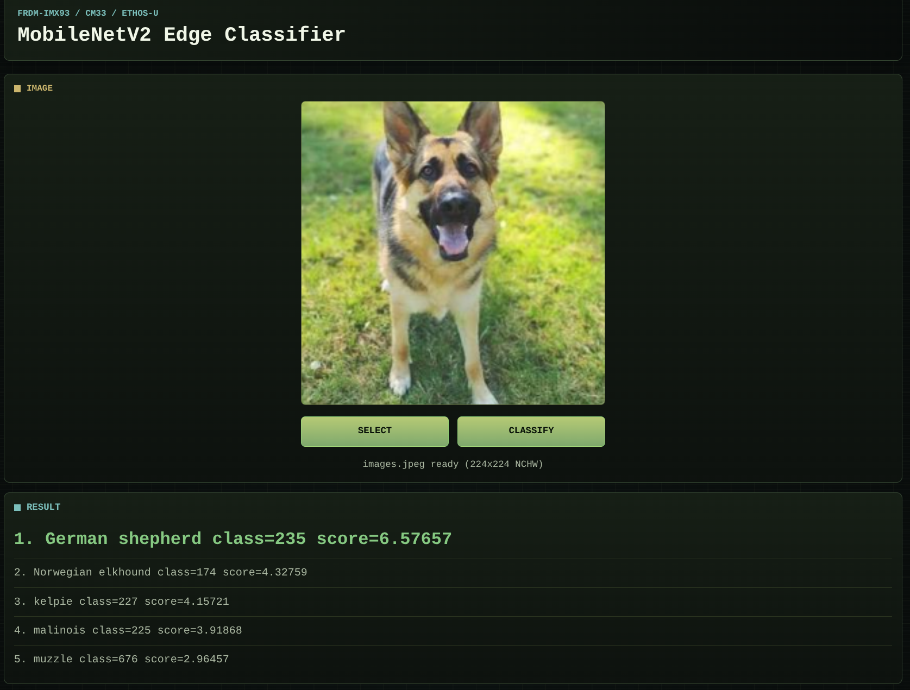

## Prepare the target

Before deploying the Template, confirm that the FRDM i.MX 93 board is reachable from your host and that it's ready for deployment:

```bash
topo health --target <user>@<target-ip>
```
Replace `<target-ip>` with the IP address or hostname of your board.

Resolve any errors before continuing.

The target section should include successful checks similar to:

```output
Host
----
Topo: ✅ (topo)
SSH: ✅ (ssh)
Curl: ✅ (curl)
Container Engine: ✅ (docker)

Target
------
Destination: ssh://<target-ip>
Connectivity: ✅
Container Engine: ✅ (docker)
Remoteproc Runtime: ✅ (remoteproc-runtime)
Remoteproc Shim: ✅ (containerd-shim-remoteproc-v1)
Hardware Info: ✅ (lscpu)
Subsystem Driver (remoteproc): ✅ (imx-rproc)
```

{}
If `remoteproc-runtime` is missing, install it with Topo:

```bash
topo install remoteproc-runtime --target <user>@<target-ip>
```

Run the health check again:

```bash
topo health --target <user>@<target-ip>
```
{}

## Reserve memory in the device tree

The web application and Cortex-M33 firmware exchange data through reserved physical memory. The target device tree must reserve memory for the model/input buffer and for the Ethos-U65. This prevents Linux from allocating memory that the Cortex-M33 firmware and Ethos-U65 need to access by physical address. You are now going to modify the device tree and reboot the target so that these modifications take effect.

{}
Back up the board's original device tree before modifying it. The exact boot partition can differ between Linux images, so check the paths on your board before copying files.
{}

On your host, create a working directory and dump the live device tree from the target:

```bash
mkdir -p devicetree
ssh <user>@<target-ip> 'cat /sys/firmware/fdt' > devicetree/live.dtb
dtc -I dtb -O dts -o devicetree/live.dts devicetree/live.dtb
```

Open `devicetree/live.dts` in a text editor of your choice.

Under `remoteproc-cm33`, add the CM33 power domain if it is not already present:

```dts
power-domains = <0x61>;
```

Under `reserved-memory`, add the model memory range:

```dts
model@c0000000 {
    reg = <0x00 0xc0000000 0x00 0x400000>;
    no-map;
};
```

Update the Ethos-U reserved-memory node so it is reserved and not reusable:

```dts
ethosu_region@A8000000 {
    compatible = "shared-dma-pool";
    reg = <0x00 0xa8000000 0x00 0x8000000>;
    no-map;
    phandle = <0x60>;
};
```

Add `iomem=relaxed` to `chosen.bootargs`. For example:

```dts
bootargs = "clk-imx93.mcore_booted console=ttyLP0,115200 earlycon root=/dev/mmcblk1p2 rootwait rw iomem=relaxed";
```

Return to your host machine terminal and build the patched device tree:

```bash
dtc -I dts -O dtb -o devicetree/patched.dtb devicetree/live.dts
```

Copy it to the board:

```bash
scp devicetree/patched.dtb <user>@<target-ip>:/tmp/patched.dtb
```

Install it on the board. Adjust the boot partition path if your image uses a different location:

```bash
ssh <user>@<target-ip>
cp /run/media/boot-mmcblk1p1/imx93-11x11-frdm.dtb \
   /run/media/boot-mmcblk1p1/imx93-11x11-frdm.dtb.bak
cp /tmp/patched.dtb \
   /run/media/boot-mmcblk1p1/imx93-11x11-frdm.dtb
sync
reboot
```

After the board reboots, run the Topo health check again from the host and verify everything is still correct:

```bash
topo health --target <user>@<target-ip>
```

## Deploy to the board

You can choose to deploy from the original Template, or from the Template you built from scratch. If you have not already cloned the original Template, clone it now:

```bash
topo clone https://github.com/Arm-Examples/topo-imx93-npu-deployment.git
```

Topo prompts for optional build cache image arguments. Accept the defaults unless you have your own cache images.

Then `cd` into the correct directory:

```bash
cd topo-imx93-npu-deployment
```

Or:

```bash
cd new-topo-npu-template
```

{}
If not pulling from the cache, the first build can take a long time and requires about 25 GB of free disk space. It downloads and builds ExecuTorch, the Arm GNU toolchain, MCUX SDK components, RPMsg-Lite, and the Cortex-M33 runner sources. Later builds are faster when Docker can reuse local cache layers or import the configured GHCR cache layers.
{}

Deploy the project to your target:

```bash
topo deploy --target <user>@<target-ip>
```

During deployment, Topo builds the required images, transfers them to the target, starts the Cortex-M33 firmware through `remoteproc-runtime`, and starts the web application.

When deployment succeeds, the output includes a successful service startup. You can also check the deployed services:

```bash
topo ps --target <user>@<target-ip>
```

Your output should show a process on both the Cortex-M33, and the Linux Host, similar to below:

```output
Image                                   Status          Processing Domain   Address
topo-imx93-npu-deployment-cm33-runner   Up 50 minutes   imx-rproc
topo-imx93-npu-deployment-webapp        Up 50 minutes   Linux Host          imx93-scorpio.cambridge.arm.com:3001, [::]:3001%
```

## Open the web application

Open the web application in a browser:

```
http://<target-ip>:3001
```

{}
If you need to use a different target port, set `WEBAPP_PORT` when deploying:

```bash
WEBAPP_PORT=3002 topo deploy --target <user>@<target-ip>
```

Then open:

```output
http://<target-ip>:3002
```
{}

The application shows:

- an image selector
- a **Classify** button
- board prerequisite checks
- classification results
- an expandable analysis section with runtime details

You should see something similar to:



When you select an image in the browser and click **Classify**, the web application:

1. Resizes and normalizes the image to classify into an input tensor compatible with the [MobileNetV2](https://arxiv.org/abs/1801.04381) model.
2. Writes the ExecuTorch `.pte` program and input tensor into reserved physical memory.
3. Sends a `RUN` command to the Cortex-M33 runner over `RPMsg`.
4. Waits for the Cortex-M33 firmware to run inference using Ethos-U65 acceleration.
5. Displays the top-1 and top-5 ImageNet classification results in the browser.

Try this out with an image from an ImageNet-supported class.

## What you've accomplished

You have prepared an FRDM i.MX 93 board for shared-memory NPU inference, deployed the `topo-imx93-npu-deployment` Template with Topo, started Cortex-M33 firmware through `remoteproc-runtime`, and used a browser-based application to stage the ExecuTorch `.pte` program and input tensor for MobileNetV2 classification with Ethos-U65 acceleration.

You can now use the deployed application as a reference for your own heterogeneous Arm applications, or adapt the model, firmware runner, web interface, or Topo metadata for another target.
