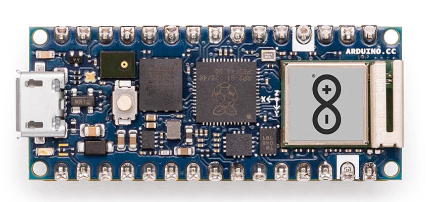
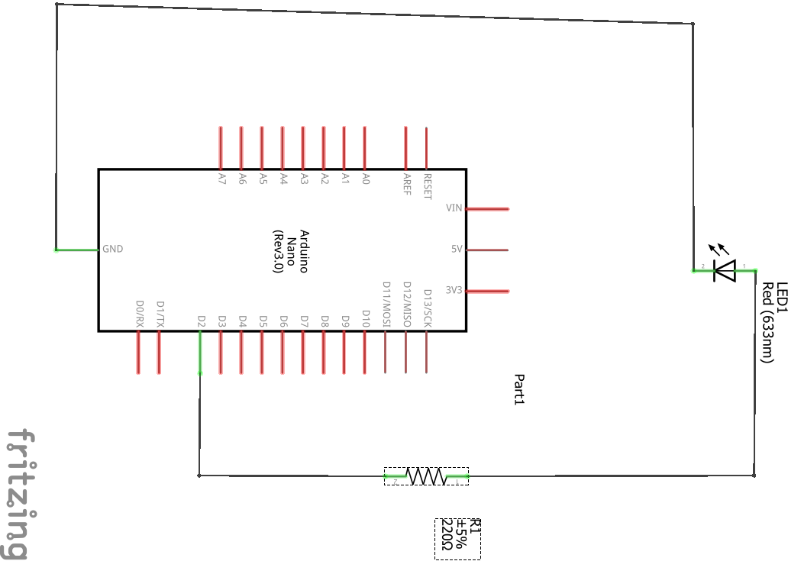

## Arduino Nano RP2040

To get started with your first **TinyML project**, the **Arduino Nano RP2040 Connect** is a good option. Built by Arduino, it uses the **RP2040 microcontroller** and is fully supported by the Arduino core package. 

The board comes with built-in Wi-Fi, Bluetooth, and an onboard IMU. These are features that are useful for deploying machine learning models at the edge.

Its compatibility with popular tools like Edge Impulse and the Arduino IDE makes it a suitable choice for TinyML applications. You can learn more about the Arduino Nano RP2040 Connect on the [Arduino website](https://store.arduino.cc/products/arduino-nano-rp2040-connect-with-headers?_gl=1*1laabar*_up*MQ..*_ga*MTk1Nzk5OTUwMS4xNzQ2NTc2NTI4*_ga_NEXN8H46L5*czE3NDY1NzY1MjUkbzEkZzEkdDE3NDY1NzY5NTkkajAkbDAkaDE1MDk0MDg0ODc.).

## Connect and set up the Arduino Nano RP2040 Connect

This guide will help you connect the Arduino Nano RP2040 Connect to your computer and set up the Arduino IDE for programming.

## Gather the components

To visualize the output of the voice command model, you'll use a simple LED circuit.

You will need the following components:

- Arduino Nano RP2040 Connect  
- 1× LED  
- 1× 220 Ω resistor  
- Breadboard and jumper wires

## Connect the LED to the Arduino Nano RP2040

- **Anode (long leg) of the LED** → connect to **GPIO pin D2** through a 220 Ω resistor  
- **Cathode (short leg)** → connect to **GND**

## Set up the Arduino IDE

To program and deploy your trained model to the Arduino Nano RP2040, you first need to configure your development environment.

Follow the steps in the [Arduino Nano RP2040 install guide](/install-guides/arduino-pico/).

This guide walks you through:

- Installing the Arduino IDE  
- Adding the board support package for the Nano RP2040


Follow all steps in the guide except *How do I set up the Raspberry Pi Pico W?*, which is not required for this project.


## Select your board and port in the Arduino IDE

Open the Arduino IDE. To select your board:

Go to **Tools** > **Board** then select **Arduino Nano RP2040 Connect**

To select your port:

Connect your board to your computer using a USB cable, then follow these steps:  

- Go to **Tools** > **Port**  
- Select the port labeled with your board's name, such as `COM4 (Arduino Nano RP2040 Connect)` or `/dev/cu.usbmodem...` on macOS.

Your Arduino IDE is now ready to upload code to the Arduino Nano RP2040.
