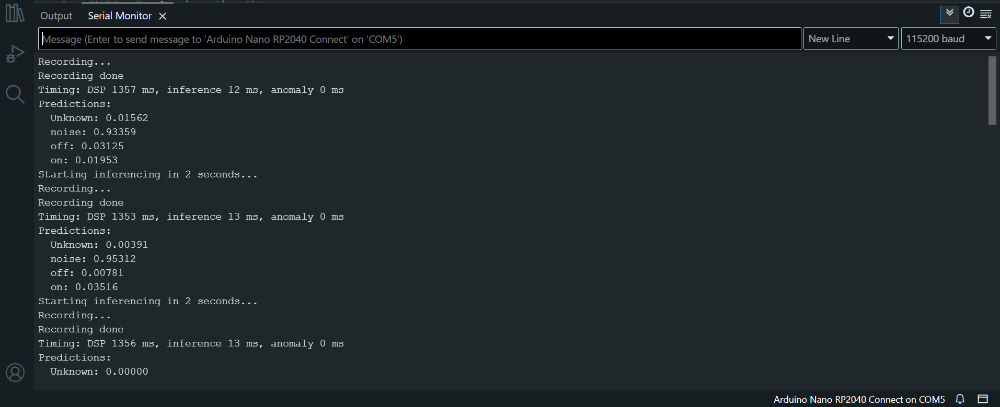

## Program and deploy your first TinyML device

This section shows you how to create a complete sketch that you can upload onto your Arduino Nano RP2040.

You’ll begin by setting up a new sketch in the Arduino IDE, then add the library generated by Edge Impulse. After reviewing a sample program, you’ll upload it to your board to run real-time audio inference and control an LED based on voice commands.

By the end of this section, your board will be able to respond to the words "on" and "off". It is a simple, but powerful, demonstration of TinyML in action.

## Create a new sketch

To create a new sketch in the Arduino IDE, follow these steps:

* Open the **Arduino IDE**, and then go to **File** > **New**.
* A new sketch window will open, and you will see a blank sketch with the default structure, which includes two main functions: `setup()` and `loop()`. The `setup()` function runs once when the program starts, and the `loop()` function runs continuously after that.
* You will see a blank sketch with the default structure, which includes two main functions: `setup()` and `loop()`. The `setup()` function runs once when the program starts, and the `loop()` function runs continuously after that.
* Now save your sketch using **File** > **Save**, and give it a clear name. For example, you can name it **"TinyML_Voice_Control"** or something similar that describes your project.


Make sure to save it in a location where you can easily find it later, such as your **Documents** folder or a dedicated **Arduino** folder.



## Upload the Arduino library from Edge Impulse

* After creating and saving your sketch, go to **Sketch** > **Include Library** > **Add .ZIP Library**
* In the file dialog that opens, navigate to the location of the ZIP file you exported from Edge Impulse.
* Select the ZIP file and click **Open**
* The Arduino IDE will automatically install the library and any dependencies it requires.

## Include the library in your sketch

To include the library and model in your sketch, go to **Sketch** > **Include Library** and select the newly installed Edge Impulse library from the list.


The header file should be named something like `Name_of_your_library_inferencing.h`


This will add the necessary include statement at the top of your sketch, allowing you to use the functions and classes provided by the Edge Impulse library.

## Code walk-through

In the example repository, you will find a code snippet named `Code_Sample.ino`, which is used as a sketch for this project. Before running the code, it’s important to understand what each part does.

Take a few minutes to read through the comments and logic in the sketch before uploading it to your board. The code is available in the example repository, and below is a walk-through of the steps.

## Include the library in your sketch

To include the library and model in your sketch, go to **Sketch** > **Include Library** and select the newly installed Edge Impulse library from the list.


The header file should be named something like `Name_of_your_library_inferencing.h`


This will add the necessary include statement at the top of your sketch, allowing you to use the functions and classes provided by the Edge Impulse library.

## Code walk-through

In the example repository, you will find a code snippet named `Code_Sample.ino`, which is used as a sketch for this project. Before running the code, it’s important to understand what each part does.

Take a few minutes to read through the comments and logic in the sketch before uploading it to your board. The code is available in the example repository, and below is a walk-through of the steps.

## Include libraries and define inference data structure

This block sets up the core dependencies for running Edge Impulse inference on audio input. It includes the necessary libraries and defines a structure `inference_t` that holds the audio buffer and relevant state needed to manage sampling and inferencing.

```c
#include <Name_of_your_library_inferencing.h>  // Include the Edge Impulse inference SDK for running the model
#include <PDM.h>  // Include the Pulse Density Modulation (PDM) library for audio input

// Define a structure to store inference-related audio data
typedef struct {
    int16_t *buffer;       // Pointer to the audio sample buffer (16-bit signed integers)
    uint8_t buf_ready;     // Flag to indicate if the buffer is ready for inference (1 = ready)
    uint32_t buf_count;    // Number of audio samples currently in the buffer
    uint32_t n_samples;    // Total number of samples required for a complete inference
} inference_t;
```

## Define global variables for inference and sample buffer

This block declares and initializes global variables used to store inference data, raw audio samples, a debug flag, and a recording readiness flag. These variables coordinate the data collection and inference process.

```c
static inference_t inference;             // Global instance of the inference structure to manage audio data
static signed short sampleBuffer[2048];   // Buffer to temporarily store raw audio samples (16-bit signed)
static bool debug_nn = false;             // Flag to enable/disable detailed neural network debug output
static volatile bool record_ready = false; // Flag indicating when the system is ready to start recording (volatile due to use in ISR)


## Setup Function for Initializing the Serial and Microphone

The `setup()` function is called once when the program starts. It initializes the serial communication, sets up the LED pin, prints out configuration details, and starts the microphone buffer for audio data collection.

```c
// DEFINE THE MACRO FOR YOUR LED PIN HERE
# define LED_PIN 2                            // Update the pin number to match the digital pin you intend to use for the LED
void setup() {
    Serial.begin(115200);                     // Start serial communication at 115200 baud rate
    while (!Serial);                          // Wait for the serial port to be ready
    pinMode(LED_PIN, OUTPUT);                 // Configure the LED pin as output (to control an LED)
    Serial.println("Edge Impulse Inferencing Demo");  // Print a startup message to the serial monitor

    // Print inference configuration settings
    ei_printf("Inferencing settings:\n");
    ei_printf("\tInterval: ");
    ei_printf_float((float)EI_CLASSIFIER_INTERVAL_MS);  // Print the interval between inference cycles
    ei_printf(" ms.\n");
    ei_printf("\tFrame size: %d\n", EI_CLASSIFIER_DSP_INPUT_FRAME_SIZE);  // Print frame size for DSP processing
    ei_printf("\tSample length: %d ms.\n", EI_CLASSIFIER_RAW_SAMPLE_COUNT / 16);  // Print sample length in ms
    ei_printf("\tNo. of classes: %d\n", sizeof(ei_classifier_inferencing_categories) / sizeof(ei_classifier_inferencing_categories[0]));  // Print the number of classes

    // Start the microphone buffer for audio input and check if it was successful
    if (!microphone_inference_start(EI_CLASSIFIER_RAW_SAMPLE_COUNT)) {
        ei_printf("ERR: Could not allocate audio buffer\n");  // Error message if allocation fails
        return;  // Exit the setup function
    }
}
```
{}
The macro `#define LED_PIN 2` specifies the pin number to which the LED is connected. You can change this value to any available digital pin on your board.
{}

## Main loop to handle inference and control LED

The `loop()` function runs continuously after `setup()`. It performs the inference process, including recording audio, running the classifier, and controlling an LED based on the model's prediction.


```c
void loop() {
    ei_printf("Starting inferencing in 2 seconds...\n");   // Print message indicating a 2-second delay before starting inference
    delay(2000);                                           // Wait for 2 seconds before beginning the next operation

    ei_printf("Recording...\n");                            // Print message to indicate that recording is starting
    if (!microphone_inference_record()) {                   // Start recording audio data
        ei_printf("ERR: Failed to record audio...\n");      // Print error if recording fails
        return;                                            // Exit loop if recording fails
    }

    ei_printf("Recording done\n");                          // Print message after recording is done

    // Set up the signal structure to hold the audio data and provide a function for data retrieval
    signal_t signal;
    signal.total_length = EI_CLASSIFIER_RAW_SAMPLE_COUNT;    // Set the total length of the recorded signal
    signal.get_data = microphone_audio_signal_get_data;     // Specify the function to get the data from the microphone

    ei_impulse_result_t result = {0};                        // Initialize the result structure to store the classifier's output

    // Run the classifier continuously on the signal and store the results
    if (run_classifier_continuous(&signal, &result, debug_nn) != EI_IMPULSE_OK) {
        ei_printf("ERR: Failed to run classifier\n");         // Print error if classifier fails
        return;                                             // Exit loop if classifier fails
    }

    print_inference_result(result);                          // Print the inference results (e.g., classification)

    // LED logic based on classifier result (turn on/off the LED based on inference)
    for (uint16_t i = 0; i < EI_CLASSIFIER_LABEL_COUNT; i++) {
        // If the classification result is "on", turn the LED on
        if (strcmp(ei_classifier_inferencing_categories[i], "on") == 0 && result.classification[i].value > 0.5) {
            digitalWrite(LED_PIN, HIGH);  // Turn LED on
        }
        // If the classification result is "off", turn the LED off
        else if (strcmp(ei_classifier_inferencing_categories[i], "off") == 0 && result.classification[i].value > 0.4) {
            digitalWrite(LED_PIN, LOW);   // Turn LED off
        }
    }
}
```

{}
The values 0.5 and 0.4 in the code above represent threshold levels that you can adjust to test and optimize the performance of the machine learning model. These thresholds determine when the LED should turn on or off based on the model's inference results.

In this example, the LED will turn on if the model predicts the "on" label with a confidence of 50% or higher (i.e., a threshold of 0.5). Similarly, it will turn off if the model predicts the "off" label with a confidence of 40% or higher (i.e., a threshold of 0.4).

You are free to modify these threshold values to better suit your application or improve model response.
{}

## PDM data ready callback for buffer management

The `pdm_data_ready_inference_callback()` function is triggered when the Pulse Density Modulation (PDM) buffer is full. It reads the available audio data and stores it in the inference buffer for processing.

```c
/* PDM buffer full callback */
static void pdm_data_ready_inference_callback(void) {
    int bytesAvailable = PDM.available();                  // Check how many bytes are available in the PDM buffer
    int bytesRead = PDM.read((char *)&sampleBuffer[0], bytesAvailable);  // Read the available data into the sampleBuffer

    // If the buffer is not yet full and recording is ready, store the incoming data in the inference buffer
    if ((inference.buf_ready == 0) && (record_ready == true)) {
        // Loop through the bytes read and store them in the inference buffer
        for (int i = 0; i < bytesRead >> 1; i++) {
            inference.buffer[inference.buf_count++] = sampleBuffer[i];  // Store each 16-bit audio sample
            if (inference.buf_count >= inference.n_samples) {  // Check if enough samples have been collected
                inference.buf_count = 0;                       // Reset the sample count
                inference.buf_ready = 1;                       // Mark the buffer as ready for inference
                break;                                          // Exit loop once the buffer is full
            }
        }
    }
}
```

## Initialize microphone for inference

Allocates memory for audio sampling, configures the PDM microphone, and prepares the system to begin audio inference.

```c
static bool microphone_inference_start(uint32_t n_samples) {
    // Allocate memory to store the audio samples
    inference.buffer = (int16_t *)malloc(n_samples * sizeof(int16_t));
    if (inference.buffer == NULL) {
        return false;  // Return false if memory allocation fails
    }

    // Initialize inference buffer settings
    inference.buf_count = 0;           // Reset sample count
    inference.n_samples = n_samples;   // Store number of required samples
    inference.buf_ready = 0;           // Mark buffer as not ready yet

    // Set the callback function that will be triggered when PDM data is available
    PDM.onReceive(pdm_data_ready_inference_callback);

    // Set the size of the internal PDM buffer
    PDM.setBufferSize(2048);

    // Give the microphone some time to initialize
    delay(250);

    // Begin capturing from PDM microphone with 1 channel at classifier frequency
    if (!PDM.begin(1, EI_CLASSIFIER_FREQUENCY)) {
        ei_printf("ERR: Failed to start PDM!");  // Print error if microphone fails to start
        microphone_inference_end();              // Clean up resources
        return false;                            // Return failure
    }

    return true;  // Microphone successfully started
}

```

## Microphone inference record function

Defines the `microphone_inference_record()` function, which waits for the microphone buffer to be filled with audio samples. Once the buffer is ready, it resets the buffer state and prepares for the next recording cycle.

```c
static bool microphone_inference_record(void) {
    record_ready = true;                          // Set the flag indicating that the system is ready to start recording
    while (inference.buf_ready == 0) {            // Wait until the buffer is full (i.e., ready for processing)
        delay(10);                                // Brief delay to avoid busy-waiting
    }
    inference.buf_ready = 0;                      // Reset the buffer ready flag after processing the data
    record_ready = false;                         // Reset the recording flag, indicating recording is no longer active
    return true;                                  // Return true indicating the recording was successful
}
```

## Microphone data handling and cleanup

Defines two functions: `microphone_audio_signal_get_data()`, which converts raw audio data from the buffer into a float format, and `microphone_inference_end()`, which cleans up by stopping the PDM and freeing memory allocated for the audio buffer.

```c
// Function to retrieve audio data from the inference buffer and convert it to float format
static int microphone_audio_signal_get_data(size_t offset, size_t length, float *out_ptr) {
    numpy::int16_to_float(&inference.buffer[offset], out_ptr, length);  // Convert int16 audio data to float format
    return 0;  // Return 0 to indicate success
}

// Function to clean up the microphone inference by stopping the PDM and freeing memory
static void microphone_inference_end(void) {
    PDM.end();                   // Stop the Pulse Density Modulation (PDM) interface
    ei_free(inference.buffer);    // Free the memory allocated for the inference buffer
}
```

## Function to print the inference results

Defines the `print_inference_result()` function, which outputs the results of the inference, including the timing of different stages — **DSP**, classification, anomaly detection — and the prediction values for each class.

```c
void print_inference_result(ei_impulse_result_t result) {
    // Print timing information for the DSP, inference, and anomaly stages
    ei_printf("Timing: DSP %d ms, inference %d ms, anomaly %d ms\n",
              result.timing.dsp,               // Time taken for DSP processing
              result.timing.classification,    // Time taken for classification
              result.timing.anomaly);          // Time taken for anomaly detection

    ei_printf("Predictions:\n");
    // Loop through each class and print the classification result
    for (uint16_t i = 0; i < EI_CLASSIFIER_LABEL_COUNT; i++) {
        ei_printf("  %s: %.5f\n",               // Print class name and its predicted value
                  ei_classifier_inferencing_categories[i],
                  result.classification[i].value);
    }

    // If anomaly detection is enabled, print the anomaly prediction
#if EI_CLASSIFIER_HAS_ANOMALY == 1
    ei_printf("Anomaly prediction: %.3f\n", result.anomaly);  // Print the anomaly score
#endif
}
```

{}
The `ei_printf` command is a custom logging function from the Edge Impulse SDK, used for printing debug or inference-related information to the serial monitor, optimized for embedded systems. It works similarly to `printf` but is tailored for the Edge Impulse environment. You can find the complete `Code_Sample.ino` in the example repository and try it out yourself.
{}

## Run your code

Now that you have a good understanding of the code, you should run it on your device. With your **Arduino Nano RP2040** plugged into your computer, and the correct [board and port](/learning-paths/embedded-and-microcontrollers/egde/connect-and-set-up-arduino/) selected in the Arduino IDE, follow these steps:

If you're using the **Upload Button**:

- Click the **right-facing arrow** at the top-left of the Arduino IDE window.
- The IDE will compile your code and upload it to your board.
- Wait for the message **“Done uploading.”** to appear at the bottom of the IDE.

If you're using the **Sketch Menu**:

- Go to **Sketch** > **Upload**.
- The IDE will compile and upload your sketch to the board.
- Once the upload is complete, you’ll see **“Done uploading.”** at the bottom.

Your board should now start running the uploaded code automatically.

## Verify your code is running

To confirm that your code is running properly:

- Go to **Tools** > **Serial Monitor** in the Arduino IDE  
- Set the baud rate to **115200** (if it's not already)  
- Observe the output messages:  
   - Start and end of recording  
   - Inference process  
   - Predictions for each label  

These messages indicate that your model is working and processing voice input as expected.

## Record your voice to toggle the LED

- Wait for the **Recording...** message to appear on the Serial Monitor. This means the system is ready to capture voice input.  
- Say your command (for example, "on" or "off") clearly and promptly. The system records for only about one second.  
- The model will make a prediction based on your voice input and toggle the LED accordingly.  
- You can adjust the **threshold** values in the code to control how confident the prediction must be before the LED toggles. This helps fine-tune the system’s responsiveness.  
- If the LED turns on when you say "on" and turns off when you say "off", your system is working correctly.


## Serial Monitor output

Your Serial Monitor should look like the image below:



Congratulations, you’ve successfully programmed your first TinyML microcontroller! You've also built a functional, smart system to control an LED with your voice.

