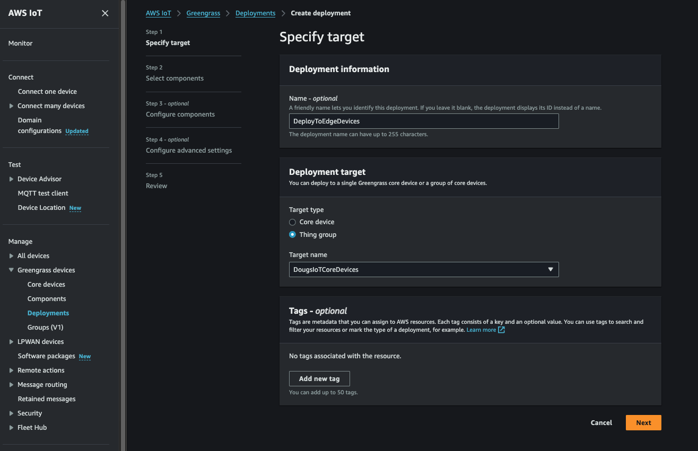
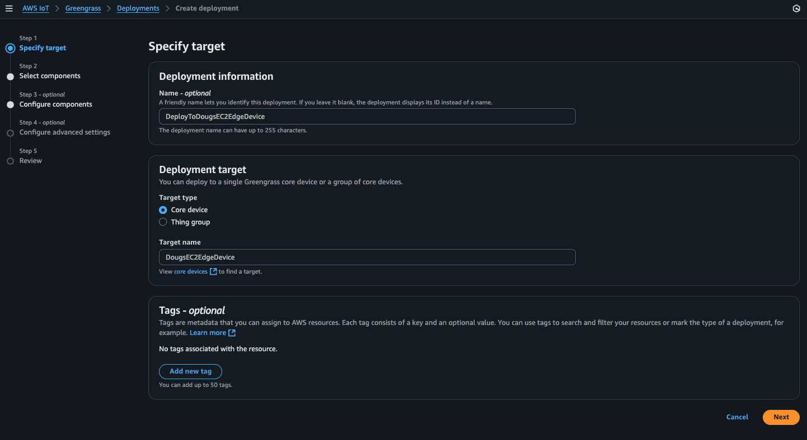
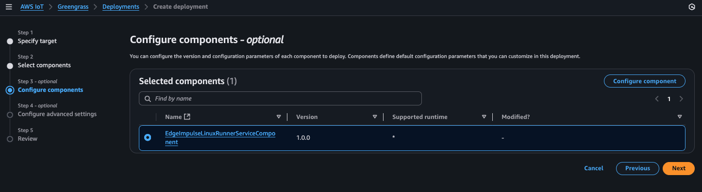

## Greengrass Component Deployment

In this section, we will create an AWS IoT Greengrass deployment that will download, prepare, install, and run our Edge Impulse "Runner" service on our edge device. When the  "Runner" service starts, it will connect back to our Edge Impulse environment via the API key we inserted into AWS Secret Manager and will download and start to run our deployed ML model we created in Edge Impulse Studio!  Let's get this started!

### 0. (Non-Camera Edge Devices Only): Additional Custom Component 

If your edge device does not contain a camera (i.e. EC2 edge device), you will need to deploy an additional custom component. Please follow [these steps](./NonCameraCustomComponent.md) to get the additional component created. You will be selecting this component in addition to the custom component we created for the Edge Impulse "Runner" service. 

### 1. Deploy the custom component to a selected Greengrass edge device or group of edge devices. 

Almost done!  We can now go back to the AWS Console -> IoT Core -> Greengrass -> Deployments page and select a deployment (or create a new one!) to deploy our component down to as selected edge device or group of gateways as needed: 

Deploy to a group of devices:

Deploy to a specific device (i.e. my EC2 Edge Device):

In either case above we now press "Next" and select our newly created custom component:

>**_NOTE:_**
>If you are using an edge device which does not have a camera, you will also need to select the "EdgeImpulseRunnerRuntimeInstallerComponent" custom component that you created above ("Non-Camera Edge Device Custom Component"):
>

Press "Next" again, then select our custom component and press "Configure Component" to configure the "Runner" component:

>**_NOTE:_**
>If you also have the Non-Camera component, it does NOT need to be configured... only the "EdgeImpulseLinuxRunnerServiceComponent" should be configured

#### Customizing a specific Deployment

We now see that our custom component we registered has a default configuration. We can, however, customize it specifically for our specific hardware configuration (i.e. to a specific device or group of similar devices...).  

First lets recall the JSON we saved off when we configured our hardware. Lets customize our Greengrass deployment by clearing, copying, and pasting that JSON into the "Configuration to merge" window... then press "Confirm":

You'll then see the previous page and continue pressing "Next" until you get to the "Deploy" page:

> **_NOTE:_**
>When performing the deployment, its quite common to, when selecting one of our newly created custom components, to then "Customize" that component by selecting it for "Customization" and entering a new JSON structure (same structure as what's found in the component's associated YAML file for the default configuration) that can be adjusted for a specific deployment (i.e. perhaps your want to change the DeviceName for this particular deployment or specify "gst_args" for a specific edge device(s) camera, etc...). This highlights the power and utility of the component and its deployment mechanism in AWS IoT Greengrass.

> **_NOTE:_**
> The component deployment may take awhile depending on network speed/etc... the reason for this is that all of the required prerequisites to run the Edge Impulse "Runner" service have to be downloaded, setup, and installed. 
> 
> Back on the edge device via SSH, you can "tail" two different files to watch the progress of the installation/setup as well as the component operation (as root):
> 
> 		% sudo su - 
> 		# tail -f /greengrass/v2/logs/EdgeImpulseLinuxRunnerServiceComponent.log
> 		# tail -f /tmp/ei*log
> 
> The first "tail" will log all of the installation activity during the component setup. The second "tail" (wildcarded) will be the log file of the "running" component. You can actually watch the Edge Impulse "Runner" output in that file if you wish. 
> 
> Both files are critical for debugging any potential issues with the deployment and/or component configuration. 

Now that our custom component has been deployed, the component will install Edge Impulse's "Runner" runtime that will then, in turn, pull down and invoke our Edge Impulse's current Impulse (i.e. model...). We will next check that our model is running on our edge device!