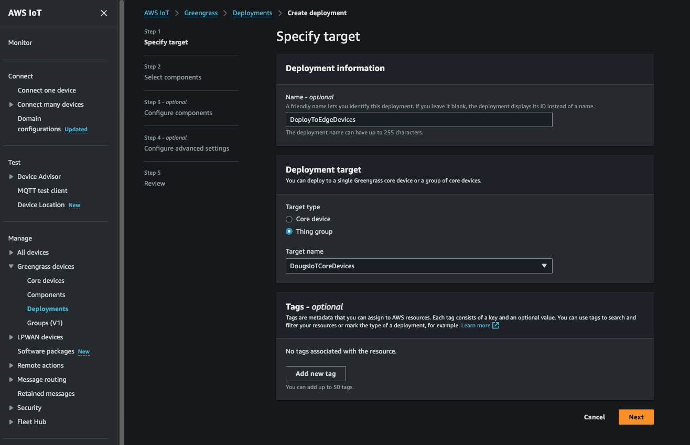
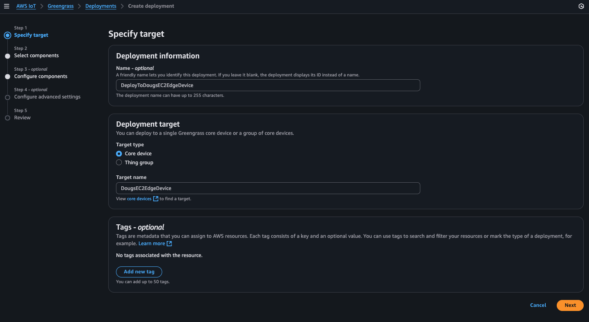
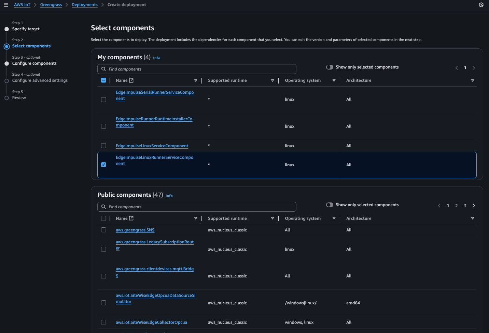
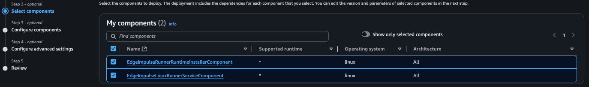
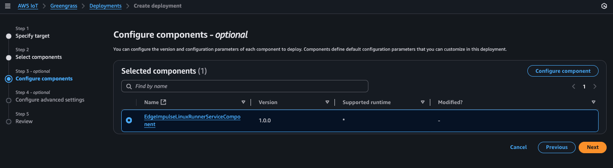
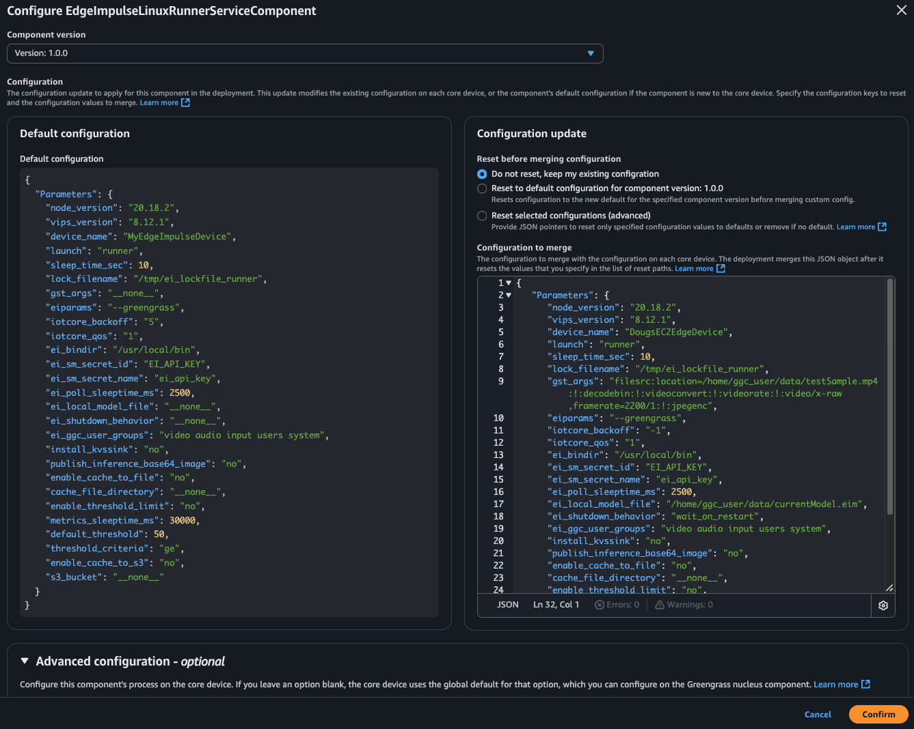
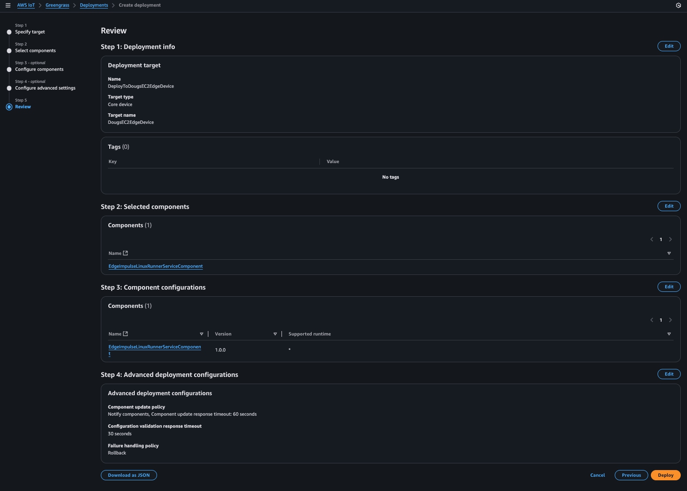

## Overview

In this section, you create a Greengrass deployment that downloads, installs, and runs the Edge Impulse Runner service on your edge device. When the Runner starts, it connects to your Edge Impulse project using the API key stored in AWS Secrets Manager, downloads your trained ML model, and begins running inference.

{}
If your edge device doesn't have a camera (for example, an EC2 instance), you need to deploy an additional custom component first. Follow the [non-camera component setup](/learning-paths/embedded-and-microcontrollers/edge_impulse_greengrass/noncameracustomcomponent/) before continuing. You'll select that component alongside the Edge Impulse Runner component during deployment.
{}

## Create a Greengrass deployment

Open the AWS Console and navigate to **AWS IoT Core** > **Greengrass** > **Deployments**. You can either create a new deployment or modify an existing one.

You have two deployment target options. To deploy to a group of devices, select a thing group:



To deploy to a specific device (for example, your EC2 edge device), select a single core device:



After choosing your target, select **Next**. On the components page, select your **EdgeImpulseLinuxRunnerServiceComponent** custom component:



{}
If your edge device doesn't have a camera, also select the **EdgeImpulseRunnerRuntimeInstallerComponent** that you created in the non-camera component setup step:


{}

Select **Next** again. Select the **EdgeImpulseLinuxRunnerServiceComponent** and select **Configure component** to customize it for your device:



{}
If you also have the non-camera component, it doesn't need configuration. Only configure the **EdgeImpulseLinuxRunnerServiceComponent**.
{}

## Apply the device-specific configuration

The component has a default configuration from the recipe, but you can override it for this specific deployment. This is where you use the device-specific JSON you saved during hardware setup.

Clear the **Configuration to merge** text box, paste your saved JSON, and select **Confirm**:



The ability to customize the configuration per deployment is one of the key benefits of Greengrass components. You can deploy the same component to different devices while adjusting settings like `device_name` or `gst_args` for each target's specific hardware.

Continue selecting **Next** through the remaining pages until you reach the review page. Select **Deploy**:



## Monitor the deployment

The deployment can take several minutes depending on network speed. The component downloads and installs all prerequisites (Node.js, libvips, the Edge Impulse CLI) before starting the Runner.

To monitor progress, SSH into your edge device and tail the component logs:

```bash
sudo tail -f /greengrass/v2/logs/EdgeImpulseLinuxRunnerServiceComponent.log
```

This log shows the installation activity during the component setup phase. After the install completes, the Runner writes its own log file. To watch running inference output:

```bash
sudo tail -f /tmp/ei*log
```

Both log files are essential for debugging deployment or configuration issues. If the deployment fails, check the component log first for installation errors.

## What you've accomplished

In this section, you created a Greengrass deployment, applied your device-specific configuration, and deployed the Edge Impulse Runner component to your edge device. The Runner is now downloading your ML model and starting inference. In the next section, you verify that the model is running and view inference results.