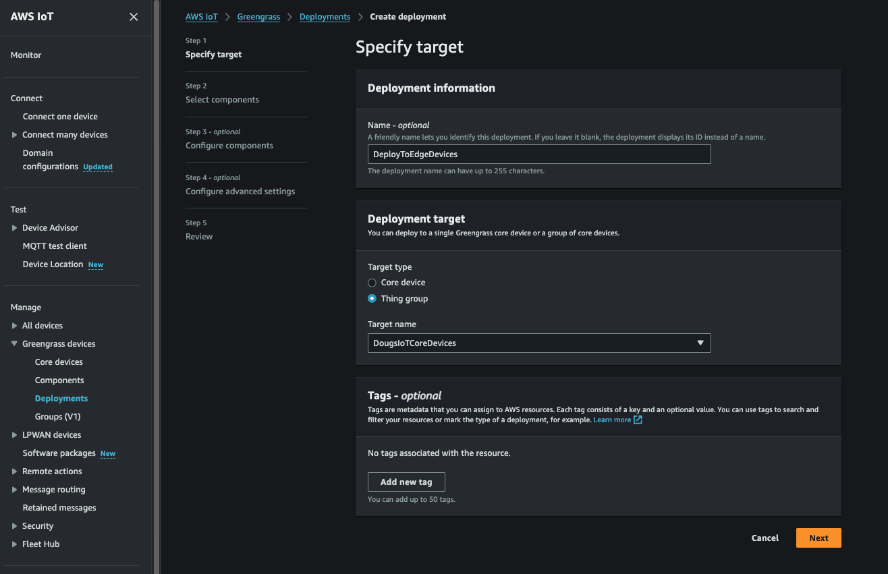
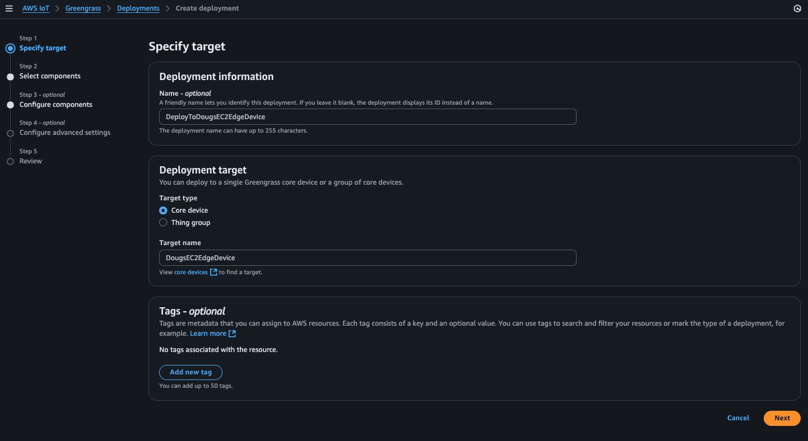
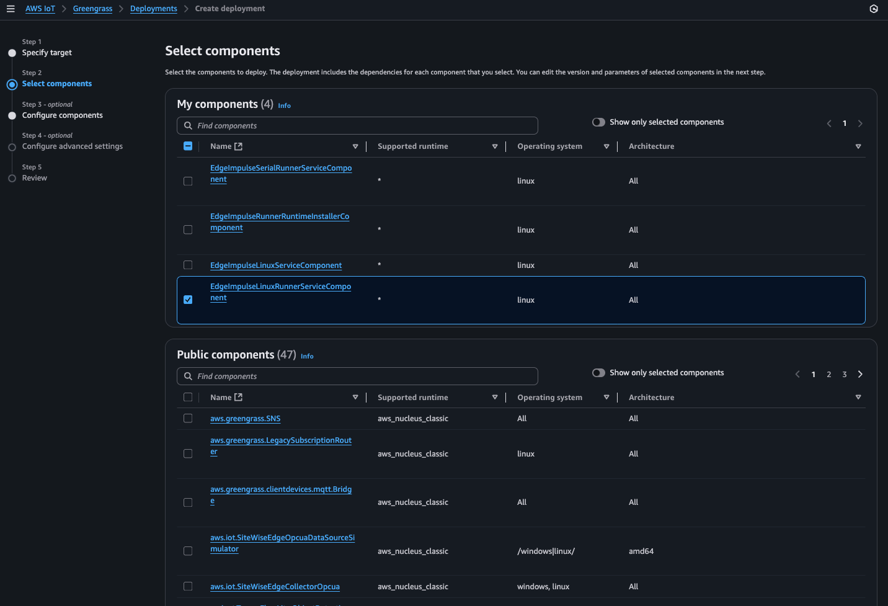
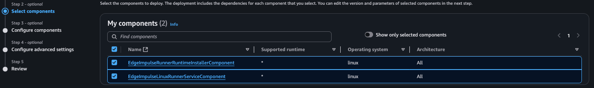
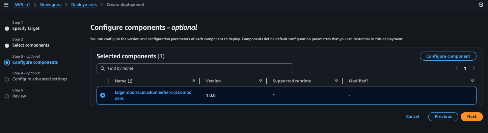
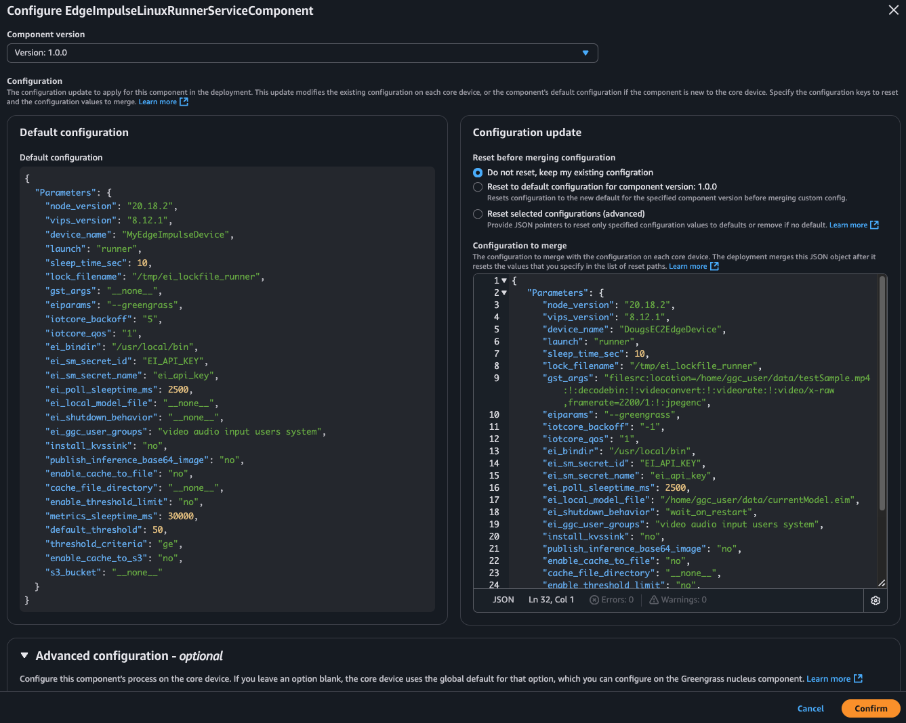
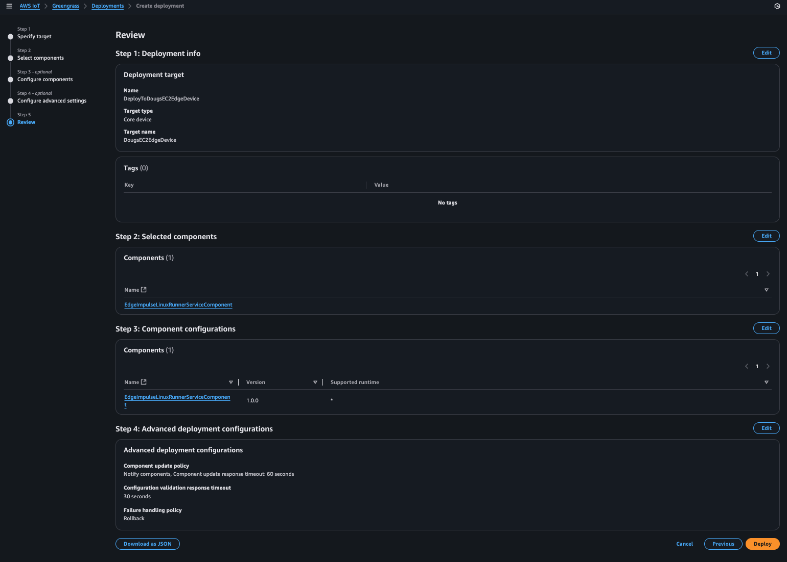

## Overview

Create a Greengrass deployment that downloads, installs, and runs the Edge Impulse Linux Runner service on your edge device. When the Edge Impulse Linux Runner starts, it connects to your Edge Impulse project using the API key stored in AWS Secrets Manager, downloads your trained ML model, and begins running inference.

{}
If your edge device doesn't have a camera, for example an EC2 instance, deploy the additional custom Greengrass component before you start the deployment.

Follow the [non-camera additional component setup steps](/learning-paths/embedded-and-microcontrollers/edge_impulse_greengrass/noncameracustomcomponent/) before continuing.

During deployment, select both the additional component and the Edge Impulse Linux Runner component.
{}

## Create a Greengrass deployment

Open the AWS Console and navigate to **AWS IoT Core** > **Greengrass** > **Deployments**. You can either create a new deployment or modify an existing one.

You have two deployment target options. To deploy to a group of devices, select a thing group:



To deploy to a specific device (for example, your EC2 edge device), select a single core device:



After choosing your target, select **Next**. On the components page, select your **EdgeImpulseLinuxEdge Impulse Linux RunnerServiceComponent** custom component:



{}
If your edge device doesn't have a camera, also select the **EdgeImpulseEdge Impulse Linux RunnerRuntimeInstallerComponent** that you created in the non-camera component setup step:


{}

Select **Next** again. Select the **EdgeImpulseLinuxEdge Impulse Linux RunnerServiceComponent** and select **Configure component** to customize it for your device:



{}
If you also have the non-camera component, it doesn't need configuration. Only configure the **EdgeImpulseLinuxEdge Impulse Linux RunnerServiceComponent**.
{}

## Apply the device-specific configuration

The component has a default configuration from the recipe, but you can override it for this specific deployment. This is where you use the device-specific JSON you saved during hardware setup.

Clear the **Configuration to merge** text box, paste your saved JSON (from your edge device hardware setup section), and select **Confirm**:



The ability to customize the configuration per deployment is one of the key benefits of Greengrass components. You can deploy the same component to different devices while adjusting settings like `device_name` or `gst_args` for each target's specific hardware.

Continue selecting **Next** through the remaining pages until you reach the review page. Select **Deploy**:



## Monitor the deployment

The deployment can take several minutes depending on network speed. The component downloads and installs all prerequisites (Node.js, libvips, the Edge Impulse CLI) before starting the Edge Impulse Linux Runner.

To monitor progress, SSH into your edge device and tail the component logs:

```bash
sudo tail -f /greengrass/v2/logs/EdgeImpulseLinuxEdge Impulse Linux RunnerServiceComponent.log
```

This log shows the installation activity during the component setup phase. After the install completes, the Edge Impulse Linux Runner writes its own log file. To watch running inference output:

```bash
sudo tail -f /tmp/ei*log
```

Both log files are essential for debugging deployment or configuration issues. If the deployment fails, check the component log first for installation errors.

## What you've accomplished

In this section, you created a Greengrass deployment, applied your device-specific configuration, and deployed the Edge Impulse Linux Runner component to your edge device. The Edge Impulse Linux Runner is now downloading your ML model and starting inference. In the next section, you verify that the model is running and view inference results.
