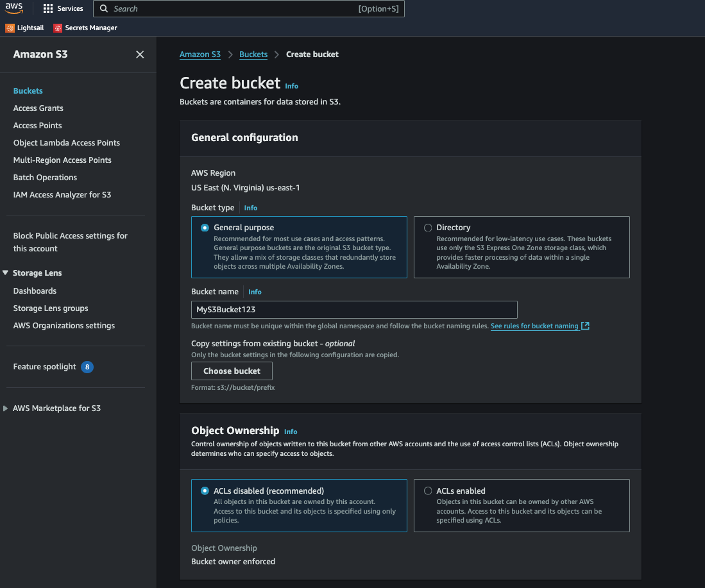
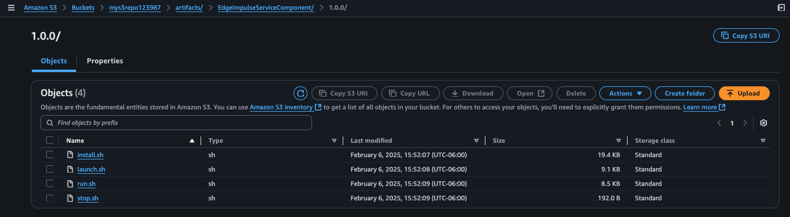
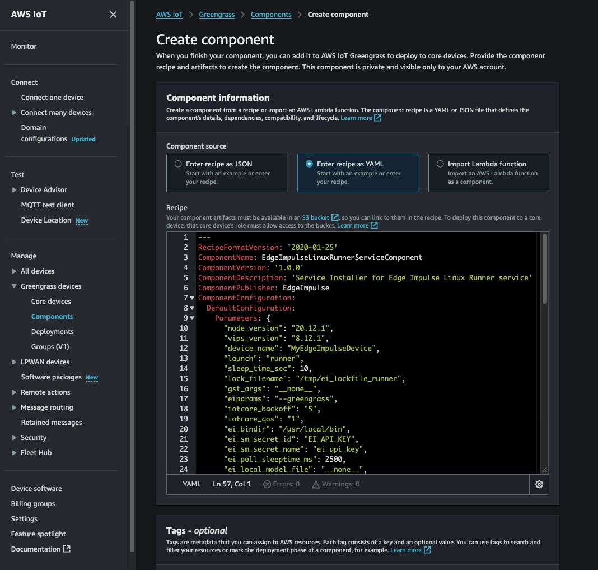

## Overview

AWS IoT Greengrass uses *custom components* to package and deploy software to edge devices. In this section, you create a custom component that installs and runs the Edge Impulse Runner service on your device. The component handles all prerequisites (Node.js, libvips) and manages the Runner lifecycle — install, run, and shutdown.

The component consists of two parts:
- **Artifacts**: Shell scripts (stored in S3) that install dependencies and launch the Runner.
- **Recipe**: A YAML file that tells Greengrass where to find the artifacts, what configuration to apply, and how to manage the component lifecycle.

## Clone the component repository

Clone the Edge Impulse Greengrass components repository to get the recipe and artifact files:

```bash
git clone https://github.com/edgeimpulse/aws-greengrass-components.git
```

This repository contains the YAML recipe file and the shell script artifacts you'll upload to S3.

## Upload artifacts to S3

The Greengrass component downloads its artifacts from an S3 bucket at deployment time. You need to create a bucket and upload the shell scripts.

Open the AWS Console and navigate to **S3**. Select **Create bucket** and give it a name (for example, `my-ei-greengrass-artifacts`):



Inside your new bucket, create the following directory structure:

```text
artifacts/EdgeImpulseServiceComponent/1.0.0/
```

Navigate to the `1.0.0` directory in your S3 bucket and select **Upload**. Upload all four files from the cloned repository's `./artifacts/EdgeImpulseServiceComponent/1.0.0/` directory:

- `install.sh`
- `run.sh`
- `launch.sh`
- `stop.sh`

After the upload, your S3 bucket should look like this:



## Customize the component recipe

The recipe YAML file tells Greengrass where to download the artifacts from S3. You need to update it with your actual bucket name.

Open `EdgeImpulseLinuxRunnerServiceComponent.yaml` from the cloned repository and replace all occurrences of `YOUR_S3_ARTIFACT_BUCKET` with your S3 bucket name (for example, `my-ei-greengrass-artifacts`). Save the file.

### Default configuration reference

The recipe file includes a default configuration JSON block. You don't need to modify these defaults for this Learning Path — they're overridden at deployment time by the device-specific JSON you saved during hardware setup. However, understanding each field is useful for troubleshooting and customization.

```json
{
   "node_version": "20.12.1",
   "vips_version": "8.12.1",
   "device_name": "MyEdgeImpulseDevice",
   "launch": "runner",
   "sleep_time_sec": 10,
   "lock_filename": "/tmp/ei_lockfile_runner",
   "gst_args": "__none__",
   "eiparams": "--greengrass",
   "iotcore_backoff": "5",
   "iotcore_qos": "1",
   "ei_bindir": "/usr/local/bin",
   "ei_sm_secret_id": "EI_API_KEY",
   "ei_sm_secret_name": "ei_api_key",
   "ei_ggc_user_groups": "video audio input users",
   "install_kvssink": "no",
   "publish_inference_base64_image": "no",
   "enable_cache_to_file": "no",
   "ei_poll_sleeptime_ms": 2500,
   "ei_local_model_file": "__none__",
   "ei_shutdown_behavior": "__none__",
   "cache_file_directory": "__none__",
   "enable_threshold_limit": "no",
   "metrics_sleeptime_ms": 30000,
   "default_threshold": 50.0,
   "threshold_criteria": "ge",
   "enable_cache_to_s3": "no",
   "s3_bucket": "__none__"
}
```

### Configuration field reference

The table below describes each configuration field:

| Field | Description |
|---|---|
| `node_version` | Version of Node.js to install on the device. |
| `vips_version` | Version of the libvips library to compile and install. |
| `device_name` | Base name for the device in Edge Impulse. A unique suffix is appended automatically to prevent collisions when deploying to multiple devices. |
| `launch` | Service launch type. Leave as `runner`. |
| `sleep_time_sec` | Wait loop sleep time for the component lifecycle. Leave as default. |
| `lock_filename` | Lock file path for this component. Leave as default. |
| `gst_args` | GStreamer pipeline arguments with spaces replaced by colons. Set per-device during deployment (for example, `v4l2src:device=/dev/video0:!:video/x-raw,width=640,height=480:!:videoconvert:!:jpegenc`). Use `__none__` to disable. |
| `eiparams` | Additional parameters for the Edge Impulse Runner. The `--greengrass` flag is required. |
| `iotcore_backoff` | Number of inference results to skip between MQTT publications. Controls publication frequency and cost. Set to `-1` to publish every result, or a positive number to throttle. |
| `iotcore_qos` | MQTT Quality of Service level. Leave as `1`. |
| `ei_bindir` | Installation directory for the Edge Impulse CLI tools. Leave as default. |
| `ei_sm_secret_id` | Secret ID in AWS Secrets Manager that holds the Edge Impulse API key. Must match the secret name you created (`EI_API_KEY`). |
| `ei_sm_secret_name` | Key name within the Secrets Manager secret. Must match the key you created (`ei_api_key`). |
| `ei_ggc_user_groups` | Linux groups the Greengrass service user (`ggc_user`) is added to. For Jetpack 6.x and later, add `render` to this list for GPU access. |
| `install_kvssink` | Set to `yes` to build and install the KVS sink GStreamer plugin. Default: `no`. |
| `publish_inference_base64_image` | Set to `yes` to include a base64-encoded image with each inference result published to MQTT. Default: `no`. |
| `enable_cache_to_file` | Set to `yes` to write inference results and associated images to a local directory as paired files (`<guid>.json` and `<guid>.img`). Default: `no`. |
| `cache_file_directory` | Local directory path for cached files when `enable_cache_to_file` is `yes`. Default: `__none__`. |
| `ei_poll_sleeptime_ms` | Polling interval in milliseconds for the long-polling message processor. Leave as default. |
| `ei_local_model_file` | Path to a previously downloaded local model file (`.eim`). Set to `__none__` to download the model from Edge Impulse at runtime. |
| `ei_shutdown_behavior` | Controls Runner behavior after the model finishes. Set to `wait_on_restart` to pause after a video file ends and wait for a restart command. Default: `__none__`. |
| `enable_threshold_limit` | Set to `yes` to enable the confidence threshold filter. Default: `no`. |
| `metrics_sleeptime_ms` | Interval in milliseconds between model metrics publications. Default: `30000`. |
| `default_threshold` | Confidence threshold value between 0 and 100. Inference results below this threshold are filtered out when `enable_threshold_limit` is `yes`. Default: `50.0`. |
| `threshold_criteria` | Comparison operator for the threshold filter. Must be one of: `gt`, `ge`, `eq`, `le`, or `lt`. Default: `ge`. |
| `enable_cache_to_s3` | Set to `yes` to cache inference images and results to an S3 bucket. Default: `no`. |
| `s3_bucket` | S3 bucket name for cached results when `enable_cache_to_s3` is `yes`. Default: `__none__`. |

## Register the component in Greengrass

With the artifacts in S3 and the recipe updated, register the component in the AWS Console.

Navigate to **AWS IoT Core** > **Greengrass** > **Components** and select **Create component**. Then:

1. Select **Enter recipe as YAML** as the input method.
2. Clear the default "hello world" YAML from the text box.
3. Copy and paste the entire contents of your edited `EdgeImpulseLinuxRunnerServiceComponent.yaml` file.
4. Select **Create component**.



If the recipe format is valid and Greengrass can access the S3 artifacts, the component appears in your custom components list.

## What you've accomplished

In this section, you cloned the Edge Impulse component repository, uploaded artifacts to S3, customized the recipe with your bucket name, and registered the component in Greengrass. In the next section, you create a Greengrass deployment to push this component to your edge device.