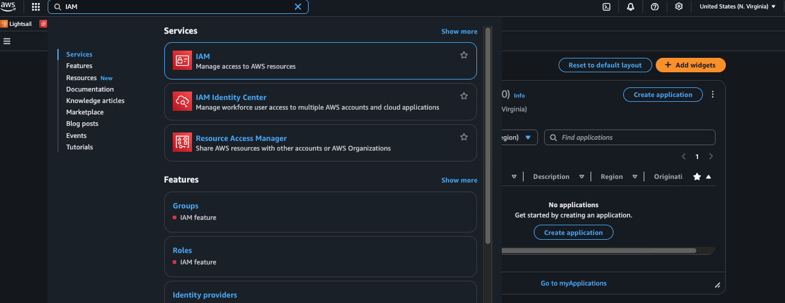
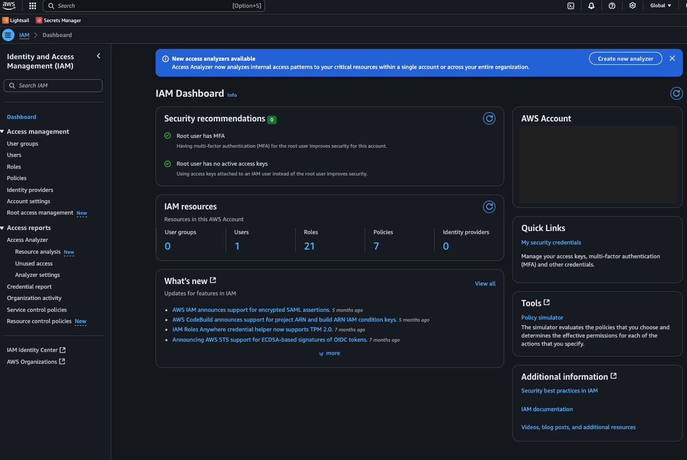
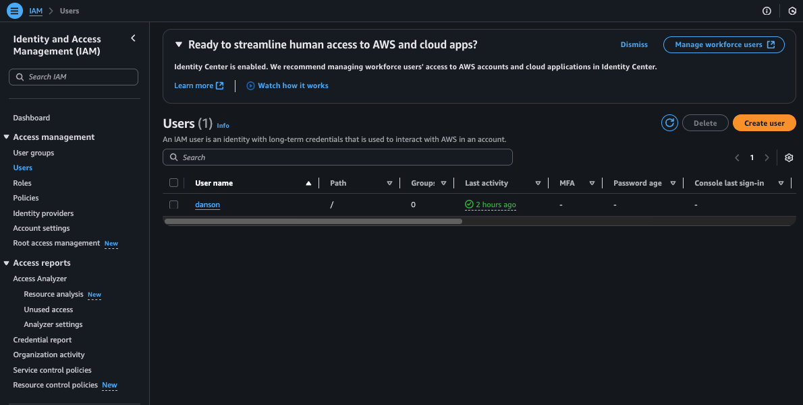
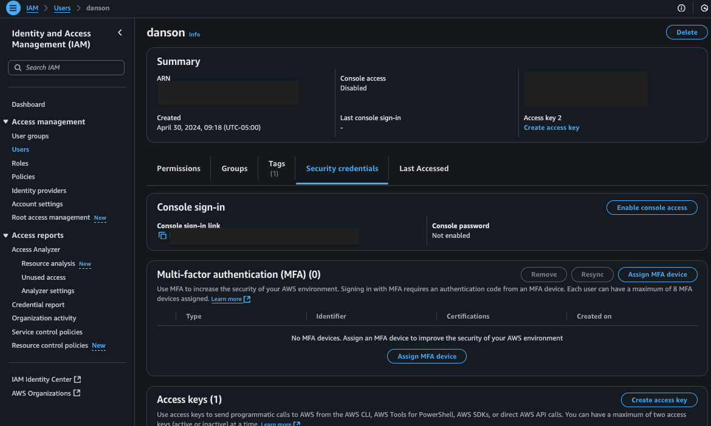
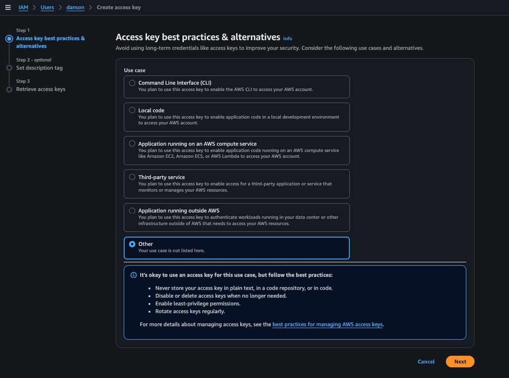
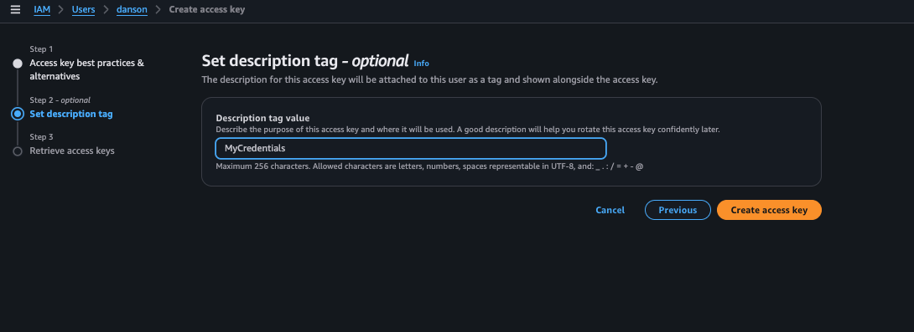
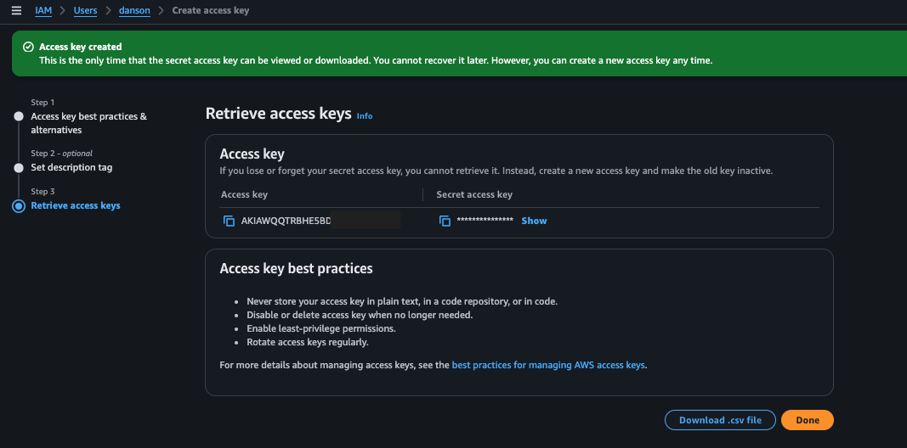
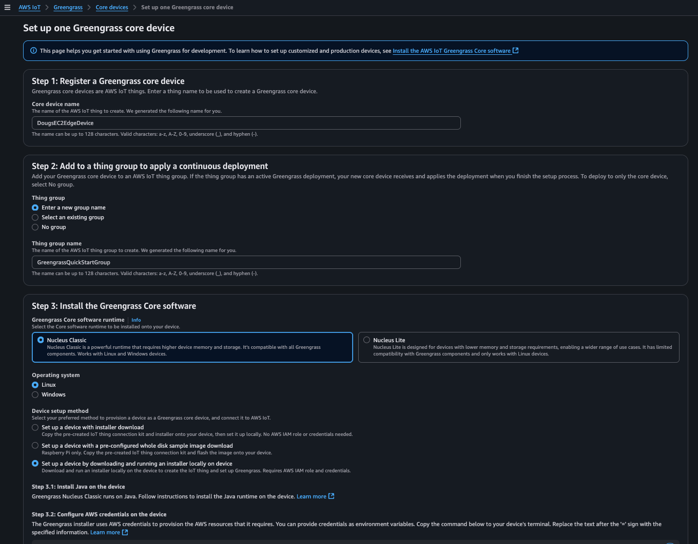
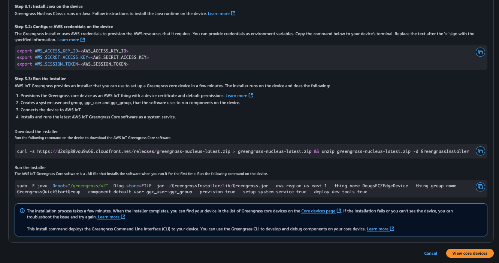
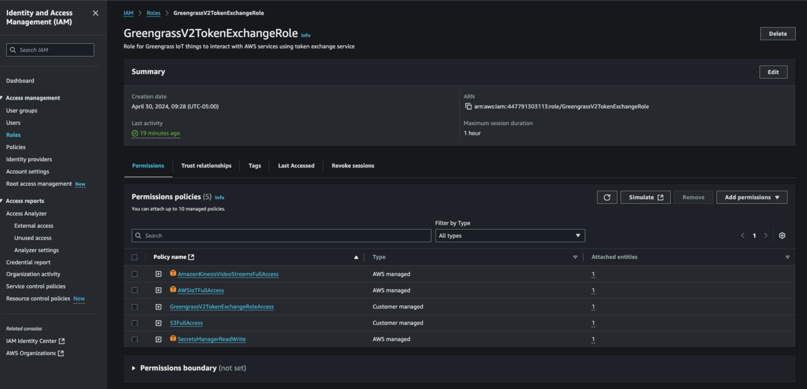

## Create AWS access credentials

Before installing AWS IoT Greengrass, you need a set of AWS access credentials. The Greengrass installer uses these credentials to register your edge device with AWS IoT Core and configure the required cloud resources.

{}
If you're using an AWS-hosted event account, credentials might be provided to you automatically. If so, copy them for the next step. They should look like this:

```bash
export AWS_ACCESS_KEY_ID=<your-access-key-id>
export AWS_SECRET_ACCESS_KEY=<your-secret-access-key>
```

If you already have credentials, skip ahead to [Install Greengrass Nucleus Classic](#install-greengrass-nucleus-classic).
{}

If you're using a personal AWS account and don't have access credentials yet, follow the steps below to create them.

### Create access credentials for a personal AWS account

Open the AWS Console and search for **IAM**:



Open the IAM Dashboard:



Select **Users** from the left sidebar:



Select your user, then select the **Security credentials** tab:



Select **Create access key**:



Choose **Other** as the use case and select **Next**:



Enter a description for the access key (for example, "Greengrass installer") and select **Create access key**:



This is the only time you can view the full credentials. Copy them and save them to a temporary file in this format:

```bash
export AWS_ACCESS_KEY_ID=<your-access-key-id>
export AWS_SECRET_ACCESS_KEY=<your-secret-access-key>
```

You'll paste these into your SSH session during the Greengrass installation.

## Install Greengrass Nucleus Classic

AWS IoT Greengrass has two versions: **Nucleus Classic**, which is Java-based, and **Nucleus Lite**, which is a native implementation typically used with Yocto-based images. This Learning Path uses Nucleus Classic because it runs on standard Linux distributions that your edge device is already running.

In the AWS Console, navigate to **AWS IoT Core** > **Greengrass** > **Core devices** and select **Set up one core device**.

Select **Linux** as the device type. The console generates download and install commands customized for your account:



Scroll down to see the install steps. The console provides commands tailored to your account. Follow these steps in an SSH session on your edge device:

1. Export your AWS credentials in the terminal:

   ```bash
   export AWS_ACCESS_KEY_ID=<your-access-key-id>
   export AWS_SECRET_ACCESS_KEY=<your-secret-access-key>
   ```

2. Copy and run the **Download the installer** command from the console. This downloads the Greengrass Nucleus installer to your device.

3. Copy and run the **Run the installer** command from the console. This installs and starts the Greengrass Nucleus service.

4. Wait for the installer to finish. A successful installation displays a confirmation message.

The screenshot below shows where to find these commands in the console:



## Add permissions to the Greengrass token exchange role

When Greengrass runs a component, it uses a Linux service user called `ggc_user` (on Nucleus Classic installations) to start the process. AWS credentials are passed to the component through its environment at launch time, and the component's AWS SDK uses those credentials to connect to AWS services. The permissions available to the component are controlled by an IAM role called `GreengrassV2TokenExchangeRole`.

By default, this role doesn't include the permissions that the Edge Impulse component needs. You need to add three policies:

- **AWSIoTFullAccess** — allows the component to publish inference results and receive commands through AWS IoT Core MQTT topics.
- **AmazonS3FullAccess** — allows access to S3 buckets where component artifacts are stored.
- **SecretsManagerReadWrite** — allows the component to retrieve the Edge Impulse API key from AWS Secrets Manager.

To add these permissions, navigate to **IAM** > **Roles** in the AWS Console and search for `GreengrassV2TokenExchangeRole`. Then:

1. Select **GreengrassV2TokenExchangeRole** from the search results.
2. Select **Add permissions** > **Attach policies**.
3. Search for **AWSIoTFullAccess**, select it, and select **Add permissions**.
4. Repeat for **AmazonS3FullAccess** and **SecretsManagerReadWrite**.



After updating, your `GreengrassV2TokenExchangeRole` should show all three policies attached.

## What you've accomplished

In this section, you created AWS access credentials, installed Greengrass Nucleus Classic on your edge device, and configured the token exchange role with the permissions that the Edge Impulse component requires. In the next section, you store your Edge Impulse API key in AWS Secrets Manager.