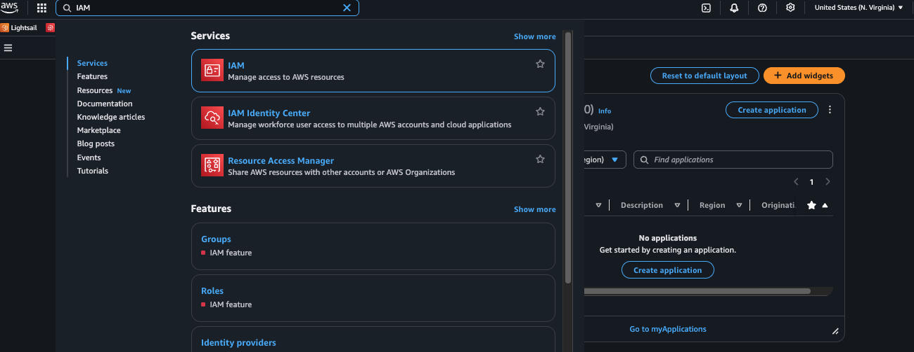
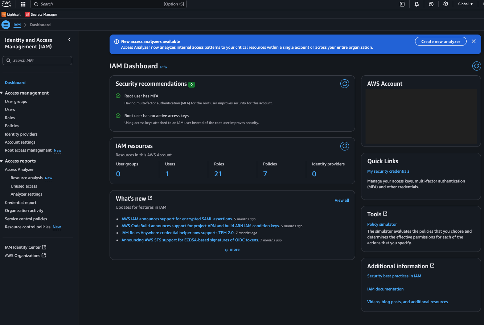
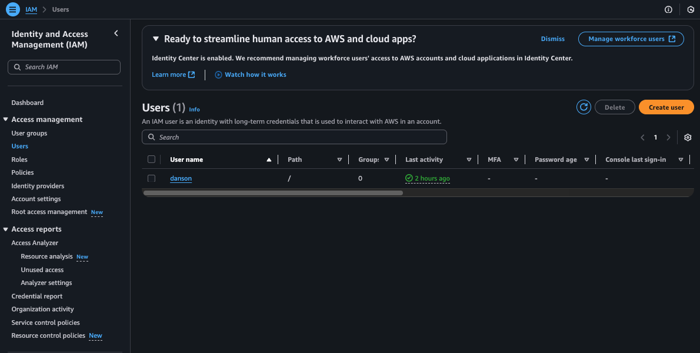
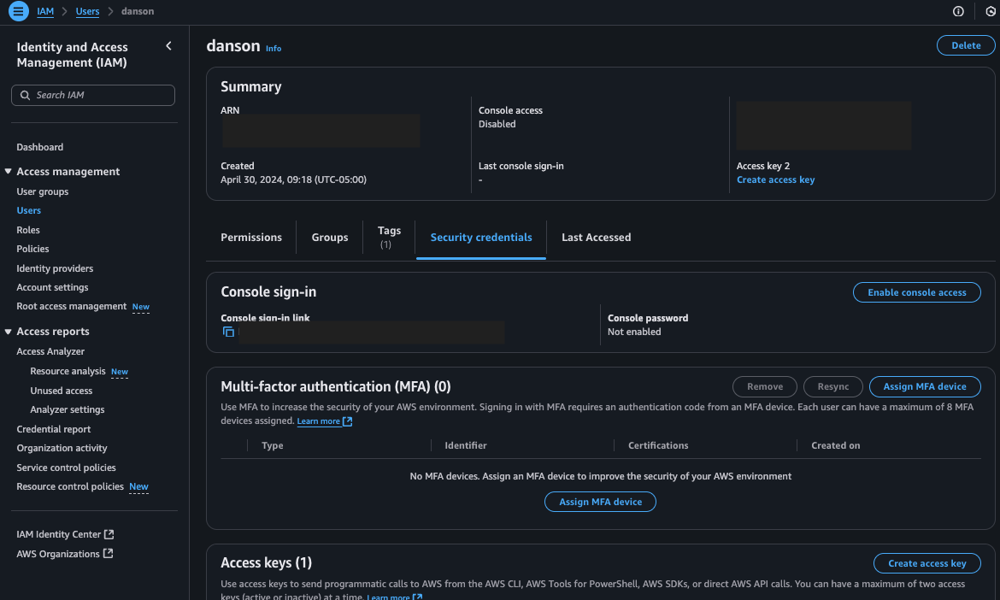
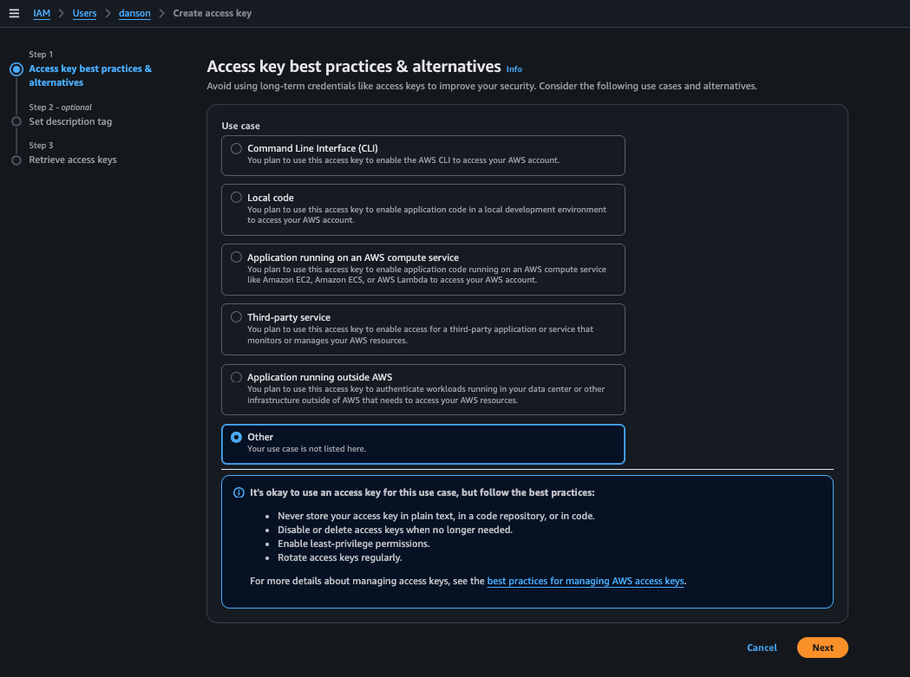
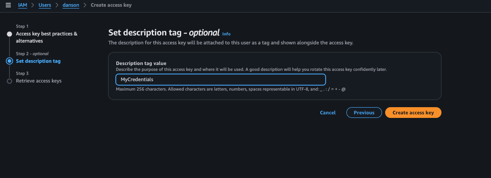
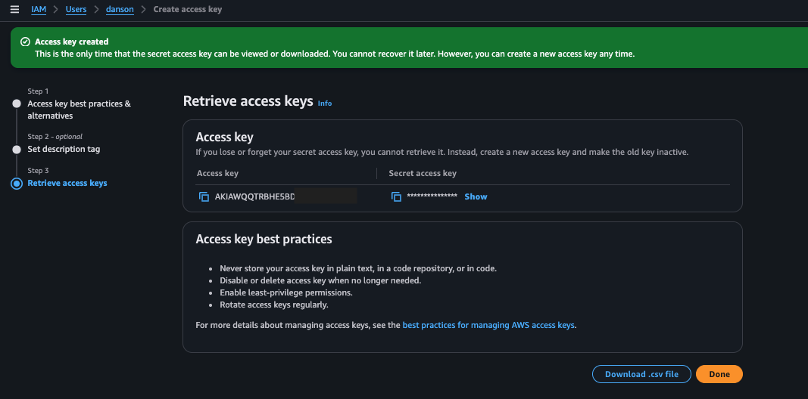
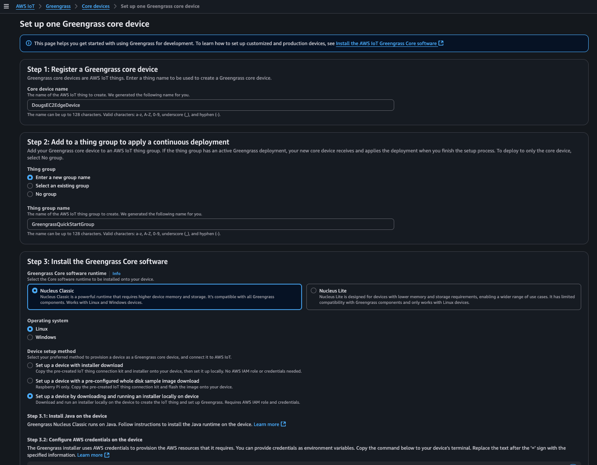
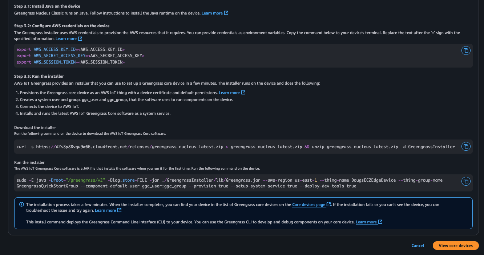
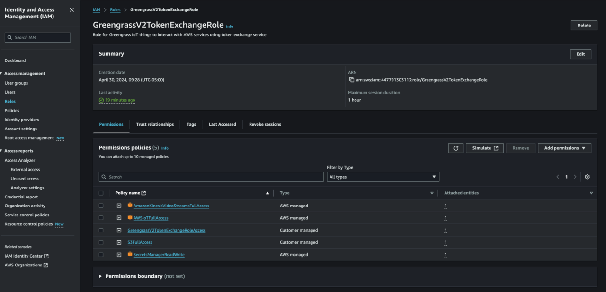

## Create AWS access credentials

Before installing AWS IoT Greengrass, you need a set of AWS access credentials. The Greengrass installer uses the credentials to register your edge device with AWS IoT Core and configure the required cloud resources.

{}
If you're using an AWS-hosted event account, credentials might be provided to you automatically that look like the following:

```bash
export AWS_ACCESS_KEY_ID=<your-access-key-id>
export AWS_SECRET_ACCESS_KEY=<your-secret-access-key>
```

If you already have credentials, copy them and skip ahead to [Install Greengrass Nucleus Classic](#install-greengrass-nucleus-classic).
{}

If you're using a personal AWS account and don't have access credentials yet, create them as follows.

### Create access credentials for a personal AWS account

To create access credentials for a personal AWS account:

1. Open the AWS Console and search for `IAM`:

   

2. Open the **IAM Dashboard**:

   

3. Select **Users**:

   

4. Select your user, then select the **Security credentials** tab:

   

5. Select **Create access key**:

   

6. Choose **Other** as the use case, and select **Next**:

   

7. Enter a description for the access key — for example, `Greengrass installer` — and select **Create access key**:

   

This is the only time that you can view the full credentials. Copy the credentials and save them to a temporary file in the following format:

```bash
export AWS_ACCESS_KEY_ID=<your-access-key-id>
export AWS_SECRET_ACCESS_KEY=<your-secret-access-key>
```

You'll paste the credentials into an SSH session during the Greengrass installation.

## Install Greengrass Nucleus Classic

AWS IoT Greengrass has two versions: Nucleus Classic, which is Java-based, and Nucleus Lite, which is a native implementation that's typically used with Yocto-based images. Use Nucleus Classic because it runs on standard Linux distributions that your edge device is already running.

To install Nucleus Classic:

1. In the AWS Console, navigate to **AWS IoT Core** > **Greengrass** > **Core devices**.
2. Select **Set up one core device**.
3. Select **Linux** as the device type. The console generates download and install commands customized for your account:



4. The console provides installation commands tailored to your account. Run the commands in an SSH session on your edge device:

   a. Export your AWS credentials in the terminal:

   ```bash
   export AWS_ACCESS_KEY_ID=<your-access-key-id>
   export AWS_SECRET_ACCESS_KEY=<your-secret-access-key>
   ```

   b. Copy and run the **Download the installer** command from the console. This downloads the Greengrass Nucleus installer to your device.

   c. Copy and run the **Run the installer** command from the console. This installs and starts the Greengrass Nucleus service.

   d. Wait for the installer to finish. A successful installation displays a confirmation message.

The following screenshot shows where to find these commands in the console:



## Add permissions to the Greengrass token exchange role

When Greengrass runs a component, it uses a Linux service user called `ggc_user` on Nucleus Classic installations to start the process. AWS credentials are passed to the component through its environment at launch time. The component's AWS SDK uses those credentials to connect to AWS services. The permissions available to the component are controlled by an IAM role called `GreengrassV2TokenExchangeRole`.

By default, `GreengrassV2TokenExchangeRole` doesn't include the permissions that the Edge Impulse component needs. You need to add three policies to the role:

- `AWSIoTFullAccess` — allows the component to publish inference results and receive commands through AWS IoT Core MQTT topics.
- `AmazonS3FullAccess` — allows access to S3 buckets where component artifacts are stored.
- `SecretsManagerReadWrite` — allows the component to retrieve the Edge Impulse API key from AWS Secrets Manager.

To add these permissions, navigate to **IAM** > **Roles** in the AWS Console and search for `GreengrassV2TokenExchangeRole`. Then:

1. Select **GreengrassV2TokenExchangeRole** from the search results.
2. Select **Add permissions** > **Attach policies**.
3. Search for `AWSIoTFullAccess`, select it, and select **Add permissions**.
4. Repeat step 3 for `AmazonS3FullAccess` and `SecretsManagerReadWrite`.



After updating, your `GreengrassV2TokenExchangeRole` should show all three policies attached.

## Place the Edge Impulse model

Verify the Edge Impulse `.eim` model file that you copied earlier:

```bash
ls -al /tmp/currentModel.eim
```

The output is similar to:

```output
/tmp/currentModel.eim
```

Copy the `.eim` file to the Greengrass service user. In an SSH session on your edge device, run:

```bash
sudo su - 
su - ggc_user
mkdir $HOME/data
cd $HOME/data
cp /tmp/currentModel.eim .
chmod 755 currentModel.eim
ls -al /home/ggc_user/data/currentModel.eim
```

The expected output lists `/home/ggc_user/data/currentModel.eim` in your SSH session.

{}
While completing the Learning Path, you'll copy and place the `.eim` file manually. In a production deployment, the `.eim` file is instead typically distributed to edge devices through the device management system.
{}

With the deployment built and the `.eim` file placed on your edge device, you'll store your API key.

## What you've accomplished and what's next

You've created AWS access credentials and installed Greengrass Nucleus Classic on your edge device. You've configured the token exchange role with the permissions that the Edge Impulse component requires. 

Next, you'll store your Edge Impulse API key in AWS Secrets Manager.
