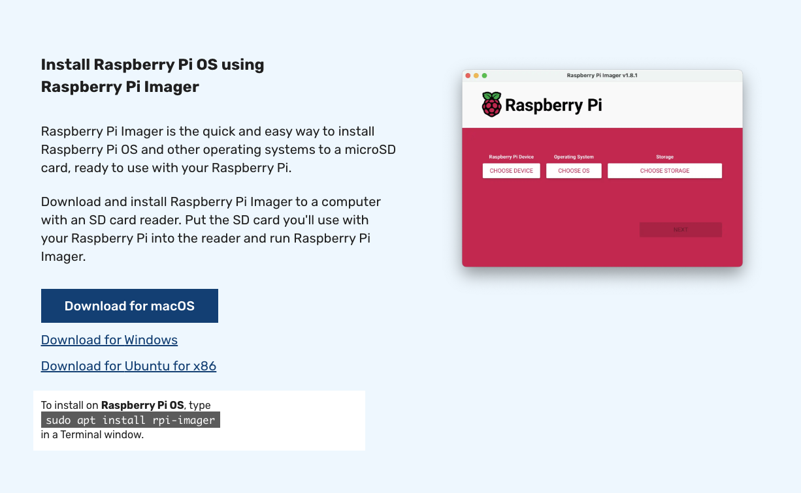

## Setup and configuration of Raspberry Pi 5 with Raspberry Pi OS

### Install RaspberryPi OS

The Raspberry Pi 5 is a super simple device that is fully supported by Edge Impulse and AWS as an edge device. 

First step in this exercise is to install the latest version of the Raspberry Pi OS onto your RPi. A SD card will be required and typically should be at least 16GB in size. 

The easiest way to setup Raspberry Pi OS is to follow the instructions here after downloading and installing the Raspberry Pi Imager application:

Instructions: [Install Raspberry Pi Imager](https://www.raspberrypi.com/software/)

Please save off the IP address of your edge device along with login credentials to remote SSH into the edge device. You'll need these in the next steps. 

#### Additional Prerequisites

First, lets open a shell into your RPi (using the Raspberry Pi OS default username of "pi" with password "raspberrypi" and having an IP address of 1.2.3.4):

	ssh pi@1.2.3.4
	
Once logged in via ssh, lets install the prerequisites that we need. Please run these commands to add some required dependencies:

	sudo apt update	
	sudo apt install -y curl unzip
	sudo apt install -y gcc g++ make build-essential nodejs sox gstreamer1.0-tools gstreamer1.0-plugins-good gstreamer1.0-plugins-base gstreamer1.0-plugins-base-apps
	
Additionally, we need to install the prerequisites for AWS IoT Greengrass "classic":

	sudo apt install -y default-jdk  

Lastly, please safe off these JSONs.  These will be used to customize our AWS Greengrass custom component based upon using an RPi5 device with or without a camera:

#### Camera configuration

	{     
	   "Parameters": {
	      "node_version": "20.18.2",
	      "vips_version": "8.12.1",
	      "device_name": "MyRPi5EdgeDevice", 
	      "launch": "runner",
	      "sleep_time_sec": 10,
	      "lock_filename": "/tmp/ei_lockfile_runner",
	      "gst_args": "v4l2src:device=/dev/video0:!:video/x-raw,width=640,height=480:!:videoconvert:!:jpegenc",
	      "eiparams": "--greengrass --force-variant float32 --silent",
	      "iotcore_backoff": "-1",
	      "iotcore_qos": "1",
	      "ei_bindir": "/usr/local/bin",
	      "ei_sm_secret_id": "EI_API_KEY",
	      "ei_sm_secret_name": "ei_api_key",
	      "ei_poll_sleeptime_ms": 2500,
	      "ei_local_model_file": "__none__",
	      "ei_shutdown_behavior": "__none__",
	      "ei_ggc_user_groups": "video audio input users",
	      "install_kvssink": "no",
	      "publish_inference_base64_image": "no",
	      "enable_cache_to_file": "no",
	      "cache_file_directory": "__none__",
	      "enable_threshold_limit": "no",
	      "metrics_sleeptime_ms": 30000,
	      "default_threshold": 65.0,
	      "threshold_criteria": "ge",
	      "enable_cache_to_s3": "no",
	      "s3_bucket": "__none__"
	   }  
	}     

#### Non-Camera configuration

	{     
	   "Parameters": { 
	      "node_version": "20.18.2",
	      "vips_version": "8.12.1",
	      "device_name": "MyRPi5EdgeDevice",
	      "launch": "runner",
	      "sleep_time_sec": 10,
	      "lock_filename": "/tmp/ei_lockfile_runner",
	      "gst_args": "filesrc:location=/home/ggc_user/data/testSample.mp4:!:decodebin:!:videoconvert:!:videorate:!:video/x-raw,framerate=2200/1:!:jpegenc",
	      "eiparams": "--greengrass",
	      "iotcore_backoff": "-1",
	      "iotcore_qos": "1",
	      "ei_bindir": "/usr/local/bin",
	      "ei_sm_secret_id": "EI_API_KEY",
	      "ei_sm_secret_name": "ei_api_key",
	      "ei_poll_sleeptime_ms": 2500,
	      "ei_local_model_file": "/home/ggc_user/data/currentModel.eim",
	      "ei_shutdown_behavior": "wait_on_restart",
	      "ei_ggc_user_groups": "video audio input users system",
	      "install_kvssink": "no",
	      "publish_inference_base64_image": "no",
	      "enable_cache_to_file": "no",
	      "cache_file_directory": "__none__",
	      "enable_threshold_limit": "no",
	      "metrics_sleeptime_ms": 30000,
	      "default_threshold": 50,
	      "threshold_criteria": "ge",
	      "enable_cache_to_s3": "no",
	      "s3_bucket": "__none__" 
	   }  
	}  

Alright!  Lets continue by getting our Edge Impulse project setup! Let's go!

[Next](../../edgeimpulseprojectbuild/)