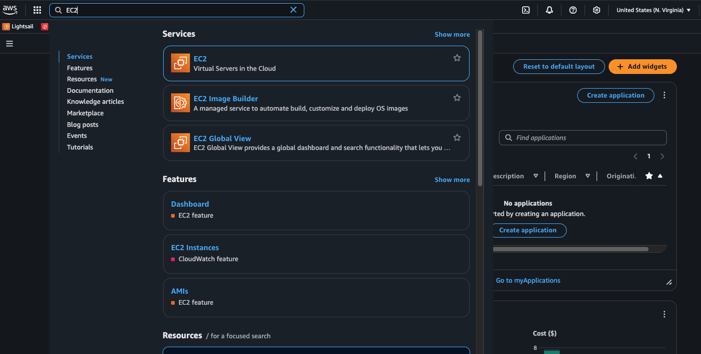
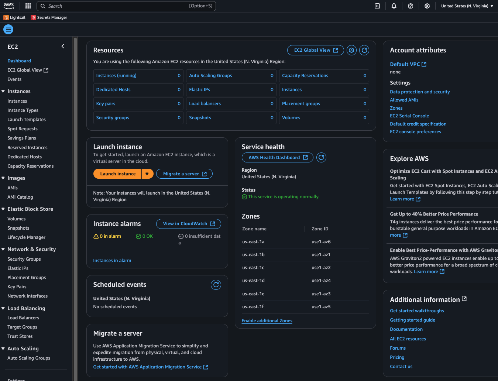
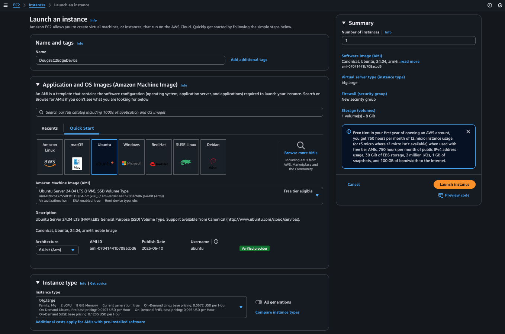
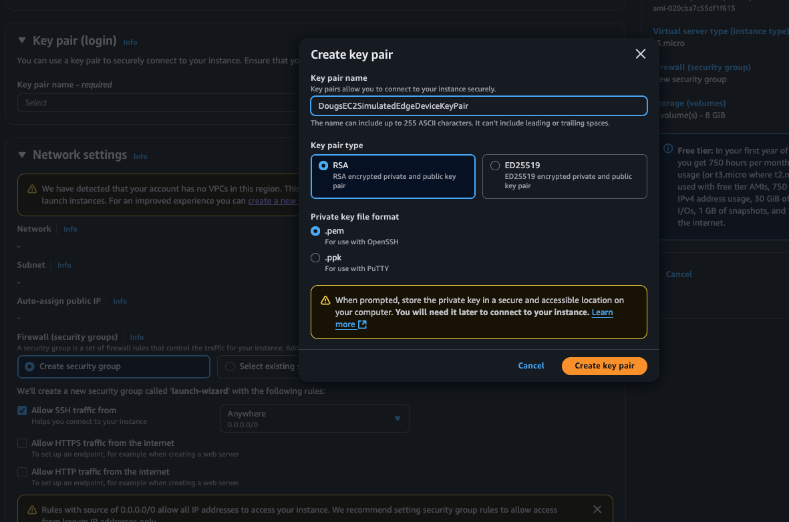
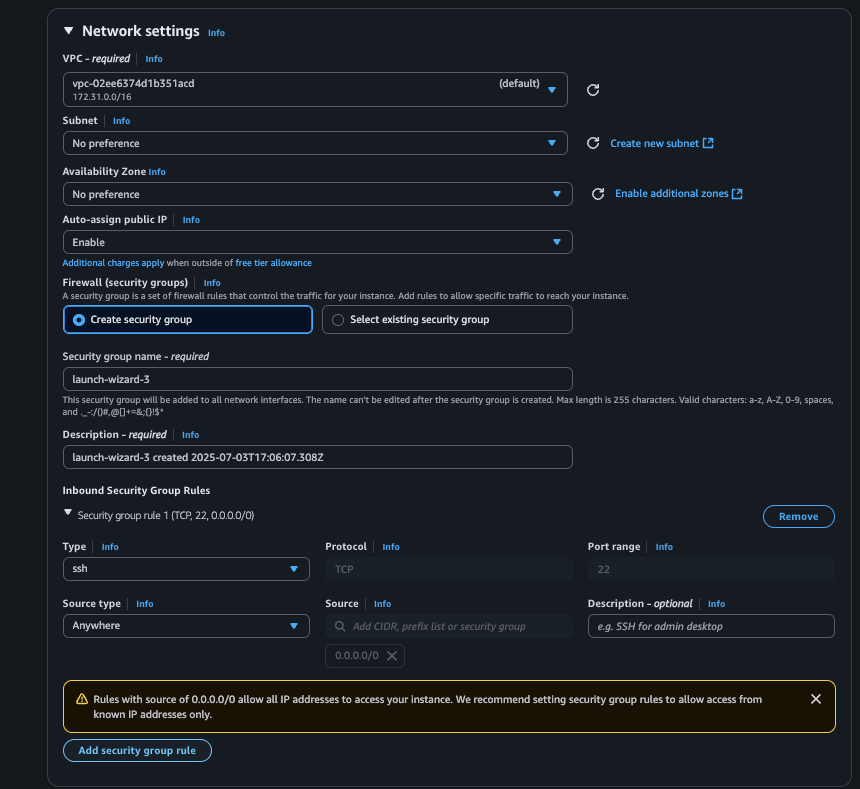
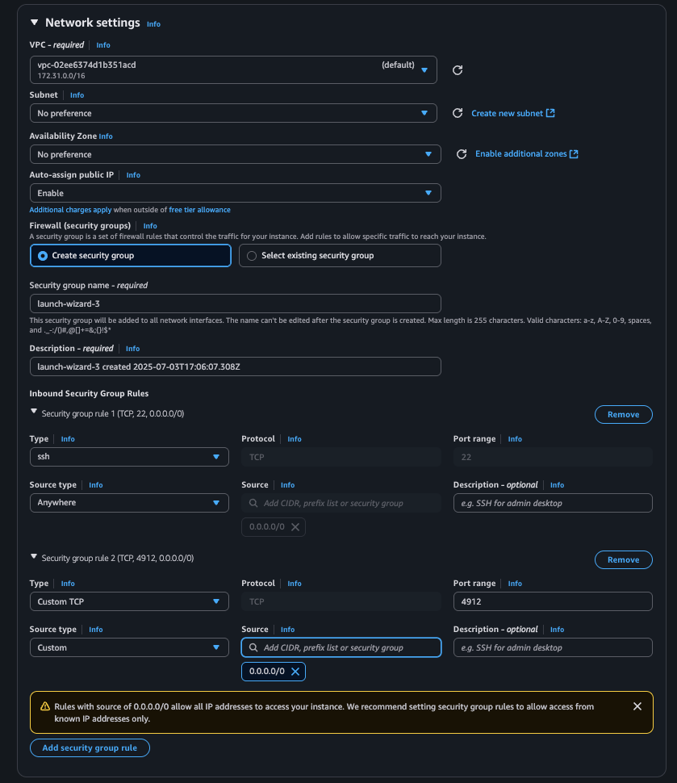
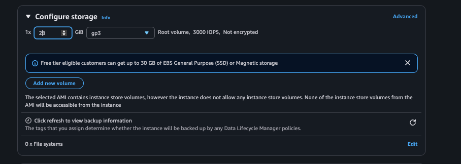
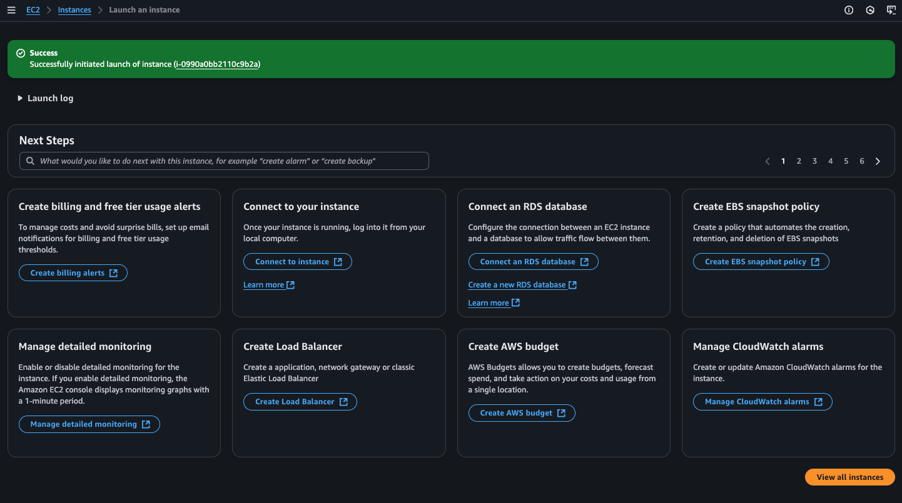
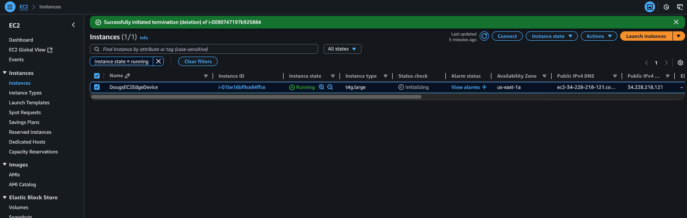
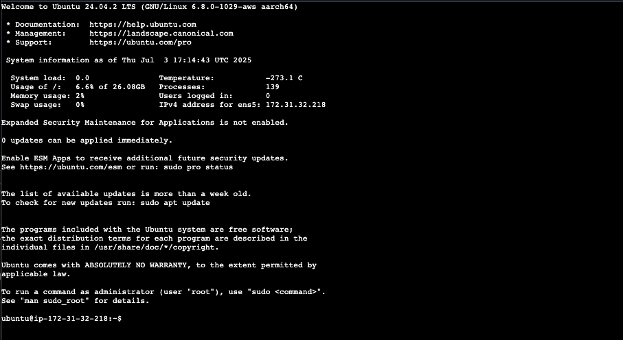

## Set up an Ubuntu EC2 Arm instance

If you don't have a physical edge device, you can use an AWS EC2 instance with an Arm-based Graviton processor to simulate one. This section walks you through creating the instance, connecting over SSH, and installing the dependencies needed for AWS IoT Greengrass and Edge Impulse.

### Create the EC2 instance

Open the AWS Console and search for **EC2**:



Open the EC2 console page:



Select **Launch instance** and configure the following settings:

- Provide a name for the instance (for example, `EdgeDeviceSimulator`).
- Under **Quick Start**, select **Ubuntu**.
- Set the architecture to **64-bit (Arm)**.
- Set the instance type to **t4g.large**.



### Create an SSH key pair

Select **Create new Key Pair** and provide a name for the key pair. Select **Create key pair**:



{}
Your browser downloads a `.pem` file automatically. Save this file in a known location because you need it to SSH into the instance.
{}

### Configure network settings

Scroll down to **Network Settings** and select **Edit**:



Select **Add security group rule** and add a rule to allow inbound TCP traffic on port 4912. The Edge Impulse Runner serves a web-based inference viewer on this port, which you use later to confirm the model is running.

For both the SSH rule (port 22) and the port 4912 rule, restrict the source to your own IP address rather than allowing access from anywhere. To find your current public IP, run:

```bash
curl http://checkip.amazonaws.com
```

Enter the returned IP address with a `/32` suffix (for example, `203.0.113.10/32`) in the **Source** field for each security group rule. This limits access to your machine only.



### Increase disk space

The default 8 GB root volume isn't enough for the dependencies and model files. Under **Configure storage**, change the root volume size from `8` to `28` GB:



### Launch and verify the instance

Select **Launch instance**. You should see a confirmation that the instance is being created:



Select **View all instances** and refresh the page. Your instance should show a **Running** state:



Copy the **Public IPv4 address** from the instance details. You need this to connect over SSH.

### Connect over SSH

Open a terminal and connect to the instance using your `.pem` file and the public IP address. Replace the placeholders with your actual file name and IP:

```bash
chmod 600 your-key-pair.pem
ssh -i ./your-key-pair.pem ubuntu@<your-ec2-public-ip>
```

You should see a login shell for your EC2 instance:



Keep this shell open. You'll use it in the following steps.

### Install dependencies

The Edge Impulse Runner and AWS IoT Greengrass require several system packages. Update the package list and install the build tools, Node.js, and GStreamer plugins:

```bash
sudo apt update
sudo apt install -y curl unzip
sudo apt install -y gcc g++ make build-essential nodejs sox gstreamer1.0-tools gstreamer1.0-plugins-good gstreamer1.0-plugins-base gstreamer1.0-plugins-base-apps
```

Greengrass Nucleus Classic is Java-based, so you also need a JDK:

```bash
sudo apt install -y default-jdk
```

### Save the component configuration

The JSON below configures the Edge Impulse Greengrass component for this EC2 instance. Because the instance has no camera, the configuration uses `gst_args` to read inference input from a local video file instead.

Save this JSON to a text file on your local machine. You'll paste it into the Greengrass deployment configuration in a later step.

```json
{
   "Parameters": {
      "node_version": "20.18.2",
      "vips_version": "8.12.1",
      "device_name": "MyEC2EdgeDevice",
      "launch": "runner",
      "sleep_time_sec": 10,
      "lock_filename": "/tmp/ei_lockfile_runner",
      "gst_args": "filesrc:location=/home/ggc_user/data/testSample.mp4:!:decodebin:!:videoconvert:!:videorate:!:video/x-raw,framerate=2200/1:!:jpegenc",
      "eiparams": "--greengrass",
      "iotcore_backoff": "-1",
      "iotcore_qos": "1",
      "ei_bindir": "/usr/local/bin",
      "ei_sm_secret_id": "EI_API_KEY",
      "ei_sm_secret_name": "ei_api_key",
      "ei_poll_sleeptime_ms": 2500,
      "ei_local_model_file": "/home/ggc_user/data/currentModel.eim",
      "ei_shutdown_behavior": "wait_on_restart",
      "ei_ggc_user_groups": "video audio input users system",
      "install_kvssink": "no",
      "publish_inference_base64_image": "no",
      "enable_cache_to_file": "no",
      "cache_file_directory": "__none__",
      "enable_threshold_limit": "no",
      "metrics_sleeptime_ms": 30000,
      "default_threshold": 50,
      "threshold_criteria": "ge",
      "enable_cache_to_s3": "no",
      "s3_bucket": "__none__"
   }
}
```

Your EC2 instance is ready. Return to the [hardware setup page](/learning-paths/embedded-and-microcontrollers/edge_impulse_greengrass/hardwaresetup/) and continue to the next section to set up your Edge Impulse project.
