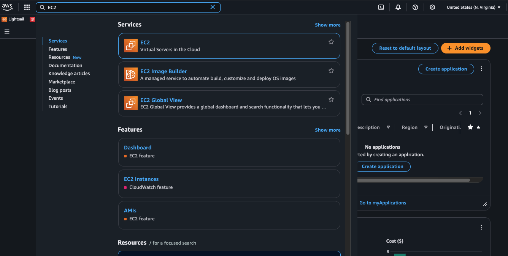
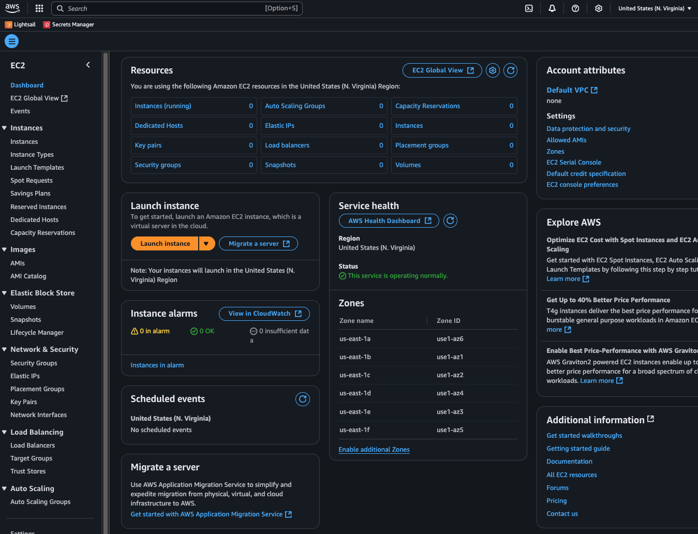
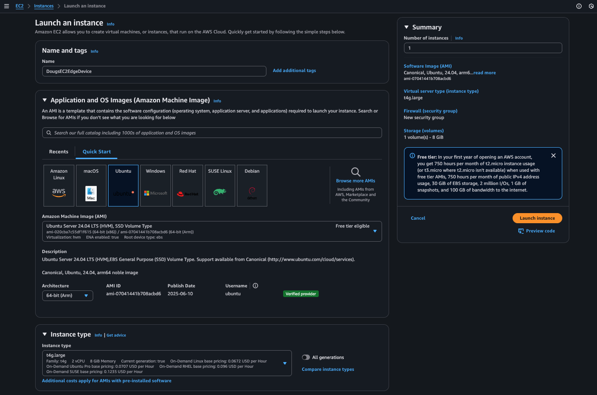
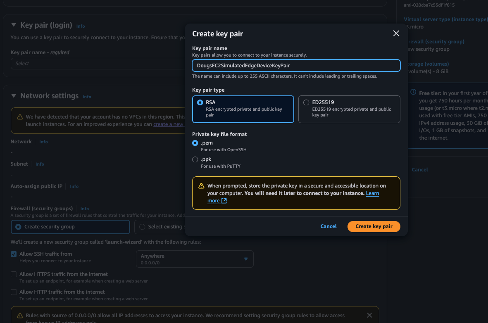
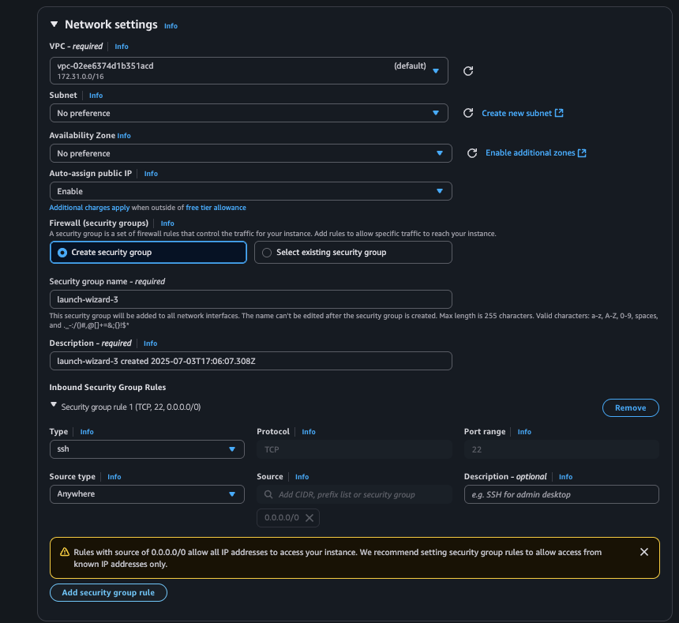
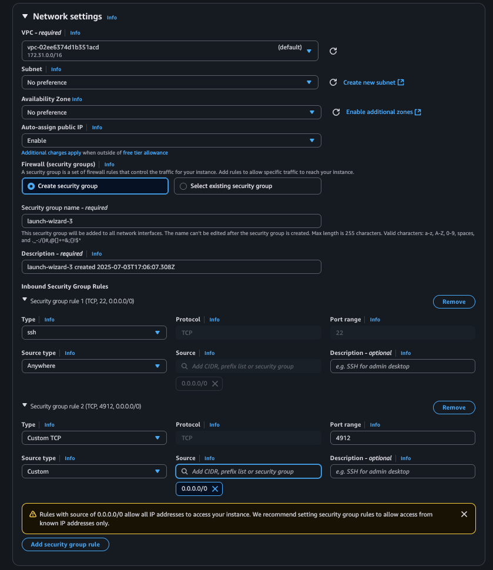
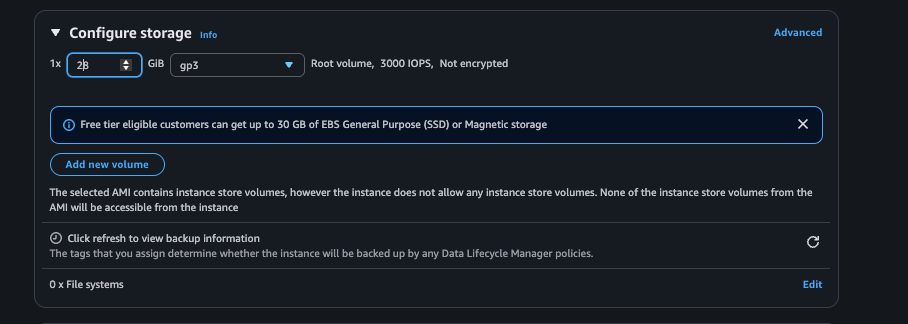
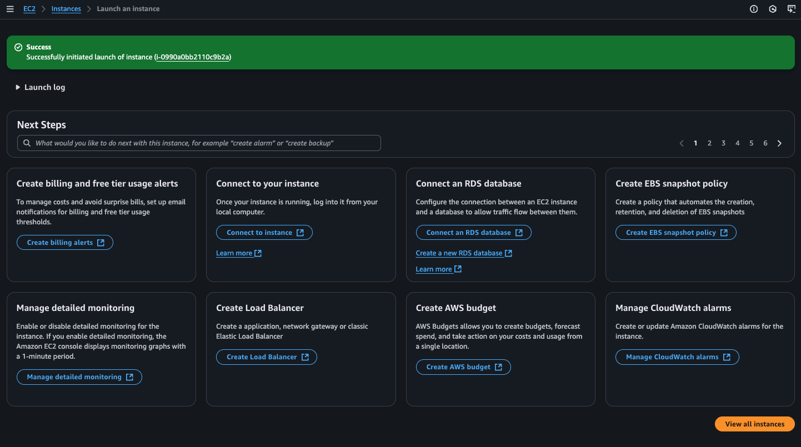
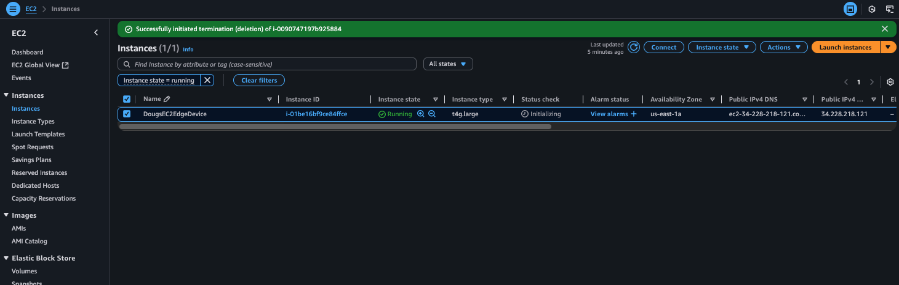
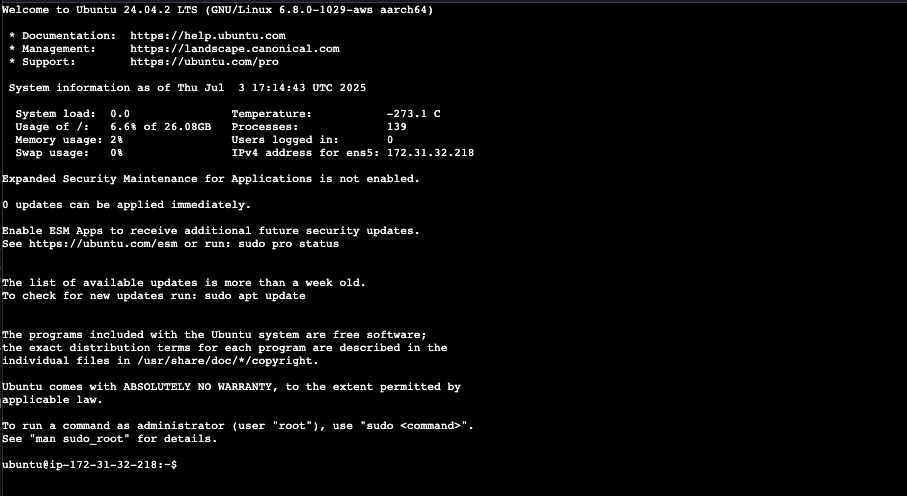

## Prepare an Arm-based Amazon EC2 instance

If you don't have a physical edge device, you can use an Arm-based Amazon EC2 instance with an AWS Graviton processor to simulate one. Create an instance, then connect to it over SSH, and install the dependencies needed for AWS IoT Greengrass and Edge Impulse.

### Create the EC2 instance

To create an instance, follow these steps:

1. Open the AWS Console and search for `EC2`:



2. Open the EC2 console page:



3. Select **Launch instance** and configure the following settings:

- Provide a name for the instance (for example, `EdgeDeviceSimulator`).
- Under **Quick Start**, select **Ubuntu**.
- Set the architecture to **64-bit (Arm)**.
- Set the instance type to **t4g.large**.



### Create an SSH key pair

Select **Create new Key Pair** and provide a name for the key pair. Select **Create key pair**:



{}
Your browser downloads a `.pem` file automatically. Save this file in a known location because you need it to SSH into the instance.
{}

### Configure network settings

To configure network settings:

1. Scroll down to **Network Settings** and select **Edit**:



2. Select **Add security group rule** and add a rule to allow inbound TCP traffic on port `4912`. 

   The Edge Impulse Linux Runner serves a web-based inference viewer on this port, which you'll use later to confirm the model is running.

3. For both the SSH rule (port `22`) and the port `4912` rule, restrict the source to your own IP address rather than allowing access from anywhere. To find your current public IP, run:

   ```bash
   curl http://checkip.amazonaws.com
   ```
   Enter the returned IP address with a `/32` suffix (for example, `203.0.113.10/32`) in the **Source** field for each security group rule. This limits access to your machine only.



### Increase disk space

The default 8 GB root volume isn't enough for the project dependencies and model files. 

To update the disk space, under **Configure storage**, increase the root volume size to **28 GiB**:



### Launch and verify the instance

To launch the instance and verify that the launch was successful:

1. Select **Launch instance**. You should see a confirmation that the instance is being created:



2. Select **View all instances** and refresh the page. Your instance should show a **Running** state:



Copy the **Public IPv4 address** from the instance details. You need the address to connect over SSH.

### Connect over SSH

Open a terminal and connect to the instance using your `.pem` file and the public IP address. Replace the placeholders with your file name and IP address:

```bash
chmod 600 your-key-pair.pem
ssh -i ./your-key-pair.pem ubuntu@<your-ec2-public-ip>
```

You'll see a login shell for your EC2 instance:



Keep the shell open. 

### Install dependencies

The Edge Impulse Linux Runner and AWS IoT Greengrass require several system packages. Update the package list and install the build tools, Node.js, and GStreamer plugins on the instance:

```bash
sudo apt update
sudo apt install -y curl unzip
sudo apt install -y gcc g++ make build-essential nodejs sox gstreamer1.0-tools gstreamer1.0-plugins-good gstreamer1.0-plugins-base gstreamer1.0-plugins-base-apps
```

Greengrass Nucleus Classic is Java-based, so you also need a JDK.

Install a JDK:

```bash
sudo apt install -y default-jdk
```

### Save the component configuration

The following JSON configures the Edge Impulse Greengrass component for the instance. Because the instance has no camera, the configuration uses `gst_args` to read inference input from a local video file instead.

Save the JSON to a text file on your local machine:

```json
{
   "Parameters": {
      "node_version": "20.18.2",
      "vips_version": "8.12.1",
      "device_name": "MyEC2EdgeDevice",
      "launch": "runner",
      "sleep_time_sec": 10,
      "lock_filename": "/tmp/ei_lockfile_runner",
      "gst_args": "filesrc:location=/home/ggc_user/data/testSample.mp4:!:decodebin:!:videoconvert:!:videorate:!:video/x-raw,framerate=2200/1:!:jpegenc",
      "eiparams": "--greengrass",
      "iotcore_backoff": "-1",
      "iotcore_qos": "1",
      "ei_bindir": "/usr/local/bin",
      "ei_sm_secret_id": "EI_API_KEY",
      "ei_sm_secret_name": "ei_api_key",
      "ei_poll_sleeptime_ms": 2500,
      "ei_local_model_file": "/home/ggc_user/data/currentModel.eim",
      "ei_shutdown_behavior": "wait_on_restart",
      "ei_ggc_user_groups": "video audio input users system",
      "install_kvssink": "no",
      "publish_inference_base64_image": "no",
      "enable_cache_to_file": "no",
      "cache_file_directory": "__none__",
      "enable_threshold_limit": "no",
      "metrics_sleeptime_ms": 30000,
      "default_threshold": 50,
      "threshold_criteria": "ge",
      "enable_cache_to_s3": "no",
      "s3_bucket": "__none__"
   }
}
```
You'll paste it into the Greengrass deployment configuration in a later step.

## What you've accomplished and what's next

You've set up an Arm-based Amazon EC2 instance running Ubuntu, installed its dependencies, and saved its component configuration.

Next, you'll [set up the Edge Impulse project](/learning-paths/embedded-and-microcontrollers/edge_impulse_greengrass/edgeimpulseprojectbuild/). 
