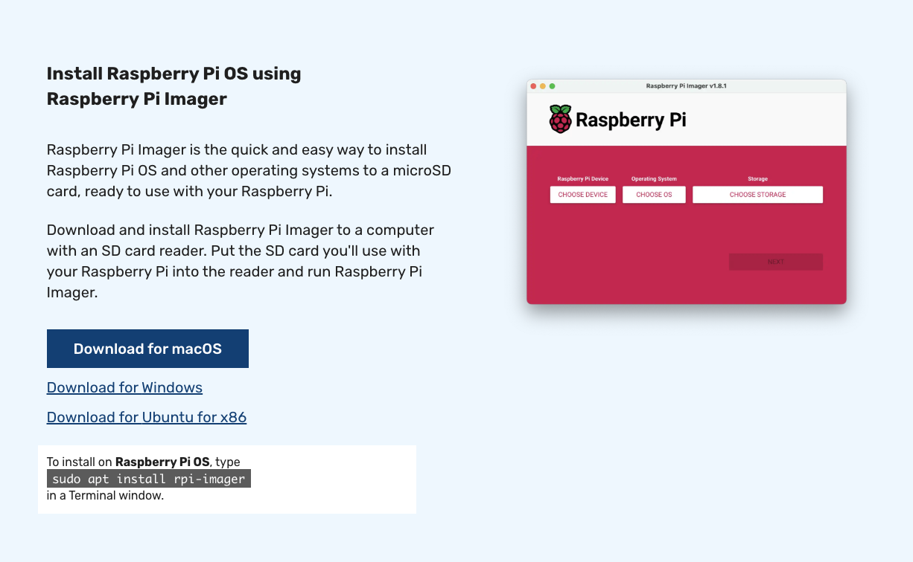

## Set up a Raspberry Pi 5 with Raspberry Pi OS

The Raspberry Pi 5 is a widely available Arm-based board with full support for both Edge Impulse and AWS IoT Greengrass. This section covers flashing Raspberry Pi OS, enabling SSH, installing dependencies, and preparing the component configuration.

### What you need

- A Raspberry Pi 5 board with a power supply (USB-C, 5V/5A recommended).
- A microSD card, 16 GB minimum (32 GB recommended for comfortable headroom).
- A computer with an SD card reader to flash the OS image.
- A network connection (Ethernet or Wi-Fi) for the Raspberry Pi 5.
- Optional: a USB camera if you want to run live inference. Without a camera, the Runner uses a sample video file instead.

### Flash Raspberry Pi OS

Download and install the [Raspberry Pi Imager](https://www.raspberrypi.com/software/) on your computer.



Open the Imager and configure the following:

1. Select **Raspberry Pi 5** as the device.
2. Select **Raspberry Pi OS (64-bit)** as the operating system. The 64-bit version is required for aarch64 compatibility with Edge Impulse models.
3. Select your microSD card as the storage target.
4. Select the gear icon (or **Edit Settings**) to open the advanced options. Configure these settings:
   - **Set hostname**: Choose a recognizable name (for example, `rpi5-edge`).
   - **Enable SSH**: Select **Use password authentication**.
   - **Set username and password**: Create a username and password you'll remember. Raspberry Pi OS no longer includes default credentials.
   - **Configure wireless LAN**: Enter your Wi-Fi network name and password if you're not using Ethernet.
5. Select **Write** and wait for the flashing process to complete.

Insert the microSD card into your Raspberry Pi 5 and power it on. Give it a minute or two to complete its first boot.

### Find the IP address

You need the IP address of your Raspberry Pi 5 to connect over SSH. There are several ways to find it:

- Check your router's admin page for connected devices.
- If you set a hostname (for example, `rpi5-edge`), try `ping rpi5-edge.local` from your computer.
- If you have a monitor connected, open a terminal on the Raspberry Pi 5 and run `hostname -I`.

Note the IP address for the next step.

### Connect over SSH

Open a terminal on your computer and connect to the Raspberry Pi 5 using the username and IP address you configured:

```bash
ssh your-username@<your-rpi5-ip-address>
```

### Install dependencies

Update the package list and install the build tools, Node.js, and GStreamer plugins that the Edge Impulse Runner requires:

```bash
sudo apt update
sudo apt install -y curl unzip
sudo apt install -y gcc g++ make build-essential nodejs sox gstreamer1.0-tools gstreamer1.0-plugins-good gstreamer1.0-plugins-base gstreamer1.0-plugins-base-apps
```

Greengrass Nucleus Classic is Java-based, so you also need a JDK:

```bash
sudo apt install -y default-jdk
```

It's also a good idea to install any available security patches:

```bash
sudo apt upgrade -y
```

### Verify the camera (optional)

If you have a USB camera connected, confirm the system detects it:

```bash
ls /dev/video*
```

You should see at least `/dev/video0` in the output. If nothing appears, check that the camera is plugged in securely and try a different USB port.

### Save the component configuration

The JSON configurations below set up the Edge Impulse Greengrass component for the Raspberry Pi 5. Choose the configuration that matches your setup and save it to a text file on your local machine. You'll paste it into the Greengrass deployment configuration in a later step.

#### With a USB camera

This configuration uses `gst_args` to capture live video from `/dev/video0` at 640x480 resolution. The `--force-variant float32` flag selects the float32 model variant, and `--silent` suppresses console output since the Runner runs as a background service.

```json
{
   "Parameters": {
      "node_version": "20.18.2",
      "vips_version": "8.12.1",
      "device_name": "MyRPi5EdgeDevice",
      "launch": "runner",
      "sleep_time_sec": 10,
      "lock_filename": "/tmp/ei_lockfile_runner",
      "gst_args": "v4l2src:device=/dev/video0:!:video/x-raw,width=640,height=480:!:videoconvert:!:jpegenc",
      "eiparams": "--greengrass --force-variant float32 --silent",
      "iotcore_backoff": "-1",
      "iotcore_qos": "1",
      "ei_bindir": "/usr/local/bin",
      "ei_sm_secret_id": "EI_API_KEY",
      "ei_sm_secret_name": "ei_api_key",
      "ei_poll_sleeptime_ms": 2500,
      "ei_local_model_file": "__none__",
      "ei_shutdown_behavior": "__none__",
      "ei_ggc_user_groups": "video audio input users",
      "install_kvssink": "no",
      "publish_inference_base64_image": "no",
      "enable_cache_to_file": "no",
      "cache_file_directory": "__none__",
      "enable_threshold_limit": "no",
      "metrics_sleeptime_ms": 30000,
      "default_threshold": 65.0,
      "threshold_criteria": "ge",
      "enable_cache_to_s3": "no",
      "s3_bucket": "__none__"
   }
}
```

#### Without a camera

This configuration reads inference input from a local sample video file instead of a live camera feed. The `ei_local_model_file` field points to a pre-downloaded model, and `ei_shutdown_behavior` is set to `wait_on_restart` so the Runner pauses after the video ends and waits for a restart command.

```json
{
   "Parameters": {
      "node_version": "20.18.2",
      "vips_version": "8.12.1",
      "device_name": "MyRPi5EdgeDevice",
      "launch": "runner",
      "sleep_time_sec": 10,
      "lock_filename": "/tmp/ei_lockfile_runner",
      "gst_args": "filesrc:location=/home/ggc_user/data/testSample.mp4:!:decodebin:!:videoconvert:!:videorate:!:video/x-raw,framerate=2200/1:!:jpegenc",
      "eiparams": "--greengrass",
      "iotcore_backoff": "-1",
      "iotcore_qos": "1",
      "ei_bindir": "/usr/local/bin",
      "ei_sm_secret_id": "EI_API_KEY",
      "ei_sm_secret_name": "ei_api_key",
      "ei_poll_sleeptime_ms": 2500,
      "ei_local_model_file": "/home/ggc_user/data/currentModel.eim",
      "ei_shutdown_behavior": "wait_on_restart",
      "ei_ggc_user_groups": "video audio input users system",
      "install_kvssink": "no",
      "publish_inference_base64_image": "no",
      "enable_cache_to_file": "no",
      "cache_file_directory": "__none__",
      "enable_threshold_limit": "no",
      "metrics_sleeptime_ms": 30000,
      "default_threshold": 50,
      "threshold_criteria": "ge",
      "enable_cache_to_s3": "no",
      "s3_bucket": "__none__"
   }
}
```

Your Raspberry Pi 5 is ready. Return to the [hardware setup page](/learning-paths/embedded-and-microcontrollers/edge_impulse_greengrass/hardwaresetup/) and continue to the next section to set up your Edge Impulse project.