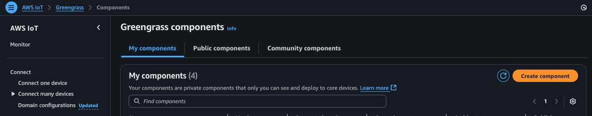
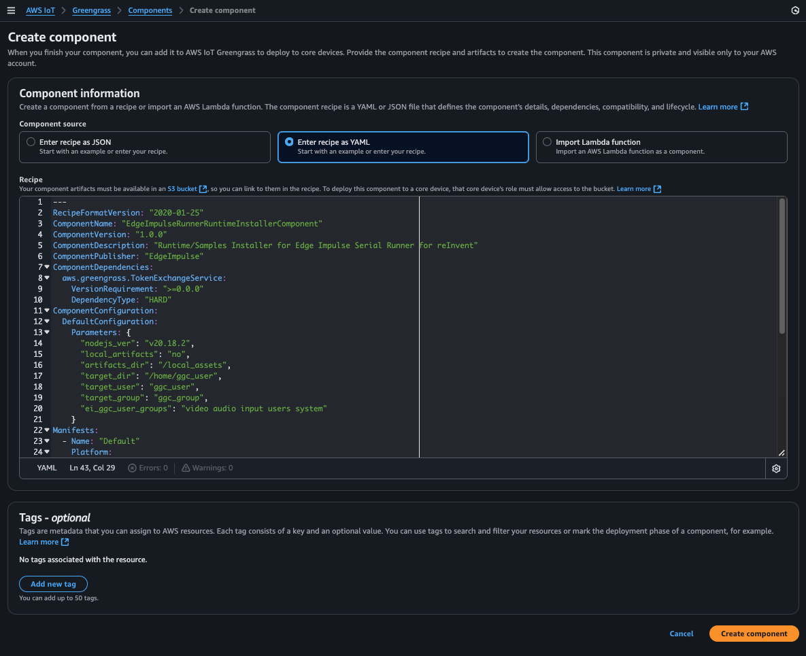
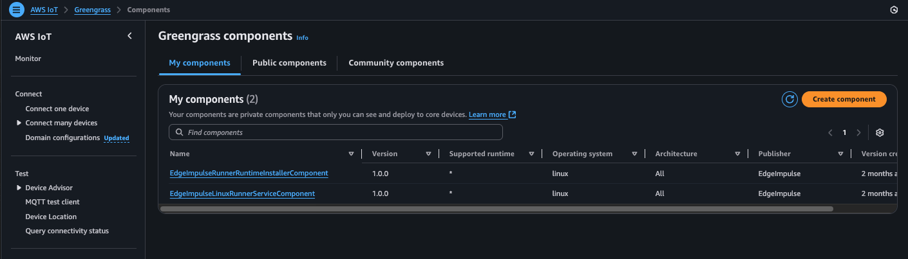

## Non-Camera Custom Component

For those edge devices that do not contain a camera, the following component will prepare the edge device with some sample images that can be referenced by the Edge Impulse "Runner" component's JSON configuration (via "gst\_args" settings) to direct the running model to pull its image data from the file (vs. camera). 

### 1. Clone the component repo

Please clone this [repo](https://github.com/edgeimpulse/aws-greengrass-workshop-supplemental). You will find the following files: 

		EdgeImpulseRunnerRuntimeInstallerComponent.yaml
		artifacts/EdgeImpulseRunnerRuntime/1.0.0/install.sh
		artifacts/EdgeImpulseRunnerRuntime/1.0.0/models.tar.gz
		artifacts/EdgeImpulseRunnerRuntime/1.0.0/samples.tar.gz
		
### 2. Copy the artifacts files to AWS S3

From the AWS dashboard, select the S3 dashboard and navigate to the same bucket you created for the "Runner" custom component. 

In that bucket, please create the following directory structure:

		artifacts/EdgeImpulseRunnerRuntime/1.0.0
		
Within the 1.0.0 directory in S3, upload these files from your cloned repo (located in ./artifacts/EdgeImpulseRunnerRuntime/1.0.0 within your cloned repo):

		install.sh
		models.tar.gz
		samples.tar.gz

Next, we need to edit the EdgeImpulseRunnerRuntimeInstallerComponent.yaml and change the artifact location from "YOUR\_S3\_ARTIFACT\_BUCKET" to the actual name of your S3 bucket name (you'll see "YOUR\_S3\_ARTIFACT\_BUCKET" near the bottom of the yaml file). Save the file. 

### 3. Create the custom component

Within the AWS dashboard, go to the IoTCore dashboard, then navigate to "Components" under the "Greengrass devices" drop-down on the left hand side. 

Press "Create Component" and select "YAML" as the recipe format type. Copy and paste the contents of your updated/modified file EdgeImpulseRunnerRuntimeInstallerComponent.yaml into the text window after clearing the initial contents:

Finally, press "Create Component" and you should now have 2 custom components registered:

Awesome!  Now that the non-camera support component is created, we can go back and continue with the deployment of these components to your edge device via the AWS IoT Greengrass deployment mechanism. Press "Return to Deployment Steps" below and continue!

### [Return to Deployment Steps](/learning-paths/embedded-and-microcontrollers/edge_impulse_greengrass/customcomponentdeployment/)